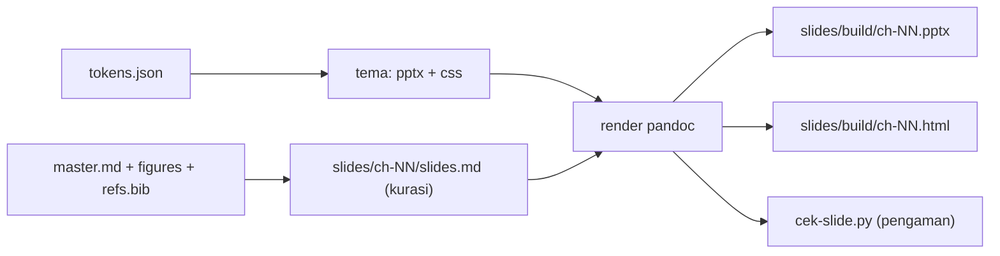

# Panduan Pembuatan Slide (PPT) Bab

> Aturan gaya, bahasa, desain, dan alur kerja untuk membuat slide presentasi tiap
> bab buku *Pengantar Deep Learning untuk Meteorologi*. Dokumen ini wajib diikuti
> agar seluruh deck seragam dan selaras dengan brand **Kanada Kurniawan**.

Rujukan induk: `README.md`, `outline.md` (Aturan Konsistensi Global), `REGISTER.md`,
`CHECKLIST-EVALUASI.md`, serta brand di `brand/brand-strategy.md` dan
`brand/voice-guidelines.md`.

---

## 1. Tujuan dan ruang lingkup

Panduan ini menetapkan:

1. Cara slide diturunkan dari sumber yang sama dengan buku (single source of truth).
2. Sistem desain tunggal (warna, font, ukuran, tata letak) untuk semua bab.
3. Aturan isi, bahasa, kode, gambar, sitasi, dan aksesibilitas.
4. Alur kerja dan pengaman otomatis agar deck tidak menyimpang dari buku.

Satu bab memiliki satu deck. Deck dipakai untuk mengajar, mendampingi blog, dan
menjadi bahan video di Fase II. Karena itu isi deck bukan salinan penuh naskah,
melainkan ringkasan terkurasi dari naskah.

---

## 2. Prinsip single source of truth

Slide memakai **SSOT tingkat aset**, bukan render otomatis penuh. Artinya:

| Unsur | Sumber tunggal | Cara dipakai di slide |
|---|---|---|
| Narasi dan fakta | `manuscripts/ch-NN-*/master.md` | Diringkas, bukan dikarang ulang |
| Gambar | `manuscripts/ch-NN-*/figures/` | Dirujuk langsung, tidak disalin |
| Kode | `notebooks/` dan blok kode `master.md` | Dipotong pendek, tetap verbatim |
| Sitasi | `refs.bib` dan daftar References bab | Nomor dan DOI sama |
| Istilah | `front-matter/06-glosarium-notasi.md` | Satu istilah satu padanan |
| Warna, font, ukuran | `slides/theme/tokens.json` | Menjadi berkas tema |

Aturan penting: **jangan mengarang angka, klaim, atau gambar baru di slide**. Bila
sebuah angka belum ada di naskah, perbaiki naskahnya lebih dulu, lalu turunkan ke
slide. Dengan begitu naskah tetap menjadi sumber kebenaran.

Render otomatis penuh (naskah langsung menjadi slide) tidak dipakai karena naskah
per bab 3.000 sampai 4.500 kata. Hasilnya akan terlalu padat dan tidak layak tayang.

Penjaga konsistensi: `scripts/cek-slide.py` memastikan gambar yang dirujuk ada,
istilah asing bersih, tidak ada tanda pisah terlarang, dan bagian wajib lengkap.

---

## 3. Arsitektur berkas dan alur

```
slides/
  theme/
    tokens.json          # sumber tunggal desain (warna, font, ukuran)
    reference-doc.pptx   # hasil generate, template PPTX untuk pandoc
    theme.css            # hasil generate, tema HTML (reveal.js)
  _template/slides.md    # kerangka deck, salin ke ch-NN/
  ch-01/slides.md        # deck Bab 1
  ch-02/slides.md        # deck Bab 2
  ...
  build/                 # hasil render, tidak di-commit
scripts/
  buat-tema-slide.py     # tokens.json menjadi reference-doc.pptx + theme.css
  build-slide.py         # render semua deck (pptx + html) lalu jalankan cek
  cek-slide.py           # pengaman konsistensi deck
```

Alur dari naskah sampai slide siap tayang:



Perintah:

```
npm run slide:tema     # bangkitkan tema dari tokens.json (bila tema berubah)
npm run slide:build    # render semua deck (pptx + html) lalu jalankan cek
npm run slide:cek      # jalankan pengaman konsistensi saja
npm run slide          # sama dengan slide:build
```

Perkakas yang dipakai: **pandoc** (menghasilkan `.pptx` dan slide HTML) dan
**python-pptx** (membangkitkan template desain dari token). Keduanya sudah tersedia
di lingkungan proyek. Tidak perlu memasang Quarto atau Marp.

---

## 4. Sistem desain

Semua nilai desain berada di `slides/theme/tokens.json`. Ubah di sana, lalu
jalankan `npm run slide:tema`. Jangan menyunting `reference-doc.pptx` atau
`theme.css` secara manual karena akan tertimpa.

### 4.1 Warna (dari brand resmi)

| Peran | Token | Nilai |
|---|---|---|
| Utama (biru laut) | `primary` | `#006CAC` |
| Sekunder (hijau meteorologi) | `secondary` | `#08A88A` |
| Aksen pendukung | `accent` | `#1178C4` |
| Latar | `background` | `#FDFDFD` |
| Teks | `foreground` | `#282728` |
| Netral | `muted` | `#E6E6E6` |
| Teks redup | `mutedForeground` | `#6B7280` |

Aturan pemakaian:

- Warna utama untuk judul dan penekanan penting.
- Warna sekunder untuk aksen, ikon, atau sorotan kedua. Jangan berlebihan.
- Jangan memakai warna di luar token. Bila butuh warna baru, tambahkan ke token
  lebih dahulu agar konsisten untuk semua bab.

### 4.2 Tipografi

- Judul dan badan memakai satu keluarga huruf yang sama, dengan penebalan berbeda.
- Kode memakai huruf monospace.
- Ukuran huruf terkecil di slide tidak lebih kecil dari `minFontPt` di token
  (bawaan 18 pt). Tujuannya agar tetap terbaca dari belakang ruangan.

### 4.3 Rasio dan tata letak

- Rasio **16:9** (bawaan `13.333 x 7.5` inci).
- Satu gagasan per slide. Bila terasa padat, pecah menjadi dua slide.
- Gunakan ruang kosong secukupnya. Jangan mengisi seluruh bidang dengan teks.
- Posisi judul, catatan kaki, dan nomor halaman konsisten karena berasal dari satu
  template.

---

## 5. Struktur baku deck per bab

Setiap deck mengikuti urutan slide berikut. Bagian bertanda **wajib** selalu ada.

1. **Slide judul** (wajib). Judul bab, subjudul buku, nama penulis.
2. **Peta bagian**. Posisi bab dalam struktur buku (Bagian I sampai IV).
3. **Prasyarat**. Bab yang perlu dibaca lebih dulu dan perkakas yang dipakai.
4. **Tujuan Pembelajaran** (wajib). 3 sampai 5 butir aksi, sama dengan naskah.
5. **Peta isi**. Daftar bagian bab.
6. **Konsep inti**. Beberapa slide, satu gagasan per slide.
7. **Contoh dan kode**. Potongan kode pendek, satu per slide bila memungkinkan.
8. **Hasil**. Angka dan gambar utama, dengan pembanding *baseline*.
9. **Ringkasan** (wajib). 3 sampai 5 butir kunci.
10. **Latihan** (wajib). Selaras dengan tujuan pembelajaran.
11. **Referensi** (wajib). IEEE bernomor, nomor sama dengan naskah.
12. **Penutup**. Ajakan mengunduh buku dan tautan sumber.

Bagian **wajib** diperiksa otomatis oleh `cek-slide.py`. Bila salah satu hilang,
pemeriksaan gagal.

Format penulisan deck memakai konvensi pandoc: header level satu (`#`) untuk pembuka
bagian, header level dua (`##`) untuk judul slide baru, dan blok `::: notes` untuk
catatan pembicara. Lihat contoh di `slides/_template/slides.md`.

---

## 6. Aturan isi dan kedalaman

- Batas bawaan: **70 kata per slide** (`maxWordsPerSlide` di token). Kelebihan kata
  menggagalkan pemeriksaan.
- Satu slide satu gagasan. Judul slide sudah menyampaikan pesan utama.
- Gunakan butir pendek. Hindari paragraf panjang di slide.
- Angka penting boleh ditonjolkan, tetapi harus ada di naskah.
- Setiap hasil model selalu ditampilkan bersama tolok ukur (*baseline*). Jangan
  menampilkan klaim kemenangan tanpa pembanding.
- Kedalaman materi disesuaikan dengan tujuan pembelajaran bab. Bahan yang tidak
  ada di naskah tidak dimasukkan ke slide.

---

## 7. Aturan bahasa

Aturan ini melanjutkan aturan konsistensi global di `outline.md`.

1. **Bahasa Indonesia baku** sesuai EYD/PUEBI. Deck mengikuti nada formal-hangat
   brand, tenang dan tidak berlebihan.
2. **Istilah asing belum diserap dicetak miring** (PUEBI pasal 18). Contoh:
   *baseline*, *deep learning*, *overfitting*, *time series*, *learning rate*.
3. **Nama diri, merek, dan akronim tidak dicetak miring**. Contoh: TensorFlow,
   Keras, Colab, ERA5, BMKG, DOI.
4. **Pemunculan pertama** memakai pola "padanan Indonesia (*istilah Inggris*)",
   misalnya "fungsi aktivasi (*activation function*)". Setelahnya konsisten.
5. **Satu istilah satu padanan**. Acuan: `front-matter/06-glosarium-notasi.md`.
6. **Tanpa em-dash dan en-dash**. Untuk jeda gunakan koma, titik, titik dua, atau
   pecah menjadi kalimat baru. Aturan ini juga diperiksa otomatis.
7. **Satuan SI dan penulisan angka** seragam: desimal dengan koma, ribuan dengan
   titik, satuan seperti mm/hari, m/s, dan derajat Celsius.
8. **Anti-overhype**. Framing "materi pengenalan", bukan klaim riset baru.
9. **Catatan pembicara** boleh lebih panjang dan santai, tetapi tetap sopan dan
   bebas istilah asing yang tidak perlu.

Pemeriksaan bahasa memakai skrip proyek yang sudah ada:

```
python scripts/cek-bahasa-asing.py --file slides/ch-01/slides.md
python scripts/cek-dash-prosa.py --file slides/ch-01/slides.md
```

`cek-slide.py` menjalankan keduanya otomatis.

---

## 8. Aturan kode

- Potongan kode singkat, satu pesan per slide. Kode panjang dipecah atau cukup
  dirujuk ke notebook.
- Kode adalah teks verbatim. Jangan mencetak miring dan jangan mengubah gaya
  penulisannya. Istilah asing di dalam kode tidak dimiringkan.
- Sertakan bahasa pada blok kode, misalnya ` ```python `.
- Sebutkan versi TensorFlow bila kode sensitif versi.
- Jangan menempel keluaran panjang. Cukup baris keluaran yang penting.

---

## 9. Aturan gambar

- Gambar diambil dari `manuscripts/ch-NN-*/figures/` lewat rujukan relatif
  `figures/...`. Tidak boleh disalin ulang ke folder slide.
- Setiap gambar wajib punya **keterangan** dan **sumber atau lisensi**, misalnya
  "(Sumber: [URL], lisensi)". Pemeriksaan memberi peringatan bila tidak ada.
- Setiap gambar wajib punya **alt text** yang deskriptif untuk aksesibilitas.
- Gambar hasil sendiri dibuat dengan matplotlib, seaborn, atau plotly, mengikuti
  gaya minimal tanpa efek tiga dimensi.
- Ukuran memadai agar teks di dalam gambar tetap terbaca saat diproyeksikan.
- Peraga nomor gambar (misalnya Gambar 2.1) harus sama dengan nomor di naskah dan
  `REGISTER.md`.

Contoh rujukan gambar di deck:

```markdown

```

---

## 10. Aturan sitasi

- Gaya **IEEE** bernomor, `[1]`, `[2]`, dan seterusnya, sesuai urutan kemunculan
  pertama, sama seperti naskah.
- Nomor di slide harus sama dengan nomor di `master.md` dan `refs.bib` bab.
- Cantumkan **DOI** bila tersedia. Untuk sumber tanpa DOI, cantumkan URL dan
  tanggal akses.
- Jumlah sitasi di slide lebih sedikit daripada naskah. Cukup sumber kunci.
- Jangan menambah sumber baru yang belum ada di `refs.bib`. Bila perlu, tambahkan
  ke `refs.bib` lebih dahulu.

---

## 11. Aksesibilitas

- Kontras teks terhadap latar memenuhi tingkat WCAG AA. Warna token sudah dipilih
  untuk itu. Jangan memakai teks abu muda di atas latar putih.
- Ukuran huruf minimum 18 pt.
- Alt text untuk semua gambar.
- Hindari mengandalkan warna saja untuk menyampaikan makna. Beri label atau tanda.
- Susunan judul slide berurutan agar mudah diikuti.

---

## 12. Metadata deck

Frontmatter YAML di awal `slides.md`:

```
---
title: "Judul Bab"
subtitle: "Pengantar Deep Learning untuk Meteorologi"
author: "Kanada Kurniawan"
---
```

Judul harus sama dengan judul bab di `master.md`. Ini memperkuat keterkaitan
naskah dan slide.

---

## 13. Alur kerja

1. Pastikan naskah bab sudah stabil (`master.md`, gambar, `refs.bib`).
2. Salin `slides/_template/` menjadi `slides/ch-NN/`.
3. Sesuaikan frontmatter dan isi slide mengikuti struktur baku di bagian 5.
4. Rujuk gambar dari `figures/` bab terkait.
5. Jalankan `npm run slide:build` untuk render sekaligus memeriksa.
6. Perbaiki temuan sampai pemeriksaan lolos.
7. Simpan hasil di `slides/build/` (tidak di-commit). Sumber `slides.md` yang
   di-commit.

Bila naskah berubah setelah deck dibuat, ulangi langkah 5 dan 6 agar slide tetap
selaras. Pengaman akan menandai gambar atau istilah yang tidak lagi cocok.

---

## 14. Pengaman otomatis

`cek-slide.py` memeriksa hal berikut.

Temuan keras (menggagalkan):

- Ada em-dash atau en-dash.
- Gambar yang dirujuk tidak ditemukan di `figures/` bab pasangannya.
- Jumlah kata satu slide melebihi batas token.
- Bagian wajib hilang (Tujuan Pembelajaran, Ringkasan, Latihan, Referensi).
- Temuan dari `cek-bahasa-asing.py` atau `cek-dash-prosa.py`.

Temuan lunak (peringatan, tetap lolos):

- Gambar tanpa keterangan "Sumber:".
- Daftar Tujuan Pembelajaran bukan 3 sampai 5 butir.
- Ada penanda placeholder seperti TODO atau FIXME.

Jalankan:

```
npm run slide:cek
```

---

## 15. Checklist sebelum deck dianggap selesai

- [ ] Deck memuat seluruh bagian wajib (bagian 5).
- [ ] Judul dan tujuan pembelajaran sama dengan naskah.
- [ ] Tidak ada em-dash atau en-dash.
- [ ] Istilah asing dicetak miring, mengikuti glosarium.
- [ ] Semua gambar ada di `figures/`, lengkap keterangan dan sumber.
- [ ] Nomor gambar dan tabel sama dengan naskah dan `REGISTER.md`.
- [ ] Sitasi IEEE bernomor sama dengan naskah, DOI tercantum.
- [ ] Tidak ada klaim tanpa pembanding *baseline*.
- [ ] Setiap slide tidak melebihi 70 kata.
- [ ] `npm run slide:build` dan `npm run slide:cek` lolos (exit 0).
- [ ] Hasil `.pptx` dan `.html` sudah dibuka dan diperiksa sekali.

---

## 16. Pemeliharaan tema dan versi

- Ubah desain hanya lewat `tokens.json`, lalu jalankan `npm run slide:tema`.
- Bila font brand berubah, ubah `fonts` di token dan bangkitkan ulang tema. Bila
  font tidak terpasang di komputer pembuat slide, PowerPoint akan menggantinya,
  jadi pastikan font tersedia atau ganti ke font yang aman.
- Saat buku dirilis sebagai versi baru, deck yang dibangun ikut disimpan bersama
  rilis agar dapat dilacak. Tema dapat berubah antarversi; catat perubahannya di
  `REGISTER.md` atau catatan rilis.

---

## 17. Catatan pengembangan

Pipeline ini dapat dikembangkan tanpa mengubah sumber:

- Ekspor PDF slide memerlukan peramban berbasis Chromium. Selama peramban itu
  belum dipasang, gunakan berkas `.html` atau cetak `.pptx` menjadi PDF dari
  PowerPoint.
- Bila nanti ingin template PPTX yang lebih kaya (tata letak khusus, ikon brand),
  ganti `reference-doc.pptx` tetap lewat `tokens.json` dan skrip tema agar tetap
  satu sumber.
