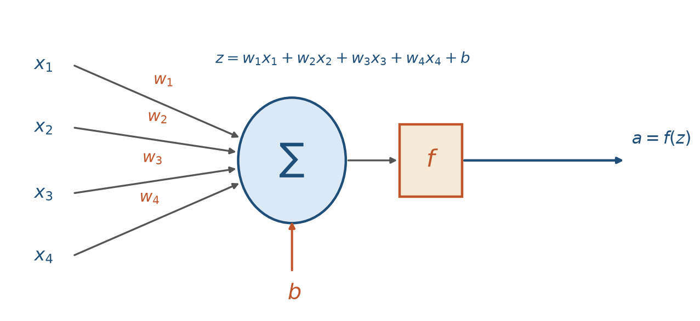
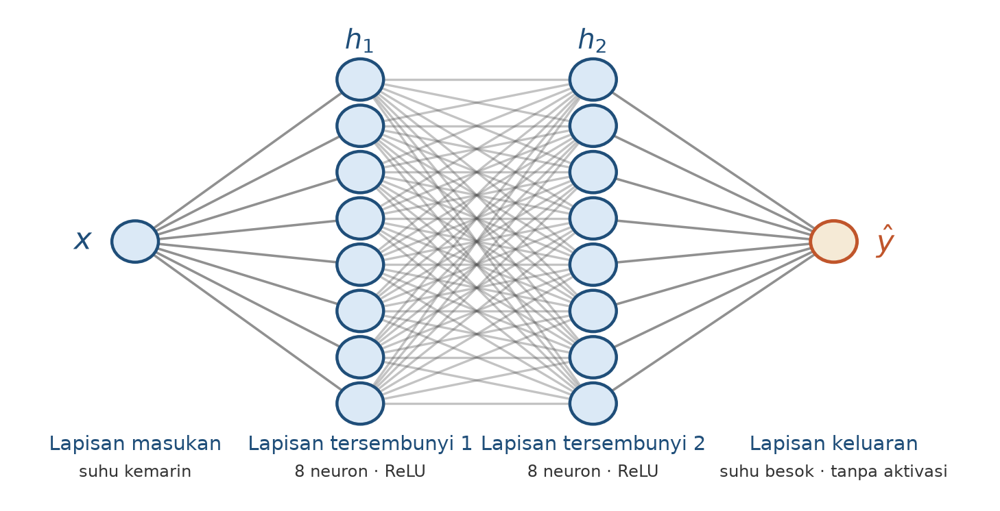

---
title: "Regresi: Perceptron dan Jaringan Saraf untuk Prediksi Besaran"
description: "Bab 2 - membangun model regresi pertama untuk prediksi besaran meteorologi: anatomi neuron (bobot, bias, fungsi aktivasi), regresi linear sebagai kasus khusus, kebutuhan non-linearitas (ReLU), mini-kasus pasang surut, perbandingan MAE vs MSE, dan alasan split berbasis waktu."
pubDate: 2026-09-01
categories: ["*Deep Learning*", "*Meteorologi*"]
tags: ["regresi", "*neural network*", "perceptron", "fungsi aktivasi", "ReLU", "*time series*"]
version: "1.1.5"
bookDOI: "10.5281/zenodo.0000000"
status: published
chapter: 2
book: "Pengantar *Deep Learning* untuk Meteorologi"
---

> **Prasyarat:** Bab 1 (tensor, konsep ML/DL). Kode memakai TensorFlow/Keras di Google Colab (Bab 1: setup lingkungan). Jika Anda sudah paham regresi linear dan pernah menulis `Dense` *layer*, Anda boleh lompat cepat ke Bagian 2.5, tetapi pastikan Anda tahu istilah bobot, bias, dan fungsi aktivasi.

> **Catatan:** Materi bab ini adalah **materi pengenalan**, bukan hasil riset baru. Seluruh isi merupakan ringkasan ulang literatur *machine learning*, dengan contoh-contoh yang dekat dengan dunia meteorologi Indonesia.

## Tujuan Pembelajaran

Setelah menyelesaikan bab ini, Anda diharapkan mampu:

1. **Membangun** model regresi *neural network* (*perceptron*/MLP) untuk prediksi besaran meteorologi dengan TensorFlow/Keras.
2. **Menjelaskan** peran bobot, bias, dan fungsi aktivasi (termasuk ReLU) serta kapan non-linearitas diperlukan.
3. **Menerapkan** mini-kasus pasang surut: *windowing*, *baseline* *persistence*, dan perbandingan MAE antara model *neural* vs *baseline*.
4. **Memilih** antara MAE dan MSE berdasarkan sifat data dan tujuan, serta membagi data deret waktu secara kronologis yang mencegah *leakage*.

## 2.1 Prediksi Besaran Sebagai Masalah Regresi

Banyak pertanyaan meteorologi yang jawabannya berupa **angka**:

- Berapa suhu maksimum besok di Pontianak?
- Berapa milimeter hujan pada hari Jumat mendatang?
- Berapa tinggi pasang surut pada pukul 18.00 nanti?
- Berapa kecepatan angin maksimum saat badai lewat?

Masalah seperti ini disebut **regresi**, memprediksi nilai kontinu dari pola di data. Kata "kontinu" penting: keluarannya adalah bilangan nyata (mis. `26.5°C`, `34 mm`), bukan kategori. Ini kontras dengan **klasifikasi** (Bab 3) yang memprediksi label, misalnya "hujan" atau "tidak hujan".

Mengapa regresi sering menjadi tempat pertama belajar *neural network*? Karena cara kerja sel sarafnya sama persis dengan klasifikasi; perbedaannya hanya di bagian ujung: lapisan keluaran dan fungsi *loss* yang dipakai. Jika Anda menguasai regresi, setengah jalan menuju klasifikasi sudah terlewati.

Ada jenis pertanyaan yang terlihat seperti angka tetapi sebenarnya bukan regresi. Test sederhana: bertanya pada diri sendiri, "apakah setiap bilangan nyata masih bermakna sebagai jawaban?" Untuk "berapa hari hujan bulan depan?" jawabannya adalah bilangan bulat (0, 1, 2, ...); -1 hari tidak bermakna. Model regresi dilatih untuk memprediksi nilai kontinu, sehingga tanpa restriksi tambahan ia dapat mengeluarkan jawaban yang tidak bermakna seperti (-3 hari atau 3,7 hari). Karena itu, pertanyaan seperti ini lebih baik diperlakukan sebagai masalah *count* atau dibentuk ulang sebagai deret waktu bulanan (*windowing*: Bab 7).

Contoh yang jelas bukan regresi: "apakah akan berpotensi banjir?". Pertanyaan ini tampak berhubungan dengan angka, seperti tinggi air, tetapi jawaban yang dimaksud adalah **kategori**: ya atau tidak. Regresi memprediksi nilai (misal tinggi air 2.3 m); klasifikasi memprediksi label (banjir atau tidak). Di klasifikasi, galat diukur bukan dengan jarak angka, tetapi apakah label tepat atau keliru; dan fungsi *loss* yang dipakai (*cross-entropy*) berbeda dari *loss *regresi (Bab 3). Bab 1 Bagian 1.8 sudah melatih Anda membedakan keduanya; di Bab 2 kita fokus pada regresi sungguhan.

### Contoh target regresi dalam meteorologi

**Tabel 2.1**: Contoh target regresi meteorologi, satuan, dan sifat datanya.

| Target                | Satuan | Sifat data                                  |
| --------------------- | ------ | ------------------------------------------- |
| Suhu udara (maks/min) | °C     | Relatif mulus, distribusi simetris          |
| Curah hujan           | mm     | Ekor kanan, banyak nol, jarang sangat besar |
| Tinggi pasang surut   | m      | Periodik, deterministik kuat                |
| Kecepatan angin       | m/s    | Berubah, tergantung musim/lokal             |

Tabel 2.1 menunjukkan bahwa "regresi meteo" bukan satu jenis data yang sama: hujan berbeda jauh dari suhu. Tiap jenis data memiliki sifat yang berbeda, perhatikan kolom sifat data pada tabel di atas. Sifat yang berbeda membutuhkan pilihan pengaturan yang berbeda. Fungsi *loss*, metrik, dan arsitektur model tergantung pada sifat tersebut (*loss* dan metrik dibahas di Bagian 2.6; arsitektur di Bab 4 saat *tuning* dibahas).

## 2.2 Anatomi Neuron: Bobot, Bias, dan Fungsi Aktivasi

Neuron buatan (*artificial neuron*) adalah unit dasar jaringan saraf. Ia menerima beberapa masukan `x`, mengalikan tiap masukan dengan **bobot** `w`, menjumlahkannya, lalu menambahkan **bias** `b`:

$$
z = w_1 x_1 + w_2 x_2 + \dots + w_n x_n + b \tag{2.1}
$$

Hasilnya "diaktifkan" oleh **fungsi aktivasi** `f`, menghasilkan keluaran:

$$
a = f(z) \tag{2.2}
$$

Bobot `w` mencerminkan **seberapa penting** tiap masukan; bias `b` adalah "ambang" yang memungkinkan neuron aktif bahkan ketika semua masukan nol. Keduanya adalah **parameter** - istilah untuk seluruh angka dalam model yang nilainya dipelajari dari data, bukan ditetapkan manusia - selama pelatihan. Saat awal, nilainya acak kecil; melalui ribuan contoh, model menyesuaikan bobot agar prediksinya semakin akurat.

Contoh paling sederhana adalah *perceptron* yang diperkenalkan Rosenblatt pada 1958 [1]: neuron dengan fungsi aktivasi berbentuk aturan - misalnya `a = 1` jika `z > 0`, dan `a = 0` sebaliknya. Perceptron penting karena menunjukkan bahwa mesin bisa belajar, tetapi terbatas pada masalah yang *linearly separable*. Dalam bab ini kita menggunakan versi modern: neuron **tanpa aktivasi di lapisan keluaran** untuk regresi (nilai bebas, bukan 0/1).



**Gambar 2.1**: Struktur neuron buatan.

Persamaan (2.1) dan (2.2) diilustrasikan pada Gambar 2.1: setiap panah masukan membawa satu komponen `x_i` yang dikalikan `w_i`; semua hasil dijumlahkan bersama bias menjadi `z` (nilai sebelum aktivasi); lalu `f` menghasilkan keluaran `a`.

### Contoh numerik sederhana

Misalkan kita memprediksi suhu minimum besok (`y`) dari dua variabel: suhu hari ini (`x₁ = 26`) dan kelembapan (`x₂ = 90%`). Jika bobot `w₁ = 0.5`, `w₂ = -0.05`, dan `bias b = 10`, maka:

$$
z = (0.5 \times 26) + (-0.05 \times 90) + 10 = 13 - 4.5 + 10 = 18.5
$$

Tanpa fungsi aktivasi (identitas), prediksi `ŷ = 18.5°C`. Pembaca bisa melihat intuisi: suhu hari ini menaikkan prediksi (bobot positif), kelembapan tinggi menurunkannya (bobot negatif). Tugas pelatihan justru menemukan `w` dan `b` yang "paling masuk akal" ini dari data, bukan menentukannya manual.

## 2.3 Satu Neuron Linear = Regresi Linear

Sebuah neuron **tanpa fungsi aktivasi** (identitas) untuk satu masukan:

$$
\hat{y} = wx + b \tag{2.3}
$$

Persamaan (2.3) identik dengan **regresi linear** yang biasa Anda pelajari di statistika. Bedanya hanya di jalur penemuan parameter:

- Statistika klasik: `w` dan `b` dihitung dengan rumus kuadrat terkecil (*closed-form*).
- *Neural network*: `w` dan `b` ditemukan lewat proses berulang (*gradient descent*, Bab 4).

Hasil akhirnya sama - dalam kondisi dasar: fungsi *loss* MSE, tanpa regularisasi, dan pelatihan yang selesai dengan baik. Jika Anda ganti loss ke MAE, menambahkan regularisasi atau menghentikan pelatihan lebih awal (*early stopping*), hasilnya akan berbeda dari solusi *closed-form*.

Catatan ini penting: "sama" berlaku hanya untuk kasus dasar di Bagian 2.3. Karena itu, satu neuron linear sebaiknya dianggap sebagai **baseline**. Prinsip di Bab 1 tetap berlaku: mulai dari model paling sederhana, ukur kinerjanya, lalu tingkatkan jika perlu.

Mengapa kita tetap mempelajari regresi linear di buku *deep learning*? Tiga alasan:

1. **Interpretasi**: `w` memiliki arti langsung ("kenaikan satu unit x menaikkan y sebesar w"). Ini sangat berharga di meteorologi, di mana rekan kerja bertanya "kenapa model bilang begini?".
2. ***Baseline* wajib**: hampir semua Bab 8-9 membandingkan LSTM/MLP dengan *baseline* linear. Tanpa memahami *baseline*, kita tidak bisa menilai "apakah DL benar-benar menambah nilai?".
3. **Blok bangunan**: regresi linear adalah neuron tunggal tanpa fungsi aktivasi; jaringan saraf adalah kumpulan neuron yang dihubungkan. Semua konsep (bobot, bias, loss) muncul di sini.

## 2.4 Kebutuhan Non-linearitas: Perkenalan ReLU

Data meteorologi jarang linear sempurna. Hubungan antara variabel seperti kelembapan, suhu, dan curah hujan tidak bisa diwakili hanya oleh garis lurus: hujan tidak meningkat terus-menerus seiring kelembapan; ada ambang, jenuh, dan interaksi. Contoh sederhana: hubungan suhu dan laju penguapan mungkin kurva, bukan garis.

Masalahnya: jika kita menyusun beberapa neuron **linear** berlapis, seluruh jaringan tetap linear - karena jumlah fungsi linear adalah fungsi linear. Komposisi `linear(linear(x))` tidak menghasilkan kemampuan baru: seberapa dalam pun, model tetap "garis lurus" dalam ruang berdimensi banyak.

Agar model mampu menangkap pola non-linear, setiap lapisan menyisipkan **fungsi aktivasi** **non-linear**. Fungsi yang paling umum sekarang adalah **ReLU** (*rectified linear unit*):

$$
\text{ReLU}(x) = \max(0, x) \tag{2.4}
$$

ReLU mengeluarkan nilai masukan jika positif, dan nol jika negatif (persamaan (2.4)). Sederhana, murah dihitung (satu perbandingan), dan menjadi komponen dasar banyak jaringan modern [2]. Referensi ini merujuk pada AlexNet (2012), jaringan yang mempopulerkan ReLU dalam kompetisi ImageNet. ReLU juga menghindari beberapa masalah *gradien *yang dimiliki sigmoid/tanh (Bab 4 membahas topik ini lebih dalam).

### Dari neuron ke MLP

**MLP** (*multi-layer perceptron*) adalah jaringan dengan satu lapisan masukan, satu atau lebih lapisan tersembunyi (masing-masing dengan fungsi aktivasi non-linear), dan lapisan keluaran. Untuk regresi, lapisan keluaran **tidak memakai aktivasi**, kita ingin nilai bebas, bukan dibatasi ke rentang tertentu. Contoh arsitektur MLP untuk memprediksi suhu besok dari suhu kemarin diilustrasikan pada Gambar 2.2:



**Gambar 2.2**: Arsitektur MLP contoh.

Cara membacanya dari kiri ke kanan: masukan `x` (suhu kemarin), dua kolom tengah adalah lapisan tersembunyi masing-masing 8 neuron dengan ReLU, dan satu neuron di ujung kanan adalah keluaran `ŷ` (suhu besok) tanpa aktivasi. Sambungan antar lapisan menggambarkan sambungan *dense* (*fully connected*).

**Kode 2.1 - Definisi arsitektur MLP regresi dengan Keras.**

```python
import tensorflow as tf

model = tf.keras.Sequential([
    tf.keras.layers.Dense(8, activation="relu", input_shape=(1,)),
    tf.keras.layers.Dense(8, activation="relu"),
    tf.keras.layers.Dense(1),
])
model.summary()
```

Kode 2.1 terlihat pendek, tetapi di dalamnya ada tiga jenis lapisan dengan tugas berbeda. Mari kita bedah satu per satu, karena pembagian ini berlaku untuk hampir semua jaringan di bab-bab selanjutnya.

**Lapisan masukan (*input layer*).** Tugasnya hanya menerima data, bukan menghitung: lapisan ini tidak punya bobot dan tidak belajar apa pun. Ia hanya mendefinisikan bentuk masukan lewat `input_shape=(1,)` - satu fitur per sampel, yaitu suhu kemarin. Di *library* Keras lapisan ini implisit: Anda tidak menuliskannya di `Sequential`, karena Keras membuatnya otomatis dari argumen tersebut. Jika fitur bertambah (misalnya suhu, kelembapan, dan tekanan udara), cukup diubah menjadi `input_shape=(3,)`.

**Lapisan tersembunyi (*hidden layer*).** Di sinilah komputasi terjadi: dua baris `Dense(8, activation="relu")`. `Dense` berarti setiap neuron terhubung ke seluruh keluaran lapisan sebelumnya (*fully connected*), dan angka 8 adalah jumlah neuron. Setiap neuron adalah neuron di Bagian 2.2 (persamaan (2.1)-(2.2)): jumlah berbobot masukan ditambah bias, lalu lewat fungsi aktivasi dalam hal ini ReLU, yang mengubah hasil negatif menjadi nol. ReLU inilah yang mencegah dua lapisan berturut-turut jatuh kembali menjadi satu fungsi linear (Bagian 2.4). Karena masukannya hanya satu, tiap neuron di lapisan pertama bekerja seperti sakelar pada ambang tertentu (efek ReLU); lapisan kedua menggabungkan sakelar-sakelar itu menjadi pola yang lebih fleksibel. Jumlah 8 dan banyaknya lapisan (2) bukan angka ajaib, melainkan keputusan desain; tuningnya dibahas di Bab 4.

**Lapisan keluaran (*output layer*).** Baris terakhir, `Dense(1)`, ditulis tanpa argumen `activation`. Tanpa aktivasi berarti identitas: keluaran neuron terakhir langsung menjadi prediksi `ŷ`. Ini disengaja untuk regresi, karena prediksi suhu boleh bernilai bebas (misalnya `22.7°C` atau `-1.5°C`); ReLU akan membuang semua nilai negatif, sedangkan sigmoid/tanh menjepit keluaran ke rentang tetap. Satu neuron berarti satu angka keluaran: suhu besok.

Alur seluruh jaringan bisa ditulis satu baris (persamaan (2.5); tiap `h` adalah vektor 8 angka):

$$
x \to h_1 = \text{ReLU}(W_1 x + b_1) \to h_2 = \text{ReLU}(W_2 h_1 + b_2) \to \hat{y} = W_3 h_2 + b_3 \tag{2.5}
$$

Karena tiap lapisan punya parameter yang dipelajari, `model.summary()` menghitungnya secara eksplisit:

```text
Layer (type)      Output Shape   Param #
dense (Dense)     (None, 8)      16      # W₁ (1×8) + b₁ (8)
dense_1 (Dense)   (None, 8)      72      # W₂ (8×8) + b₂ (8)
dense_2 (Dense)   (None, 1)      9       # W₃ (8×1) + b₃ (1)
```

Cara membacanya sederhana. Kolom Param # menghitung berapa banyak parameter yang harus dipelajari tiap lapisan: lapisan tersembunyi pertama butuh 16 (8 bobot + 8 bias), lapisan kedua 72 (64 bobot + 8 bias), dan lapisan keluaran 9 (8 bobot + 1 bias) = total 97. Bukan kita yang menentukan angka 97 itu; pelatihan yang menemukannya dari data lewat *gradient descent* (Bab 4). Lalu, apa arti `None` di kolom Output Shape? Itu adalah jumlah data yang diproses sekaligus dalam satu kelompok (*batch*) - angkanya baru ditentukan saat pelatihan, jadi untuk sekarang pustaka Keras menuliskannya kosong. Versi Keras yang lebih baru kadang juga menampilkan satu baris `InputLayer` bernilai 0 di bagian atas, itulah lapisan masukan implisit tadi, yang memang tidak punya parameter untuk dipelajari.

Kesimpulan arsitekturnya: 1 lapisan masukan + 2 lapisan tersembunyi + 1 lapisan keluaran, bukan 1 + 1 + 1. Tiga baris `Dense` di Kode 2.1 adalah dua lapisan tersembunyi plus satu lapisan keluaran; lapisan masukan tak tampak karena ia hanya bentuk data, bukan baris kode. Resep yang sama dipakai lagi di Kode 2.3, hanya `input_shape=(2,)` karena fiturnya dua: tinggi pasang surut dua hari dan satu hari sebelumnya.

### Berapa banyak lapisan yang diperlukan?

Aturan praktis soal "berapa banyak lapisan": mulailah dari yang kecil, tambah kompleksitas hanya bila diperlukan. Untuk regresi deret waktu, stasiun dengan data jam-jaman (ratusan ribu hingga jutaan baris atau data harian seratus tahun pun hanya sekitar 36 ribu baris), 1-3 lapisan tersembunyi umumnya sudah cukup. Model yang terlalu besar akan *overfit* (dijelaskan pada Bab 5) menghafal data latih dan gagal di data baru.

### ReLU dan variannya

ReLU sederhana dan efektif, tetapi punya satu kelemahan: untuk masukan negatif, keluarannya persis nol dan gradiennya juga nol. Neuron yang "mati" (selalu memberi nol) tidak ikut belajar lagi - fenomena ini disebut *dying ReLU*. Dalam praktik ringan (regresi sederhana, jaringan kecil) masalah ini jarang berpengaruh besar, tetapi di jaringan yang dalam (banyak lapisannya) bisa muncul masalah fatal.

Beberapa varian yang sering dipakai sebagai pengganti:

- **Leaky ReLU**: `max(0.01x, x)` - memberi kemiringan kecil untuk nilai negatif sehingga neuron tidak pernah sepenuhnya mati.
- **ELU**: versi mulus dengan perilaku asimtotik untuk nilai sangat negatif.
- **tanh** dan **sigmoid**: fungsi *S*-kurva yang lebih tua; relevan untuk klasifikasi (Bab 3) dan beberapa kasus lain.

Untuk Bab 2-9, ReLU (atau Leaky ReLU) adalah pilihan *default* yang aman untuk lapisan tersembunyi. Anda tidak perlu menghafal semua varian sekarang; yang penting memahami *mengapa* non-linearitas dibutuhkan dan bahwa ada beberapa pilihan dengan *trade-off*.

## 2.5 Memprediksi Tinggi Pasang Surut Sederhana

Pasang surut bersifat periodik dan di sebagian besar perairan Indonesia bertipe semi-diurnal atau diurnal campuran [3] sehingga cocok untuk regresi sederhana: ada pola yang bisa dipelajari, cukup deterministik.

Pendekatan paling dasar: memprediksi tinggi air **besok** berdasarkan tinggi air hari ini dan kemarin (dua fitur). Ini contoh *autoregressive*: target (besok) dijelaskan oleh nilai-nilai sebelumnya. Data nyata pasang surut akan dibahas penuh di Bab 8; di sini kita mengenalkan alurnya saja:

```text
input: [tinggi(t-2), tinggi(t-1)]  →  Dense+ReLU  →  output: tinggi(t)
```

### Langkah 1 - Bentuk data (*windowing*)

Model neural network tidak menerima deret waktu sebagai satu blok; ia menerima **pasangan fitur-target**, seperti di semua contoh sebelumnya. Pertanyaan desain pertama: apa yang jadi fitur dan apa yang jadi target? Untuk prediksi tinggi besok, fitur yang paling natural adalah **nilai beberapa langkah sebelumnya**. Kami menyebut bentuk data ini *windowing*.

Lihat dulu datanya (nilai ilustratif, jam demi jam):

**Tabel 2.2**: Contoh data deret waktu `tinggi(t)` pasang surut.

| `t` (indeks) | `tinggi(t)` (m) |
| ------------ | --------------- |
| 1            | 0.95            |
| 2            | 1.02            |
| 3            | 0.98            |
| 4            | 1.05            |
| 5            | 1.12            |

Metode *windowing* dua langkah memakai data berisi dua nilai yang bergeser **satu langkah demi langkah**. Untuk tiap posisi: **fiturnya** adalah dua nilai `tinggi(t-2)` dan `tinggi(t-1)`. **Targetnya** adalah nilai baru `tinggi(t)`. Catatan: angka *raw* yang sama tampil di beberapa *window*; hanya posisinya yang berubah.

Urutan fiturnya sengaja dicocokkan dengan Kode 2.2: kolom pertama `[t-2]`, kolom kedua `[t-1]`. Setiap baris contoh:

| contoh | fitur `[x1, x2]` = `[t-2, t-1]` | target `y` (t) |
| ------ | ------------------------------- | -------------- |
| 1      | `[0.95, 1.02]`                  | `0.98`         |
| 2      | `[1.02, 0.98]`                  | `1.05`         |
| 3      | `[0.98, 1.05]`                  | `1.12`         |

**Tabel 2.3**: Contoh *windowing* dua langkah pasang surut.

Cara membangun *windowing* ini dijelaskan di Bab 7 secara mendalam; di Bab 2 kita cukup memakai bentuk tabel di atas sebagai ilustrasi konsep.

### Langkah 2 - *Baseline*

Sebelum menantang neural network, ukur *baseline* sederhana. Untuk deret periodik seperti pasang surut, *baseline* paling natural adalah *persistence*: "prediksi tinggi besok = tinggi hari ini" (`ŷ(t) = y(t-1)`). Tabel 2.3 memberi kita *baseline*: berapa MAE yang dihasilkan model yang selalu menebak nilai kemarin?

Prinsip di Bab 1 menuntut: *neural network* layak dipakai hanya jika **mengalahkan** ***persistence***. Jika tidak, lebih baik kita memakai *persistence* - sederhana, tanpa pelatihan, tanpa pemeliharaan.

### Langkah 3 - Latih jaringan

**Kode 2.2 - Membangun windowing, split berbasis waktu, dan data sintetik pasang surut.**

```python
import numpy as np
import tensorflow as tf

np.random.seed(42)
tf.random.set_seed(42)

# data sintetik semi-diurnal (~12.42 jam) + sedikit noise
t = np.arange(0, 500)
tinggi = np.sin(2 * np.pi * t / 12.42) + 0.05 * np.random.randn(len(t))

X = np.column_stack([tinggi[:-2], tinggi[1:-1]])  # fitur: [t-2, t-1]
y = tinggi[2:]                                    # target: t

n = len(X)
n_train = int(n * 0.7)
n_val = int(n * 0.15)
X_train, y_train = X[:n_train], y[:n_train]
X_val, y_val = X[n_train:n_train+n_val], y[n_train:n_train+n_val]
X_test, y_test = X[n_train+n_val:], y[n_train+n_val:]
print(X_train.shape, X_val.shape, X_test.shape)
```

Kode 2.2 memperlihatkan split yang **berurutan waktu**: 70% pertama untuk latih, 15% berikutnya validasi, 15% terakhir uji. (Pembahasan mengapa tidak acak ada di Bagian 2.7.)

**Kode 2.3 - *Compile*, latih, dan evaluasi model terhadap *baseline* *persistence*.**

```python
model = tf.keras.Sequential([
    tf.keras.layers.Dense(8, activation="relu", input_shape=(2,)),
    tf.keras.layers.Dense(8, activation="relu"),
    tf.keras.layers.Dense(1),
])
model.compile(optimizer="adam", loss="mse", metrics=["mae"])

history = model.fit(
    X_train, y_train,
    validation_data=(X_val, y_val),
    epochs=60, batch_size=32, verbose=0,
)

# evaluasi vs baseline persistence
pred = model.predict(X_test, verbose=0).ravel()
base_pred = X_test[:, 1]  # persistence: pakai nilai t-1 (kolom fitur ke-2)

def mae(a, b):
    return float(np.mean(np.abs(a - b)))

print("MAE persistence:", round(mae(y_test, base_pred), 4))
print("MAE neural network:", round(mae(y_test, pred), 4))
```

Jalankan Kode 2.3 di notebook `ch-02-01_regresi_pasang_surut.ipynb`. Anda akan melihat dua angka MAE. Jika MAE jaringan **lebih kecil** daripada *persistence*, model bekerja; jika tidak, tinjau ulang (Bab 7).

### Interpretasi hasil, bukan hanya angka

Dua angka itu, misalnya:

| Model                               | MAE (m) |
| ----------------------------------- | ------- |
| *Persistence* (tebak nilai kemarin) | 0.030   |
| Jaringan (MLP)                      | 0.020   |

Nilai MAE *Persistence* lebih besar dari MLP. Tetapi walaupun MLP "lebih kecil", belum berarti "lebih berguna": angka MAE tidak menginterpretasi sendiri. Tiga lensa membantu menilai:

1. **Lensa operasional: apakah selisih mengubah keputusan?** Selisih = 0.030 - 0.020 = 0.010 m = 1 cm. Jika toleransi operasional tinggi pasang ±0.10 m (10 cm), perbaikan 1 cm tidak mengubah keputusan navigasi atau peringatan: model "lebih akurat", tetapi dampak operasionalnya minimal. Pertanyaan praktisnya seperti "apakah selisih ini mengubah keputusan pelabuhan?" - jika MAE jauh di bawah toleransi yang disyaratkan, model sudah cukup.
2. **Lensa statistik: menang atau hanya kebetulan?** Selisih kecil belum tentu berarti suatu model lebih baik; bisa saja perbedaan itu muncul karena *noise* pada data uji. Uji statistik seperti **Diebold-Mariano** menentukan apakah selisih tersebut signifikan atau hanya kebetulan. Selain itu, periksa konsistensi antar-periode: model yang menang minggu ini bisa kalah minggu depan, jadi evaluasi yang *robust* memakai beberapa periode uji (Bab 5 membahas metode; Bab 8-9 menjalan konsep).
3. **Lensa pragmatis: apakah model sederhana sudah cukup?** Apakah memakai *neural network* dapat menambah nilai yang signifikan hingga mampu mengubah keputusan? Jika Anda tidak yakin, maka *baseline* sederhana seperti ARIMA atau *persistence* bisa menjadi pilihan yang lebih baik (kembali ke prinsip Bab 1).

**Kesimpulan:** angka MAE saja belum cukup untuk menentukan kualitas model. Kita perlu melihat juga ***baseline* operasional, uji statistik, konsistensi antar-periode, serta biaya untuk menjalankan dan memelihara model**. Tidak ada model "sempurna"; yang dicari adalah model yang **cukup baik untuk tujuan** dan **lebih baik dari *baseline* sederhana**. Sikap ini yang membedakan praktisi dari sekadar pengguna *library*.

## 2.6 Mengukur Galat: MAE vs MSE

Setelah model menghasilkan prediksi, kita perlu mengukur **seberapa besar galat prediksinya**. Dua fungsi *loss* regresi yang paling umum:

**Tabel 2.4**: Perbandingan MAE dan MSE sebagai fungsi galat regresi.

| Loss                            | Definisi             | Sifat                                            |
| ------------------------------- | -------------------- | ------------------------------------------------ |
| **MAE** (*mean absolute error*) | rata-rata `          | selisih                                          |
| **MSE** (*mean squared error*)  | rata-rata `selisih²` | Memberi hukuman besar pada galat besar (kuadrat) |

Keduanya dipakai (Tabel 2.4); data seperti curah hujan memiliki distribusi dengan ekor kanan (kadang nilai sangat besar), sehingga pilihan *loss* bisa memengaruhi perilaku model. Prinsip: pilih sesuai skala & tujuan, dan selalu bandingkan dengan *baseline* (Bab 7).

### Contoh numerik sederhana

Misalkan tiga data uji memiliki aktual `y = [10, 12, 8]` dan model memprediksi `ŷ = [9, 15, 8]`. Selisihnya `[-1, +3, 0]`, sehingga:

$$
\text{MAE} = \frac{|{-1}| + |3| + |0|}{3} = \frac{4}{3} \approx 1.33 \tag{2.6}
$$

$$
\text{MSE} = \frac{(-1)^2 + (3)^2 + (0)^2}{3} = \frac{10}{3} \approx 3.33 \tag{2.7}
$$

Perhatikan: pada MSE satu galat `3` "menyumbang" nilai 9 karena 3 kuadrat. Hal ini jauh lebih besar daripada kontribusinya di MAE (3). Itulah inti perbedaan: **MSE lebih sensitif pada galat** **besar**.

**Kapan memilih yang mana?**

- Jika galat besar sangat merugikan (misal prediksi pasang surut yang meleset jauh pada jam kritis), MSE/RMSE memberi penalti lebih besar, layak dipertimbangkan.
- Jika data mengandung pencilan (sensor rusak, hujan ekstrem sesekali) dan Anda tidak ingin model "dibuat sibuk" oleh satu nilai besar, MAE lebih tenang.
- Dalam praktik, umumnya MAE dan RMSE dilaporkan bersama, karena keduanya memberi gambaran berbeda: MAE untuk galat khas, RMSE untuk bobot galat ekstrem.

Di Bab 5 kita tambah metrik domain (KGE, CSI, dsb.) - tetapi MAE/RMSE tetap fondasi untuk regresi.

### Memahami loss sebagai "jarak" dan "hukuman"

Pandangan yang membantu: ***loss* adalah ukuran seberapa buruk prediksi model** dalam satu angka, yang diminimalkan selama pelatihan. Ketika Anda menulis `loss="mse"`, *optimizer* menyesuaikan bobot dengan tujuan memperkecil rata-rata kuadrat selisih antara aktual dan prediksi. Bayangkan data suhu: jika model menebak `28.0°C` padahal aktual `30.0°C`, selisih `2.0`. MSE mengkuadratkannya menjadi `4.0`, "hukuman" ini lebih besar dari gabungan dua galat `1.0` (yang hanya `2.0`). Sifat ini membuat model yang dilatih dengan MSE cenderung menghindari galat besar, kadang mengorbankan presisi pada galat kecil.

MAE tidak mengkuadratkan, sehingga semua galat diberi bobot sama. Untuk data dengan pencilan (misal satu hari hujan ekstrem `150 mm` di tengah ratusan hari `0-20 mm`), model MSE bisa "terganggu" oleh satu nilai besar itu dan mempengaruhi semuanya; model MAE lebih tahan terhadap nilai ekstrem. Namun MAE memiliki *gradien* konstan (biasanya ±1) untuk hampir semua nilai galat, yang membuat optimasi sedikit berbeda: karena *gradien-*nya tidak mengecil saat model mendekati minimum, konvergensi bisa menjadi lambat atau berosilasi di sekitar solusi. Berbeda dengan MSE, yang gradiennya bervariasi dengan galat (gradien kecil saat galat kecil), sehingga konvergensi lebih halus di sekitar minimum. Detail optimasi ini dibahas di Bab 4.

### Metrik *versus loss*

Penting membedakan dua peran:

- ***Loss*** - dipakai selama pelatihan (*optimizer* meminimalkannya).
- **Metrik** - dilaporkan kepada pembaca untuk menilai kualitas (bisa sama atau berbeda).

Di Kode 2.3 kita menggunakan `loss="mse"` tetapi `metrics=["mae"]`. Ini wajar: melatih dengan MSE (agar galat besar dihukum) sambil melaporkan MAE (lebih mudah diinterpretasi dalam satuan °C/m). Praktik seperti ini umum; yang penting sadar bahwa keduanya tidak harus identik.

## 2.7 Adam, *Learning Rate*, dan *Split* Waktu

Setelah model dibentuk dan *loss* dipilih, kita melatihnya dengan ***optimizer***. Dua istilah yang perlu dikenal sekarang:

- **Adam** adalah algoritma optimasi modern (turunan dari *gradient descent*) yang mengatur besar langkah penyesuaian bobot per iterasi secara adaptif. Kode 2.3 memakainya cukup dengan satu baris `optimizer="adam"`. Detail cara kerja & alternatifnya dibahas di Bab 4.
- ***Learning rate*** mengontrol seberapa besar tiap langkah: terlalu besar → model melompat dan tidak konvergen; terlalu kecil → belajar sangat lambat. Adam sudah "cerdas" memilih ukuran langkah adaptif, tetapi nilai awal *learning rate* tetap perlu masuk akal (*default* Keras biasanya aman untuk pemula).

### Kenapa *split* tidak boleh acak untuk data waktu?

Untuk data **deret waktu meteorologi**, pembagian data menjadi latih/validasi/uji harus **berdasarkan waktu**, bukan acak:

```text
train (2015-2021) | validation (2022) | test (2023)
```

Alasannya adalah ***leakage*** (kebocoran informasi). Bagi acak berarti sampel uji bisa berasal dari tanggal yang berdekatan atau di antara data latih - informasi dari masa depan "bocor" ke masa latih, sehingga performa terlihat terlalu bagus. Di dunia nyata, saat model dipakai operasional, ia hanya punya data hingga hari ini: menguji dengan data masa lalu yang dicampur acak tidak merepresentasikan kondisi itu.

Bayangkan memprediksi pasang surut besok. Jika data uji mencakup tanggal yang juga ada di data latih (hanya beda beberapa hari), model bisa "meniru". Itu bukan keterampilan prediksi masa depan, itu menyontek. *Split* berbasis waktu memaksa model memprediksi periode yang benar-benar belum pernah dilihat, sama seperti kondisi nyata.

### Validasi untuk *tuning*

Data **validasi** digunakan selama pelatihan untuk memantau kinerja (misalnya lewat `validation_data` di Kode 2.3) dan bisa dipakai memilih *hyperparameter* (jumlah neuron, *learning rate*). Setelah semua keputusan selesai, model diuji **sekali** di data `test` supaya tidak curang: memakai tes berkali-kali untuk menyetel model sama saja dengan "membocorkan" tes ke latihan. Bab 5 dan Bab 7 akan mengulang dan memperdalam aturan ini.

### Ringkas alur mini-kasus

1. Bentuk *windowing* (Tabel 2.3, Kode 2.2).
2. Ukur *baseline* *persistence*.
3. Bangun & latih MLP (Kode 2.1-2.3).
4. Bandingkan MAE dengan *baseline*.
5. Jika *neural networks* tidak kalah, pakai; jika sebanding, gunakan *baseline*.

## 2.8 Latihan

**Soal konsep**

1. Jelaskan perbedaan bobot dan bias pada neuron, dengan contoh variabel meteorologi.
2. Mengapa MLP perlu fungsi aktivasi non-linear? Apa yang terjadi jika semua lapisan linear?
3. Apa keunggulan ReLU dibanding perceptron langkah (*step*) untuk pelatihan?
4. Data curah hujan memiliki banyak nol dan beberapa nilai sangat besar. *Loss* mana yang Anda pilih, MAE atau MSE, dan mengapa?

**Latihan praktik (notebook `ch-02-01_regresi_pasang_surut.ipynb`)**

1. Ubah jumlah neuron pada dua lapisan `Dense` (misal 4 dan 32). Catat MAE train/val/test. Kapan model mulai *overfit* (*train* jauh lebih baik daripada val)?
2. Tambahkan fitur ketiga `tinggi(t-3)`. Apakah MAE membaik? Apa alasan Anda?
3. Ganti `loss="mse"` dengan `loss="mae"`. Bandingkan akhir MAE test. Diskusikan perbedaan.
4. Buat *baseline* kedua: rata-rata klimatologis (nilai **rata-rata** keseluruhan train) sebagai prediksi tetap untuk seluruh test. Bandingkan dengan *persistence* dan jaringan.
5. **Proyek mini:** ambil data suhu harian stasiun lokal (misal dari GHCN-Daily - Bab 6), lakukan *windowing* 2 langkah, dan bandingkan MLP 2 lapisan vs *persistence*. Laporkan MAE.
6. **(Opsional, statistik)** Jika punya library `statsmodels` atau `sklearn`, ulangi perbandingan MAE model vs *persistence* di beberapa blok waktu dan jalankan skema uji **Diebold-Mariano** untuk menyajikan apakah selisih signifikan. Bila *library* tidak tersedia, cukup catat MAE per blok dan diskusikan konsistensinya.

Jawaban latihan tidak harus "menang": yang penting adalah Anda terbiasa membandingkan model dengan *baseline* dan membaca angka MAE secara kritis.

## 2.9 Kesalahan Umum Pemula

Beberapa jebakan yang sering muncul saat pertama kali membangun model regresi, beserta cara menghindarinya:

**1. Tidak memakai *baseline*.** Membangun MLP lalu menyimpulkan "bekerja" tanpa pernah mengukurnya terhadap *persistence*/linear. Solusi: selalu ukur *baseline* dulu (Bagian 2.5).

**2. *Split* acak untuk data waktu.** Memakai `train_test_split` *default* (acak) pada deret waktu menyebabkan *leakage*. Solusi: potong berurutan berdasarkan waktu (Bagian 2.7).

**3. Melihat data tes berulang kali.** Menyetel model terhadap tes sampai "jadi" adalah bentuk bocor. Solusi: simpan tes untuk evaluasi akhir; pakai validasi untuk *tuning* (Bagian 2.7).

**4. Mengubah skala tanpa menyimpan statistiknya.** Jika Anda menormalisasi fitur, Anda harus menyimpan rata-rata/deviasi dari *train* dan menerapkannya pada *tes* dan produksi. Menerapkan statistik dari seluruh data (termasuk tes) adalah *leakage*. (Normalisasi dibahas di Bab 6.)

**5. Melaporkan hanya *loss*, tanpa konteks satuan.** MAE `0.02 m` berarti apa? Selalu nyatakan dengan satuan dan bandingkan dengan toleransi operasional.

**6. Langsung ke arsitektur besar.** Menambah banyak lapisan/neuron sebelum mencoba model kecil. Solusi: mulai kecil, tingkatkan bertahap (Bab 4).

**7. Mengabaikan bentuk tensor.** `input_shape` yang salah adalah sumber galat umum. Periksa `model.summary()` untuk memastikan bentuk output tiap lapisan sesuai (Kode 2.1).

Menghindari galat di atas menghemat banyak waktu dan - lebih penting - menjauhkan Anda dari kesimpulan yang keliru tentang kinerja model.

## Ringkasan

- Regresi = memprediksi besaran kontinu; neuron = bobot + bias + fungsi aktivasi.
- 1 neuron linear identik regresi linear; non-linearitas (ReLU) diperlukan untuk pola yang tidak lurus.
- Mini-kasus pasang surut memperkenalkan penggunaan langsung pada data laut Indonesia; *baseline* *persistence* selalu dipakai sebagai pembanding.
- MAE vs MSE: pilih sesuai skala & tujuan; Adam & learning rate; split berbasis waktu untuk melawan *leakage*.
- Proyek ML selalu: bentuk data → *baseline* → model → bandingkan → putuskan.

## References

1. F. Rosenblatt, "The perceptron: A probabilistic model for information storage and organization in the brain," *Psychological Review*, vol. 65, no. 6, pp. 386-408, 1958, doi: 10.1037/h0042519.
2. A. Krizhevsky, I. Sutskever, and G. E. Hinton, "ImageNet classification with deep convolutional neural networks," in *Proc. Adv. Neural Inf. Process. Syst. (NeurIPS)*, vol. 25, Dec. 2012, pp. 1097-1105; reissued in *Communications of the ACM*, vol. 60, no. 6, pp. 84-90, 2017, doi: 10.1145/3065386.
3. Badan Informasi Geospasial (BIG), "Peta pasang surut dan pola pasut perairan Indonesia," [Online]. Available: [https://tides.big.go.id/](https://tides.big.go.id/) (diakses: September 2026)
