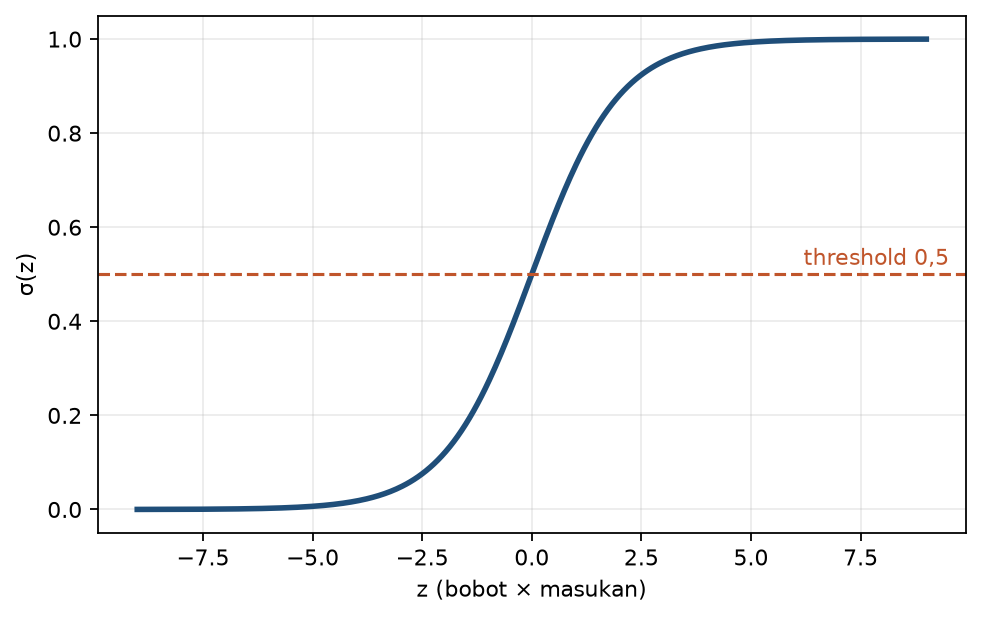
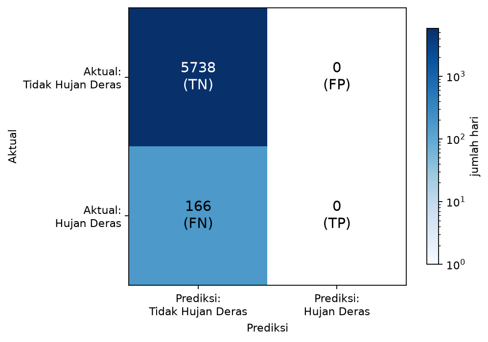
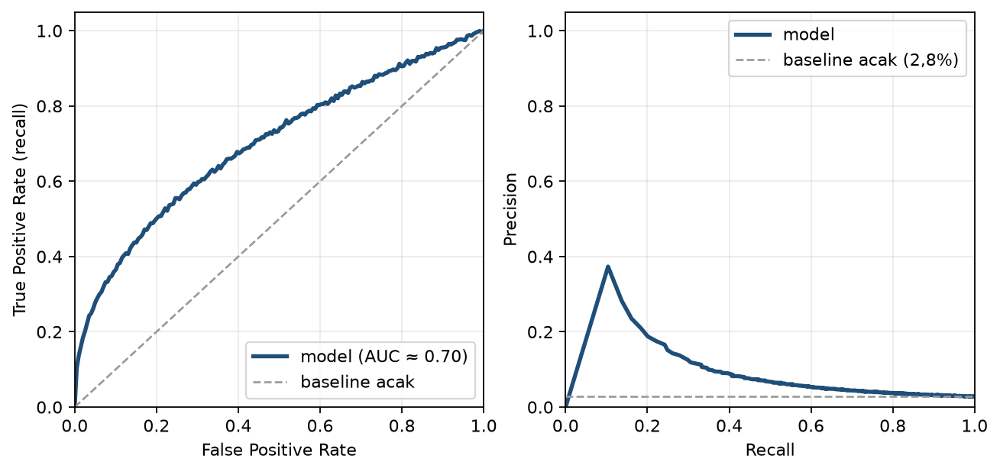

> **Prasyarat:** Bab 1 (konsep ML/DL, lingkungan Colab) dan Bab 2 (neuron, fungsi aktivasi, MAE/MSE, split waktu). TensorFlow/Keras siap di lingkungan Anda.

> **Catatan:** Materi bab ini adalah **materi pengenalan**, bukan hasil riset baru. Seluruh isi merupakan ringkasan ulang literatur *machine learning*, dengan contoh-contoh yang dekat dengan dunia meteorologi Indonesia.

## Tujuan Pembelajaran

Setelah menyelesaikan bab ini, Anda diharapkan mampu:

1. **Membangun** model klasifikasi biner dan multi-kelas (hujan/tidak hujan, level bahaya) dengan TensorFlow/Keras.
2. **Menjelaskan** peran sigmoid dan softmax serta *binary/categorical cross-entropy*.
3. **Mendiagnosis** *class imbalance* dan memilih metrik yang tepat (*precision*, *recall*, F1, pengenalan CSI/FAR) - bukan hanya akurasi.
4. **Menerapkan** *trade-off* *threshold* untuk prediksi fenomena langka.

## 3.1 Mengapa Klasifikasi Berbeda

Bab 2 membahas regresi, yaitu memprediksi besaran kontinu (suhu, tinggi pasang). Di dunia nyata, banyak keputusan meteorologi bukan "berapa?", melainkan "apa?":

- Apakah besok akan hujan atau tidak?
- Apakah intensitas hujan masuk kategori lebat, sedang, atau ringan?
- Apakah perlu peringatan dini banjir untuk level siaga?

Masalah ini disebut **klasifikasi**, memprediksi **kategori** (label) dari fitur. Ada dua varian utama:

- **Biner (dua kelas):** misal `0 = tidak hujan`, `1 = hujan`.
- **Multi-kelas:** misal `ringan`, `sedang`, `lebat` - atau level bahaya `waspada`, `siaga`, `awas`.

Perbedaan inti dari regresi: keluarannya bukan bilangan kontinu, melainkan **probabilitas atas kategori**. Kita tetap memakai neuron, tetapi lapisan keluaran memakai fungsi aktivasi khusus: **sigmoid** untuk biner dan **softmax** untuk multi-kelas. Prinsip umum pelatihan *supervised* dirangkum di literatur *deep learning* [1]. Akar historisnya adalah **perceptron** (Rosenblatt, 1958), neuron tunggal yang mengklasifikasikan masukan ke dua kelas berdasarkan ambang [2].

Mengapa kita perlu probabilitas, bukan sekadar label? Karena informasi **seberapa yakin** model sangat berharga secara operasional. Dua model yang sama-sama memprediksi "hujan" tidak setara jika yang satu yakin 90% dan yang lain 51%. Probabilitas memberi ruang untuk menetapkan ambang keputusan sesuai risiko (Bagian 3.7).

### Regresi dan klasifikasi: tabel perbandingan

**Tabel 3.1**: Perbedaan utama regresi dan klasifikasi.

| Aspek             | Regresi (Bab 2)           | Klasifikasi (bab ini)                       |
| ----------------- | ------------------------- | ------------------------------------------- |
| Keluaran          | Bilangan kontinu          | Kategori/label                              |
| Aktivasi keluaran | Tanpa aktivasi (linear)   | Sigmoid (biner) / softmax (multi-kelas)     |
| *Loss* utama      | MAE atau MSE              | *Binary/categorical cross-entropy*          |
| Metrik            | MAE, RMSE, R²             | Akurasi, *precision*, *recall*, F1, CSI/FAR |
| Contoh meteo      | Suhu besok, tinggi pasang | Hujan/tidak, level bahaya                   |

Tabel 3.1 merangkum perbedaan ini. Struktur model (lapisan `Dense` + ReLU di tengah) sama dengan Bab 2; yang berubah hanyalah ujung jaringan dan cara mengukurnya.

## 3.2 Sigmoid: Aktivasi Keluaran untuk Dua Kelas

Untuk klasifikasi biner, lapisan terakhir menggunakan **sigmoid**, yang memampatkan nilai `z` ke rentang 0-1:

$$
\sigma(z) = \frac{1}{1 + e^{-z}} \tag{3.1}
$$

Sigmoid pada Persamaan 3.1 memberi interpretasi probabilistik: keluaran `0.85` berarti keyakinan 85% bahwa sampel masuk kelas `1` (misal hujan). Sifat sigmoid yang penting:

- Nilai sangat positif → mendekati 1.
- Nilai sangat negatif → mendekati 0.
- Nilai nol → tepat 0.5 (titik tengah yang ambigu).



**Gambar 3.1**: Kurva sigmoid.

Gambar 3.1 memperlihatkan kurva *S* khas sigmoid: mulus, monoton naik, dan termampatkan. Nilai `z` dari -∞ sampai +∞ selalu dipetakan ke rentang (0, 1).

Aturan ambang (*threshold*) standar adalah 0.5: jika `σ(z) ≥ 0.5`, prediksi kelas `1`; jika tidak, kelas `0`. Namun *threshold* ini **tidak wajib**: untuk fenomena jarang seperti hujan lebat, kita sering menaikkan atau menurunkannya (dibahas Bagian 3.7).

### Contoh numerik sigmoid

Misalkan model memberi `z = 1.2`. Maka:

$$
\sigma(1.2) = \frac{1}{1 + e^{-1.2}} = \frac{1}{1 + 0.301} \approx 0.77
$$

Dengan *threshold* 0.5, sampel masuk kelas `1`. Jika kita menaikkan *threshold* ke 0.8, sampel ini menjadi kelas `0`. Keputusan berubah hanya karena ambang, bukan model.

## 3.3 Softmax: Aktivasi Keluaran untuk Banyak Kelas

Untuk klasifikasi multi-kelas, kita menggunakan **softmax**, yang mengubah vektor nilai `z` menjadi distribusi probabilitas yang **jumlahnya 1**:

$$
\text{softmax}(z)_i = \frac{e^{z_i}}{\sum_{j=1}^{K} e^{z_j}} \tag{3.2}
$$

Softmax pada Persamaan 3.2 memberi probabilitas untuk tiap kelas `i` di antara `K` kelas. Contoh: `[0.70, 0.20, 0.10]` untuk kelas `[ringan, sedang, lebat]`; prediksi model adalah kelas "ringan" karena probabilitasnya 0.70.

**Penting:** softmax bersifat relatif: ia membandingkan semua kelas. Jika kita menambahkan satu kelas lagi, probabilitas semua kelas bisa berubah meski data untuk kelas lama sama. Ini berbeda dari sigmoid yang "mandiri" per kelas (untuk biner, hanya satu). Perbandingan ringkasnya di Tabel 3.2.

### Perbandingan sigmoid dan softmax

**Tabel 3.2**: Perbandingan sigmoid dan softmax.

|                     | Sigmoid                               | Softmax                          |
| ------------------- | ------------------------------------- | -------------------------------- |
| Jumlah kelas        | 1 neuron, 2 kelas (komplementer)      | K neuron, K kelas                |
| Jumlah probabilitas | `p` tunggal, komplemen `1-p` implisit | Vektor `K` nilai, jumlah 1       |
| Fungsi              | $\frac{1}{1+e^{-z}}$                  | $\frac{e^{z_i}}{\sum_j e^{z_j}}$ |
| Kapan digunakan     | Masalah biner                         | Masalah multi-kelas              |

## 3.4 *Cross-Entropy*: Fungsi *Loss* Klasifikasi

Seperti MAE/MSE untuk regresi, klasifikasi menggunakan fungsi *loss* khusus:

- ***Binary cross-entropy*** (biner): menghukum galat antara probabilitas sigmoid dan label biner.
- ***Categorical cross-entropy*** (multi-kelas): menghukum galat antara distribusi softmax dan label *one-hot*.

Catatan singkat: *one-hot* berarti label diubah menjadi vektor dengan panjang sesuai jumlah kelas, berisi `1` di posisi kelas yang benar dan `0` di posisi lain. Contoh dan `sparse_categorical_crossentropy` ada di Bagian 3.5.

Rumus untuk *binary cross-entropy* (per sampel):

$$
\mathcal{L} = -\left[ y \log(p) + (1 - y) \log(1 - p) \right] \tag{3.3}
$$

Pada Persamaan 3.3, `y` label (0 atau 1) dan `p` probabilitas prediksi. Intuisi: jika `y=1` dan `p` mendekati 1, `log(p)` mendekati 0 → *loss* kecil. Jika `y=1` tetapi `p` mendekati 0, *loss* sangat besar, model dihukum karena yakin salah.

Prinsip intuisi: *loss* **kecil** jika model yakin benar, **besar** jika model yakin salah. Berbeda dari MSE yang menghukum selisih linier atau kuadrat, *cross-entropy* langsung menargetkan ketidaktepatan keyakinan. Inilah mengapa akurasi bisa tetap tinggi meski keyakinannya rendah.

### Kenapa bukan MSE untuk klasifikasi?

Ada dua alasan utama:

1. **Interpretasi probabilitas.** MSE dioptimalkan untuk nilai kontinu. Ia tidak memberi "hukuman" sesuai makna probabilitas. *Cross-entropy* lahir dari teori informasi dan cocok dengan keluaran 0-1.
2. **Pelatihan.** Dengan sigmoid + MSE, gradien bisa sangat kecil ketika kurva sigmoid datar, terutama saat model yakin **tetapi salah** (misal label `1`, prediksi `p ≈ 0`). Turunan sigmoid mendekati nol dan gradien MSE mengecil, sehingga belajar melambat [1]. Sebaliknya, saat model yakin dan benar (`y=1`, `p ≈ 1`), gradien *cross-entropy* juga kecil, dan itulah yang kita inginkan. *Cross-entropy* + sigmoid/softmax menghasilkan gradien yang lebih baik karena proporsional terhadap `(p - y)` dan tetap besar ketika model yakin salah. Detail di Bab 4.

## 3.5 Kode: Model Klasifikasi Pertama

**Kode 3.1 - Kode model klasifikasi biner hujan/tidak hujan dengan Keras.**

```python
import tensorflow as tf

model = tf.keras.Sequential([
    tf.keras.layers.Dense(8, activation="relu", input_shape=(n_features,)),
    tf.keras.layers.Dense(8, activation="relu"),
    tf.keras.layers.Dense(1, activation="sigmoid"),  # biner: 1 neuron, sigmoid
])
model.compile(
    optimizer="adam",
    loss="binary_crossentropy",
    metrics=["accuracy", tf.keras.metrics.Precision(), tf.keras.metrics.Recall()],
)
model.summary()
```

Kode 3.1 menggunakan API Keras di atas TensorFlow [3]. Untuk multi-kelas, ganti lapisan keluaran menjadi `Dense(K, activation="softmax")` dan *loss* `categorical_crossentropy`.

### Kode multi-kelas

**Kode 3.2 - Model klasifikasi multi-kelas intensitas hujan dengan Keras.**

```python
import tensorflow as tf

K = 3  # ringan, sedang, lebat

model = tf.keras.Sequential([
    tf.keras.layers.Dense(8, activation="relu", input_shape=(n_features,)),
    tf.keras.layers.Dense(8, activation="relu"),
    tf.keras.layers.Dense(K, activation="softmax"),  # multi-kelas: K neuron, softmax
])
model.compile(
    optimizer="adam",
    loss="sparse_categorical_crossentropy",  # label bilangan bulat, tanpa one-hot manual
    metrics=["accuracy"],
)
model.summary()
```

Perhatikan Kode 3.2: lapisan keluaran berisi `K` neuron dengan softmax dan memakai `sparse_categorical_crossentropy` bila label berupa bilangan bulat (0, 1, 2). Ini variasi praktis dari `categorical_crossentropy` yang menuntut *one-hot*.

### Latihan dengan bobot kelas (*imbalance*)

Kode 3.2 tidak menangani ketidakseimbangan. Untuk menekankan kelas minoritas, gunakan `class_weight` saat `fit`:

**Kode 3.3 - Fit dengan bobot kelas untuk menangani *imbalance*.**

```python
import numpy as np

# contoh: kelas mayoritas (0) berbobot 1, kelas minoritas (1) berbobot lebih besar
class_weight = {0: 1.0, 1: 10.0}

history = model.fit(
    X_train, y_train,
    validation_data=(X_val, y_val),
    class_weight=class_weight,
    epochs=50, batch_size=32, verbose=0,
)
```

Bobot `10.0` pada kelas `1` membuat galat pada kejadian langka dihukum 10 kali lipat. Rasio ketidakseimbangan (mis. bila 5% kejadian, bobot ≈19) adalah **titik awal** yang membantu, bukan aturan baku: bobot optimal tidak selalu dilihat dari frekuensi invers, dan nilai terlalu ekstrem bisa menaikkan *overfit* pada kelas minoritas. Sebaiknya *tuning* bobot empiris (mis. coba 2, 5, 10, 19) dan pilih yang memberi F1/CSI terbaik pada validasi. Bandingkan hasil Kode 3.3 dengan tanpa bobot di notebook.

### Memahami keluaran *one-hot*

Untuk multi-kelas, label biasanya di-encode sebagai **one-hot**: vektor panjang `K` dengan `1` pada posisi kelas yang benar dan `0` di posisi lain.

```text
ringan → [1, 0, 0]
sedang → [0, 1, 0]
lebat  → [0, 0, 1]
```

Keras menyediakan `to_categorical` untuk konversi. Label bilangan bulat juga bisa dipakai langsung dengan *loss* `sparse_categorical_crossentropy`, tanpa *one-hot* manual.

## 3.6 *Class Imbalance*: Mengapa Akurasi Dapat Menipu

Data meteorologi sering **tidak seimbang**: hujan ≥50 mm mungkin terjadi hanya beberapa hari dalam setahun di banyak stasiun tropis. Sebagai contoh nyata, di stasiun Cilacap (data harian GHCN-Daily, 1960-2024) hujan ≥50 mm tercatat hanya 166 dari 5904 hari pengamatan, sekitar 2,8% (rata-rata ±5 hari per tahun) [6]. Jika model selalu memprediksi "tidak hujan deras", akurasinya 97,2% tampak unggul, padahal model **gagal total** pada kejadian yang justru penting.

Mengapa ini sangat relevan untuk meteorologi? Karena banyak fenomena berisiko justru langka: hujan ekstrem, angin kencang, banjir rob, atau cuaca buruk penerbangan. Sebagian besar hari adalah "biasa", sedangkan kejadian berbahaya adalah sebagian kecil. Model yang dioptimalkan hanya untuk akurasi global akan "belajar" memprediksi kelas mayoritas dan praktis buta terhadap kelas langka. Ironisnya, kelas langka itu adalah kelas yang kita perlukan.

Tabel berikut menggambarkan jebakan ini:

**Tabel 3.3**: Contoh data tidak seimbang (stasiun Cilacap, GHCN-Daily 1960-2024).

|                           | Prediksi: Tidak Hujan Deras | Prediksi: Hujan Deras |
| ------------------------- | --------------------------- | --------------------- |
| Aktual: Tidak Hujan Deras | 5738 (TN)                   | 0 (FP)                |
| Aktual: Hujan Deras       | 166 (FN)                    | 0 (TP)                |

Catatan: TP/FP/FN/TN adalah empat kemungkinan hasil klasifikasi (definisi lengkap di Bagian 3.8): TP = kejadian hujan yang benar tertangkap, FP = peringatan hujan yang keliru, FN = hujan yang terlewat, TN = hari tidak hujan yang benar dinyatakan tidak hujan.



**Gambar 3.2**: *Confusion matrix* contoh data tidak seimbang.

Gambar 3.2 memvisualkan Tabel 3.3 untuk model yang selalu memprediksi "tidak hujan deras" pada seluruh rekaman Cilacap 1960-2024: TN=5738 (hari tidak hujan yang benar), FP=0 (tidak ada peringatan hujan keliru), FN=166 (semua hujan deras terlewat), TP=0 (tidak ada hujan deras yang tertangkap). Akurasi = `(TP+TN)/(TP+FP+FN+TN) = (0+5738)/5904 = 97.2%`. Model ini "tampak unggul" di akurasi, padahal dari 166 hari hujan deras tidak satu pun dapat diprediksi (*recall* 0%). Untuk peringatan dini, model seperti ini sama sekali tidak berguna.

Karena itu, metrik utama yang digunakan:

- ***Precision*** - dari semua yang diprediksi "hujan deras", berapa yang benar? `TP/(TP+FP)`. Untuk model ini `0/0` (tidak ada prediksi hujan), sehingga precision tidak terdefinisi.
- ***Recall*** - dari semua yang benar-benar hujan deras, berapa yang diprediksi benar? `TP/(TP+FN) = 0/166 = 0%`.
- **F1** - rata-rata harmonik *precision-recall* (seimbang):

$$
F_1 = \frac{2 \cdot \text{precision} \cdot \text{recall}}{\text{precision} + \text{recall}} \tag{3.4}
$$

Persamaan 3.4 memberi F1. Untuk kejadian langka dalam meteorologi operasional, kuartet yang lebih terpercaya adalah **CSI, POD, FAR, TS** (dibahas penuh di Bab 5). Pedoman resmi verifikasi prediksi operasional dikeluarkan WMO [4]. Di bab ini kita cukup paham mengapa akurasi tidak cukup.

### Empat cara mengatasi *imbalance* (pratinjau)

1. **Gunakan metrik yang tepat** - *precision*/*recall*/F1, bukan akurasi.
2. **Atur *threshold***, turunkan ambang agar kejadian langka lebih sering tertangkap (Bagian 3.7).
3. **Pemberian bobot kelas** - `class_weight` di Keras memberi penalti lebih besar untuk galat pada kelas minoritas (contoh dalam notebook).
4. ***Resampling*** - *undersampling* kelas mayoritas atau *oversampling* minoritas (konsekuensinya: distribusi berubah; diskusi di Bab 5). **Hati-hati pada deret waktu:** *oversampling* acak (mis. SMOTE) merusak urutan temporal; lebih aman gunakan `class_weight` (Bab 9).

### Contoh numerik lengkap *precision*/*recall*

Ambil kembali Tabel 3.3: `TP=0, FP=0, FN=166`. Perhitungannya:

- *Precision* = `0/(0+0) = 0/0` - tidak terdefinisi, karena model tidak pernah memprediksi "hujan deras".
- *Recall* = `0/(0+166) = 0/166 = 0` - tidak ada kejadian yang tertangkap.
- F1 = `2·TP/(2·TP+FP+FN) = 0/(0+0+166) = 0` (bentuk ekuivalen yang terdefinisi).

Nilai F1 = 0 menandakan model sama sekali tidak berguna untuk kejadian langka, meski akurasi 97,2%. Ini ilustrasi kuat mengapa laporan model untuk meteorologi sebaiknya **selalu menyertakan *confusion matrix* dan metrik langka**, bukan hanya akurasi.

## 3.7 *Trade-off* *Threshold* untuk Prediksi

Model memberi probabilitas (kekuatan sigmoid/softmax). Pertanyaan praktisnya: **di ambang berapakah kita bertindak?**

- *Threshold* rendah (mis. 0.2) → lebih banyak hujan deras terdeteksi (*recall* naik), tetapi juga lebih banyak *false alarm* (*precision* turun).
- *Threshold* tinggi (mis. 0.8) → lebih hati-hati, *false alarm* turun, tetapi banyak kejadian terlewat (*recall* turun).

Tidak ada jawaban universal: tergantung **biaya galat**. Untuk peringatan dini bencana, *false alarm* mungkin lebih diterima daripada kejadian terlewat, maka pilih *recall* tinggi. Untuk keputusan yang mahal (misal evakuasi), mungkin *precision* lebih penting.

Kurva **precision-recall** dan **ROC** membantu memilih: kita mengevaluasi model di banyak *threshold* sekaligus, bukan hanya 0.5. Di Bab 9, *trade-off* ini diterapkan pada prediksi hujan harian.

Bagaimana memilih *threshold* secara sistematis? Salah satu cara sederhana: hitung *precision* dan *recall* untuk rentang *threshold* (mis. 0.1, 0.2, ..., 0.9), lalu pilih titik yang sesuai kebutuhan. Cara lain: gunakan *cost matrix*: tetapkan berapa "harga" sebuah *miss* dan *false alarm* (misal 5:1), lalu pilih *threshold* yang meminimalkan total biaya pada validasi. Tidak ada jawaban tunggal, tetapi prosesnya **harus eksplisit dan terdokumentasi**.

### Contoh keputusan *threshold* dalam konteks peringatan dini

Bayangkan sistem peringatan dini banjir rob. Jika *threshold* terlalu tinggi (konservatif), kita jarang mengeluarkan peringatan salah, tetapi ada risiko kejadian terlewat dan warga tidak sempat bersiap. Jika *threshold* terlalu rendah, peringatan terlalu sering salah sehingga masyarakat lama-kelamaan jenuh dan mengabaikannya. Fenomena ini dikenal sebagai *alarm fatigue* (kelelahan peringatan). Pilihan *threshold* karena itu adalah **keputusan kebijakan** yang melibatkan biaya sosial, bukan sekadar statistik.

### *Threshold* mana yang "sesuai"?

Jika tidak ada preferensi biaya eksplisit, praktisi sering memilih *threshold* yang memaksimalkan **F1**, karena F1 menyeimbangkan *precision* dan *recall* dalam satu angka. Peringatan: F1 adalah rata-rata harmonik dengan bobot yang **sama** untuk *precision* dan *recall*. Ia implisit mengasumsikan bahwa biaya *false alarm* = biaya *miss*. Jika biaya *miss* jauh lebih besar (sering dalam peringatan dini bencana), *threshold* yang memaksimalkan F1 bisa bukan pilihan optimal. Dalam hal itu, gunakan *cost matrix* dengan biaya yang jelas. Selain itu, dua model dengan F1 sama bisa memiliki perilaku berbeda di lapangan. Karena itu, jangan pernah hanya melihat F1, tetapi periksa juga angka *precision* dan *recall*-nya dan, jika memungkinkan, *curve*-nya (ROC/*precision-recall*).

## 3.8 *Confusion Matrix*: Membaca yang Terlewat dan Keliru

*Confusion matrix* adalah tabel yang merangkum empat kemungkinan hasil klasifikasi, seperti pada Tabel 3.4:

- **TP** (*true positive*): aktual positif, diprediksi positif → benar.
- **FP** (*false positive* / *false alarm*): aktual negatif, diprediksi positif → peringatan yang keliru.
- **FN** (*false negative* / *miss*): aktual positif, diprediksi negatif → kejadian terlewat.
- **TN** (*true negative*): aktual negatif, diprediksi negatif → benar.

**Tabel 3.4**: Struktur *confusion matrix* untuk masalah biner.

|                 | Prediksi: Positif  | Prediksi: Negatif |
| --------------- | ------------------ | ----------------- |
| Aktual: Positif | TP                 | FN (*miss*)       |
| Aktual: Negatif | FP (*false alarm*) | TN                |

Di meteorologi operasional, dua sel yang diperhatikan adalah **FP (*false alarm*)** dan **FN (*miss*)**, karena membawa konsekuensi langsung: peringatan keliru menggerus kepercayaan, kejadian terlewat membawa risiko keselamatan.

Dari *confusion matrix* ini, semua metrik di atas diturunkan:

- Akurasi = `(TP+TN)/(TP+FP+FN+TN)`
- *Precision* = `TP/(TP+FP)`
- *Recall* = `TP/(TP+FN)`
- F1 = `2·Precision·Recall/(Precision+Recall)`

## 3.9 ROC dan *Precision-Recall Curve*

Karena *threshold* bisa digeser, kinerja model lebih baik dinilai dengan **kurva** daripada satu titik:

- **ROC curve**: plot *true positive rate* (*recall*) terhadap *false positive rate* (`FP/(FP+TN)`) untuk semua *threshold*. Luas di bawahnya disebut **AUC** - semakin mendekati 1 semakin baik (Gambar 3.3, kiri).
- ***Precision-recall curve***: plot *precision* terhadap *recall*, lebih informatif untuk data sangat tidak seimbang, karena tidak terpengaruh oleh TN yang melimpah (Gambar 3.3, kanan).



**Gambar 3.3**: Kurva ROC (kiri) dan *precision-recall* (kanan) untuk data dengan proporsi kelas positif 2,8% (proporsi Cilacap, Tabel 3.3, model ilustrasi). ROC tampak cukup baik (AUC ≈ 0,70), tetapi kurva *precision-recall* menyingkap *precision* yang rendah: kebanyakan peringatan yang keluar ternyata salah.

**Kapan menggunakan yang mana?**

- Jika kelas seimbang, ROC/AUC umum digunakan.
- Jika kelas sangat langka (hujan deras, banjir), *precision-recall curve* lebih jujur; ROC bisa tampak "bagus" padahal model praktis tak berguna karena FN/FP penting.

Bab 9 akan menggunakan kurva *precision-recall* (Gambar 3.3) untuk verifikasi hujan harian.

## 3.10 FAQ Singkat

**Apakah akurasi selalu buruk?** Tidak. Untuk masalah seimbang (misal membedakan dua jenis awan yang frekuensinya setara), akurasi adalah ringkasan yang masuk akal. Ia menjadi menyesatkan hanya pada data sangat tidak seimbang.

**Apakah saya perlu menyeimbangkan data dulu?** Tidak selalu. Mengubah distribusi kelas (*undersampling*/*oversampling*) mengubah masalah itu sendiri. Sering lebih baik: gunakan metrik yang tepat dan bobot kelas, lalu evaluasi dengan CSI/FAR (Bab 5).

**Mengapa menggunakan softmax, bukan beberapa sigmoid untuk multi-kelas?** Softmax memaksa total probabilitas = 1 dan "bersaing" antar kelas, sesuai asumsi label saling eksklusif [1]. Beberapa sigmoid (*multi-label*) cocok jika satu sampel bisa punya lebih dari satu label sekaligus (misal "hujan" dan "angin kencang" bersamaan). Untuk *multi-label*, lapisan keluaran berisi beberapa neuron sigmoid dengan *loss* `binary_crossentropy` per neuron, bukan `categorical_crossentropy` yang menuntut distribusi softmax.

## 3.11 Alur Kerja Model Klasifikasi

Berdasarkan seluruh bab, alur kerja praktis untuk setiap masalah klasifikasi:

1. **Definisikan masalah** - biner atau multi-kelas? Apa "kelas positif" (yang penting ditangkap)? Apa biaya FP dan FN?
2. **Bangun *baseline*.** Untuk klasifikasi meteo, *baseline* yang wajar adalah klimatologi (selalu prediksi kelas mayoritas) atau *persistence*. Ukur dulu metrik langka (*recall*, F1) dari *baseline*.
3. **Siapkan data** - split berbasis waktu (Bab 2), tidak ada *leakage*.
4. **Bangun model** - MLP + ReLU, keluaran sigmoid/softmax, *cross-entropy* (Kode 3.1-3.2).
5. **Evaluasi dengan metrik yang tepat** - *confusion matrix*, *precision*/*recall*/F1, untuk kejadian langka juga CSI/FAR (Bab 5).
6. **Atur *threshold*** sesuai biaya (Bagian 3.7) dan tampilkan kurva PR/ROC (Bagian 3.9).

*Baseline* klimatologi mengingatkan kita pada prinsip Bab 1: akurasi tinggi tidak berarti jika kelas langka sama sekali tidak terprediksi. Kerangka di atas akan dipakai berulang di Bab 5 dan Bab 9.

## 3.12 Galat Umum pada Klasifikasi

**1. Melaporkan hanya akurasi.** Pada data tidak seimbang, akurasi hampir tak bermakna. Selalu sertakan *confusion matrix* + *precision*/*recall*/F1 (dan akhirnya CSI/FAR).

**2. Mengatur *threshold* tetapi tidak melaporkannya.** Hasil *threshold* 0.5 tidak otomatis "standar". Jika Anda menggesernya, tulislah *threshold* yang digunakan agar dapat ditiru.

**3. Menggunakan akurasi untuk *tuning* pada data langka.** Optimasi model pada data tidak seimbang sebaiknya memakai metrik yang sesuai (F1/CSI), bukan akurasi.

**4. Normalisasi/statistik dari seluruh data.** Sama seperti Bab 2: jangan sampai statistik dari data *test* bocor ke pelatihan (*leakage*).

**5. Menganggap softmax sebagai "probabilitas sejati".** Softmax hanya peringkat relatif, bukan kalibrasi probabilistik sesungguhnya (model bisa terlalu yakin). Misal, dengan logit `[10, 5, 5]` softmax memberikan `[0.99, 0.005, 0.005]`, "yakin" ≈99% pada kelas pertama, padahal data di lapangan tidak jelas. Ini fenomena yang dikenal sebagai *overconfidence* pada *neural network* [5]. Kalibrasi dibahas singkat di Bab 10.

Dengan menghindari galat ini, laporan klasifikasi Anda jujur dan berguna, yaitu kepercayaan yang mahal di dunia operasional.

## Ringkasan

- Klasifikasi = prediksi kategori, biner menggunakan sigmoid, multi-kelas menggunakan softmax.
- *Cross-entropy* adalah *loss* utama. Akurasi menyesatkan pada data tidak seimbang.
- *Precision*/*recall*/F1 dan CSI/FAR/POD adalah metrik yang lebih sesuai untuk fenomena langka.
- *Threshold* bukan selalu 0.5 - atur sesuai biaya galat (*false alarm* dan *miss*).
- *Confusion matrix* adalah titik awal membaca kinerja. ROC/PR membantu memilih *threshold*.
- Praktik yang benar: *baseline* dulu, split waktu, metrik langka, *threshold* terdokumentasi.

## 3.13 Latihan

**Soal konsep**

1. Jelaskan perbedaan keluaran sigmoid dan softmax serta kapan masing-masing dipakai.
2. Mengapa *cross-entropy* lebih cocok untuk klasifikasi daripada MSE (kuadrat)?
3. Data hujan deras hanya ±3% dari hari (stasiun Cilacap, GHCN-Daily). Mengapa akurasi 97% bisa menyesatkan?
4. Jika biaya *false alarm* rendah tetapi biaya *miss* tinggi, *threshold* apa yang Anda pilih? Jelaskan.

**Latihan praktik (notebook `ch-03-02_klasifikasi_hujan.ipynb`)**

1. Bangun model biner hujan/tidak hujan, hitung *precision*, *recall*, F1 pada beberapa *threshold* (0.2, 0.5, 0.8), dan buat tabelnya.
2. Latih model multi-kelas intensitas (ringan/sedang/lebat). Catat *confusion matrix*.
3. Bandingkan akurasi dan F1 pada data tidak seimbang, lalu diskusikan mana yang lebih informatif.
4. (Proyek mini) Gunakan data suhu/kelembapan stasiun lokal untuk prediksi hujan besok, lalu laporkan CSI/POD/FAR untuk *threshold* yang Anda pilih.

## References

1. I. Goodfellow, Y. Bengio, and A. Courville, *Deep Learning*. Cambridge, MA, USA: MIT Press, 2016.
2. F. Rosenblatt, "The perceptron: A probabilistic model for information storage and organization in the brain," *Psychological Review*, vol. 65, no. 6, pp. 386-408, 1958, doi: 10.1037/h0042519.
3. M. Abadi et al., "TensorFlow: Large-scale machine learning on heterogeneous systems," 2016. [Online]. Available: [https://arxiv.org/abs/1603.04467](https://arxiv.org/abs/1603.04467) (diakses: September 2026).
4. World Meteorological Organization, "WMO guidelines on the verification of operational forecasts," WMO, Geneva, Switzerland, 2018. [Online]. Available: [https://library.wmo.int](https://library.wmo.int) (diakses: September 2026).
5. C. Guo, G. Pleiss, Y. Sun, and K. Weinberger, "On calibration of modern neural networks," in *Proc. 34th Int. Conf. on Machine Learning (ICML)*, PMLR, vol. 70, 2017, pp. 1321-1330. [Online]. Available: [https://arxiv.org/abs/1706.04596](https://arxiv.org/abs/1706.04596) (diakses: September 2026).
6. M. J. Menne et al., "An overview of the Global Historical Climatology Network-Daily database," *Journal of Atmospheric and Oceanic Technology*, vol. 29, no. 7, pp. 897-910, 2012, doi: 10.1175/JTECH-D-11-00103.1. Data stasiun Cilacap (ID000096805) diunduh dari [https://www.ncei.noaa.gov/pub/data/ghcn/daily/](https://www.ncei.noaa.gov/pub/data/ghcn/daily/) (diakses: September 2026).
