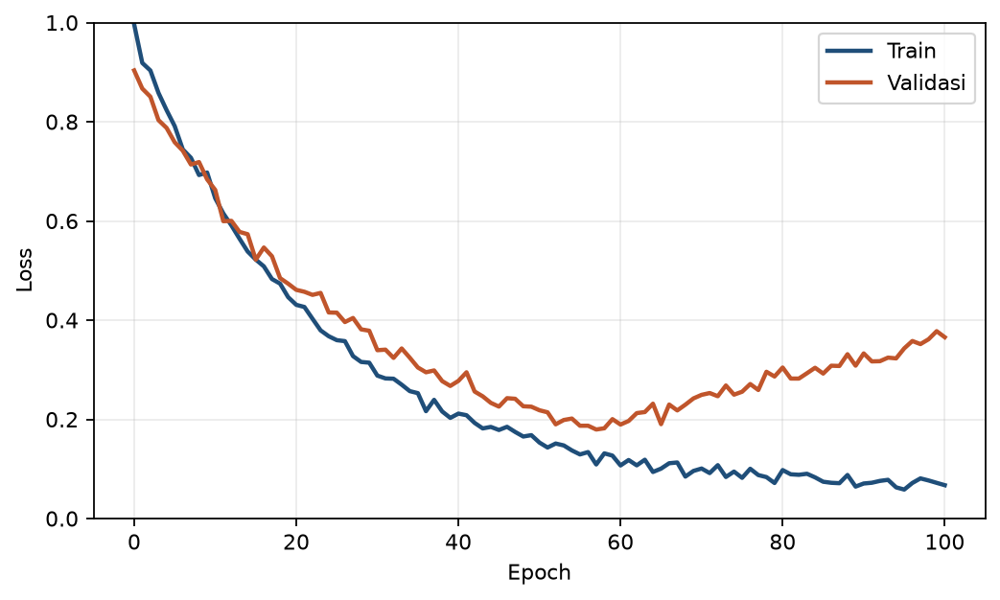

# Bab 5 - *Overfitting*, Regularisasi dan Evaluasi untuk Data Iklim

> **Prasyarat:** Bab 2 (regresi, MAE/MSE), Bab 3 (klasifikasi, metrik), Bab 4 (pelatihan, *learning curve*, *callback*). Bab 5 adalah "jembatan" antara kemampuan membangun model dan evaluasi yang jujur untuk operasional.

> **Catatan:** Materi bab ini adalah **materi pengenalan**, bukan hasil riset baru. Seluruh isi merupakan ringkasan ulang literatur *machine learning*, dengan contoh-contoh yang dekat dengan dunia meteorologi Indonesia.

## Tujuan Pembelajaran

Setelah menyelesaikan bab ini, Anda diharapkan mampu:

1. **Mendiagnosa** *underfit*/*overfit* melalui *learning curve* dan konsep *bias-variance*.
2. **Menerapkan** regularisasi (L2, *dropout*, *early stopping*) untuk mencegah *overfit*.
3. **Memilih** metrik operasional yang tepat (MAE/RMSE/R²/Willmott/KGE dan CSI/FAR/POD/TS) sesuai tujuan.
4. **Menerapkan** *cross-validation* deret waktu yang benar (*walk-forward*/blocked) dan mencegah *leakage*.

## 5.1 *Bias-Variance*: Dua Sumber Galat

Setiap model memiliki dua jenis galat struktural. Kerangka ini juga yang dipakai literatur verifikasi operasional, misalnya bagaimana WMO meninjau keandalan metrik perkiraan [1]. Rujukan standar verifikasi perkiraan adalah Jolliffe & Stephenson [2], dan untuk *deep learning* umum (termasuk aspek *bias-variance*) lihat Goodfellow et al. [3]:

- **Bias tinggi** - model terlalu sederhana, tidak menangkap pola data (*underfit*). Misal: memakai garis lurus untuk data yang jelas tidak linear.
- ***Varians* tinggi** - model terlalu sensitif pada data latih. Sedikit perubahan data mengubah prediksi secara signifikan (*overfit*). Misal: jaringan sangat besar yang "menghafal" *noise*.

Ini bukan dua "tipe" yang terpisah, melainkan ***trade-off***: saat kapasitas model naik, bias turun tetapi varian naik. Titik keseimbangan adalah di mana galat total (bias² + varian + *noise*) minimal, yang dicapai pada kondisi optimal antara *underfit* dan *overfit*.

Analoginya di meteorologi: peramal yang **selalu memakai rata-rata klimatologi** sebagai ramalannya punya **bias tinggi tetapi varian nol**. Ia tidak pernah meleset jauh, tetapi ramalannya juga tidak pernah tajam. Sebaliknya, peramal yang **menghafal pola tahun lalu dan mengulanginya begitu saja** tampak sangat akurat pada tahun yang dihafalnya, tetapi **variannya tinggi**: begitu kondisi berubah, ramalannya meleset drastis. Kita ingin peramal di tengah: mengikuti pola nyata, tetapi tidak menghafal kebetulan data. Perbandingan ringkas ketiga pola itu ada di Tabel 5.1.

**Tabel 5.1**: Perbandingan pola *underfit*, fit baik, dan *overfit*.

| Aspek           | Underfit                        | Fit baik     | Overfit                        |
| --------------- | ------------------------------- | ------------ | ------------------------------ |
| Penyebab umum   | Model/fitur/algoritma sederhana | Tuning tepat | Terlalu banyak parameter/epoch |
| Kapasitas model | Terlalu kecil                   | Cukup        | Terlalu besar                  |
| Train galat     | Tinggi                          | Rendah       | Sangat rendah (mendekati 0)    |
| Val/Test galat  | Tinggi                          | Rendah       | Naik kembali                   |

Ketika **model terlalu sederhana** sehingga belum mampu menangkap pola penting dalam data, galat pada data latih masih tinggi. Kondisi ini disebut ***underfit***.

Ketika **model memiliki kapasitas yang cukup** untuk mempelajari pola penting dalam data, galat pada data latih rendah dan galat pada data validasi/pengujian juga tetap rendah. Kondisi ini menunjukkan ***fit* yang baik**: model belajar dengan cukup baik tanpa kehilangan kemampuan untuk bekerja pada data yang belum pernah dilihat.

Sebaliknya, ketika **model terlalu kompleks** atau dilatih terlalu lama, model seakan "menghafal" data latih. Galat data latih menjadi rendah, tetapi galat data validasi/pengujian meningkat. Kondisi ini disebut ***overfit***. Model tidak hanya belajar pola yang berguna, tetapi juga detail data latih secara berlebihan hingga generalisasinya menurun.

## 5.2 Mendiagnosa via *Learning Curve*

Cara sederhana melihat *underfit*/*overfit*: **plot galat latih dan galat validasi** terhadap *epoch* (sudah dikenalkan Bab 4 §4.7):

- ***Underfit***: jika kedua kurva tinggi dan datar, artinya model tidak mampu belajar. Solusinya tingkatkan kapasitas atau gunakan fitur yang lebih baik, dan pastikan pelatihan sudah cukup lama (periksa *learning rate* serta jumlah *epoch*).
- ***Overfit***: ketika *train* terus turun, sedangkan *validation* naik setelah titik tertentu. Maka solusinya regularisasi (§5.3), lebih banyak data, lebih sedikit parameter dan *early stopping*.



**Gambar 5.1**: *Learning curve* klasik *overfit*.

Gambar 5.1 adalah pola *overfit* yang umum. Perhatikan titik di mana galat validasi mulai naik, karena itu pertanda model mulai menghafal.

Untuk **klasifikasi**, kurva yang sama bisa dipakai dengan *loss* (*cross-entropy*). Untuk regresi, gunakan MAE/MSE.

### Kapan *overfit* dikatakan buruk?

Overfitting dikatakan **buruk** ketika model kehilangan kemampuan generalisasinya terhadap data baru. Meskipun tidak ada ambang batas angka yang mutlak, berikut adalah indikator utamanya:

- **Tren *Validation Loss* yang Meningkat Konsisten.** Overfit mulai bermasalah jika *validation loss* (galat validasi) naik secara konsisten setelah mencapai titik minimumnya (bukan sekadar fluktuasi acak) sedangkan *training loss* terus menurun.
- **Kesenjangan Performa (*Generalization Gap*) yang Terlalu Lebar.** Jika galat *train* mendekati nol tetapi galat *validation* jauh lebih besar, ini adalah indikasi kuat bahwa model menghafal pola data latih, bukan mempelajari pola umum (walau *gap* besar juga bisa muncul dari pergeseran distribusi antara train dan validasi).
- **Kalah dari *Baseline* Sederhana (Lihat Bab 2).** Ini adalah indikator krusial: jika model yang *overfit* menghasilkan galat validasi yang lebih buruk (atau bahkan sama saja) dibandingkan *baseline* sederhana, maka kompleksitas model tersebut sia-sia. Model seperti ini **tidak berguna**, segera sederhanakan, beri regularisasi, atau tinggalkan.

**Kunci Utama:** Selalu evaluasi kinerja model berdasarkan **set validasi (dan *test set*)**, bukan *training set*. *Training error* yang sangat rendah sering kali menyesatkan para praktisi.

## 5.3 Regularisasi: Mencegah *Overfit*

Regularisasi adalah sekumpulan teknik yang memberikan batasan pada model agar tidak terlalu bebas "menghafal" data latih, sehingga model tetap mampu melakukan generalisasi pada data baru. Tiga teknik utama, ditambah satu teknik yang efek regularisasinya sampingan:

### 1. *Early stopping*

*Early stopping* memantau kinerja model pada data validasi dan menghentikan proses pelatihan ketika performa (*loss* atau metrik evaluasi) tidak membaik (lihat Subbab 4.6). Teknik ini merupakan pendekatan sederhana dan efisien, serta hampir selalu menjadi pertahanan pertama melawan *overfitting*.

**Kode 5.1 - *Early stopping* dengan restore best weights.**

```python
import tensorflow as tf

callbacks = [
    tf.keras.callbacks.EarlyStopping(
        monitor="val_loss", patience=15, restore_best_weights=True
    )
]
```

#### Memilih Parameter `patience`

Nilai `patience=15` pada **Kode 5.1** adalah titik awal (*starting point*) yang umum. Nilai optimal untuk parameter ini sangat bergantung pada tingkat derau (*noise*) dan fluktuasi pada kurva validasi Anda:

- **Data dengan Tingkat *Noise* Tinggi** (misal curah hujan): Fluktuasi lokal pada *validation loss* sering terjadi. Jika nilai `patience` terlalu kecil, pelatihan dapat terhenti prematur akibat fluktuasi acak, bukan karena model telah mencapai konvergensi sejati.
- **Data dengan *Loss* Halus (Dataset Besar / Sinyal Stabil):** Nilai `patience` yang terlalu besar hanya akan membuang waktu komputasi karena model terus melatih parameter meski tidak ada peningkatan performa yang berarti.

**Rekomendasi Praktis:** Mulailah dengan rentang `patience` antara **10 hingga 20**, amati grafik *loss* (*training dan validation*), lalu sesuaikan berdasarkan dinamika konvergensi model Anda.

### 2. Regularisasi L2 (*weight decay*)

Regularisasi L2 bekerja dengan cara menambahkan suku penalti ke dalam fungsi *loss* yang besarnya sebanding dengan kuadrat dari nilai bobot (*weights*):

$$
\mathcal{L}_{\text{total}} = \mathcal{L}_{\text{asal}} + \lambda \sum w^2 \tag{5.1}
$$

Di sini, hiperparameter $\lambda$ (*lambda*) mengontrol kekuatan penalti. Penalti ini "memaksa" model untuk menjaga nilai bobot tetap kecil, sehingga model tidak terlalu bergantung secara berlebihan pada satu atau beberapa fitur tertentu saja.

Pada framework Keras/TensorFlow, L2 dispesifikasikan langsung pada *layer*:

```python
tf.keras.layers.Dense(8, activation="relu", kernel_regularizer=tf.keras.regularizers.l2(1e-4))
```

#### Catatan untuk Pengembang lanjutan (*Advanced Note*)

Secara teoritis, istilah **"L2 *regularization*"** dan **"*weight decay*"** baru benar-benar identik secara matematis jika digunakan bersama *optimizer* **Stochastic Gradient Descent (SGD) vanila**.

Pada *optimizer* adaptif seperti **Adam**, menambahkan penalti L2 ke dalam fungsi *loss* tidak sama dengan *decoupled weight decay* (penalti yang diterapkan secara terpisah langsung pada pembaruan bobot, seperti pada algoritma **AdamW**). Pendekatan *decoupled weight decay* ini terbukti lebih stabil dalam melatih model-model *deep learning* modern.

Namun, untuk tingkat pemula hingga menengah pada latihan di bab ini, perbedaan nuansa ini belum krusial—penggunaan `kernel_regularizer` dengan `tf.keras.regularizers.l2` sudah sangat memadai dan bekerja dengan baik.

### 3. *Dropout*

Selama proses pelatihan (*training*), *dropout* mematikan (*deactivate*) sebagian unit neuron secara acak pada setiap iterasi dengan probabilitas tertentu (misalnya $20\% - 50\%$).

Teknik ini memaksa jaringan neural untuk tidak terlalu mengandalkan neuron tertentu atau kombinasi fitur yang spesifik (*co-adaptation*). Seolah-olah, jaringan dilatih menggunakan sub-model (*ensemble*) yang berbeda di setiap langkah pelatihan, sehingga menghasilkan model yang jauh lebih kokoh (*robust*). Saat tahap evaluasi atau prediksi (*inference*), seluruh neuron kembali diaktifkan. Implementasi modern seperti Keras/TensorFlow memakai *inverted dropout*, yaitu penskalaan aktivasi dilakukan **saat pelatihan** dengan membaginya dengan *keep probability*, sehingga saat *inference* tidak ada penyesuaian tambahan. *Dropout* klasik berbeda, ia menskalakan bobot dengan *keep probability* saat pengujian. Berikut contoh penerapan layer Dropout dengan rate 30%

```python
tf.keras.layers.Dropout(0.3)
```

Berikut adalah contoh penggabungan teknik regularisasi L2 dan *Dropout* ke dalam arsitektur model Sequential:

**Kode 5.2 - Contoh arsitektur dengan regularisasi (kernel regularizer L2 + *dropout*).**

```python
model = tf.keras.Sequential([
    tf.keras.layers.Dense(32, activation="relu",
                          kernel_regularizer=tf.keras.regularizers.l2(1e-4), input_shape=(n,)),
    tf.keras.layers.Dropout(0.3),
    tf.keras.layers.Dense(16, activation="relu",
                          kernel_regularizer=tf.keras.regularizers.l2(1e-4)),
    tf.keras.layers.Dropout(0.2),
    tf.keras.layers.Dense(1),
])
```

Kode 5.2 menunjukkan cara menggabungkan L2 dan *dropout* dalam satu arsitektur *Sequential*.

### 4. *Batch Normalization* (efek regularisasi sampingan)

*Batch Normalization* menormalkan luaran aktivasi di tiap *layer* selama pelatihan agar distribusi *input* antar-*layer* tetap stabil. Hal ini mempercepat serta menstabilkan konvergensi pelatihan. Perlu dicatat, *Batch Normalization* **bukan** teknik regularisasi utama seperti L2, *dropout*, atau *early stopping*. Efek regularisasinya hanya sampingan dan masih diperdebatkan. Efektivitas *Batch Normalization* umumnya terasa pada arsitektur jaringan dalam (*deep networks*), yang akan dibahas lebih detail pada **Bab 7**.

### Kapan Menggunakan Teknik yang Mana?

Pemilihan kombinasi regularisasi sangat bergantung pada diagnosis dinamika pelatihan model Anda:

- **Data Kecil dan *Overfitting* Ringan:** Gunakan kombinasi ***Early Stopping*** + **L2 ringan** ($\lambda \approx 10^{-4}$).
- *Overfitting* Menengah hingga Berat: Tambahkan *Dropout* (misalnya $0.2 - 0.5$) pada *layer-layer* awal/tengah.
- *Underfitting* (Model Gagal Mempelajari Pola): **Jangan tambahkan regularisasi.** Fokuskan pada peningkatan kapasitas model (menambah unit/layer) atau perbaiki rekayasa fitur (*feature engineering*).

**Aturan Penting:** Jangan pernah menambahkan regularisasi hanya karena model tampak berkinerja kurang baik tanpa menganalisis kurva pelatihan (*learning curves*). Menambahkan regularisasi pada model yang sedang mengalami *underfitting* justru akan memperburuk performanya.

### Bagaimana Regularisasi Bekerja secara Intuitif?

Ketiga teknik utama ini menyerang akar masalah yang sama yaitu **fleksibilitas model yang terlalu bebas dalam menyesuaikan diri terhadap data latih**, namun dari sudut pandang mekanis yang berbeda:

1. **L2 Regularization ("Menekan" Skala Bobot):**
  Dengan penalti pada bobot yang besar (Persamaan 5.1), L2 mengecilkan bobot ke arah nol sehingga mencegah satu bobot mendominasi. Model tidak lagi bertumpu pada satu fitur tertentu, membuatnya lebih tahan terhadap derau (*noise*) data input.
2. **Dropout ("Menciptakan Ansambel Sub-Jaringan"):**
  Dengan mematikan neuron secara acak selama pelatihan, *Dropout* mencegah timbulnya *co-adaptation* (kebergantungan berlebih antar-neuron). Secara intuitif, *Dropout* melatih "ansambel efektif" dari ribuan sub-jaringan acak secara simultan, sehingga tidak ada satu pun neuron yang menjadi titik tunggal kegagalan (*single point of failure*). Konsep fundamental ini diperkenalkan oleh Srivastava et al. (2014) [5].
3. **Early Stopping ("Membatasi Waktu Eksplorasi"):**
  *Early stopping* membatasi durasi atau iterasi pelatihan (*epoch*). Teknik ini menghentikan model tepat sebelum ia mulai "menghafal" detail-detail kecil yang sebenarnya *noise* data latih.

### Contoh sederhana efek L2

Bayangkan fitur kelembapan penting untuk hujan. Tanpa L2, model bisa memberi bobot besar pada kelembapan dan mengabaikan yang lain. Dengan L2, bobot besar "dikenai biaya" (penalti kuadrat) sehingga model mengecilkan bobot tersebut dan tidak bergantung berlebihan pada satu fitur. Efeknya, prediksi lebih stabil saat ada sedikit *noise* pada pengukuran kelembapan, yang relevan karena data lapangan selalu ber-*noise*.

### Memilih kekuatan regularisasi (lambda dan *dropout rate*)

- **L2 lambda**: mulai dari `1e-4`-`1e-3`. Terlalu kecil, tidak berefek. Namun jika terlalu besar, model menjadi "tumpul" (*underfit*). Lihat kurvanya.
- ***Dropout rate***: mulai dengan nilai `0.2-0.5` untuk lapisan tersembunyi. Terlalu tinggi maka model sulit belajar di data kecil. Pada data sangat kecil (di bawah ribuan sampel), mulai dengan nilai lebih rendah (mis. `0.1-0.2`).
- Aturan: ubah **satu per satu**, amati nilai validasi, seperti *tuning hyperparameter* di Bab 4.

### Perbandingan kode lengkap (Kode 5.2 dan 5.3 digunakan bersama)

Kode 5.1-5.2 menunjukkan pola. Dalam notebook `ch-05-04_metrik_walkforward.ipynb`, `build_model(reg=True, drop=0.3)` menggabungkan L2 + *dropout* dan dibandingkan dengan versi tanpa regularisasi pada *learning curve* serta metrik test. Latihan sebenarnya ada di §5.8.

## 5.4 Memilih Metrik Operasional yang Tepat

Bagian ini adalah yang membedakan buku ini dengan buku ML umum: **metrik yang benar untuk meteorologi** bergantung pada fenomena dan tujuan.

### Untuk regresi (besaran kontinu)

- **MAE (*Mean Absolute Error*):** Mengukur galat rata-rata dalam satuan yang sama dengan variabel asli. MAE lebih tahan terhadap pencilan (*outlier*) dibanding RMSE karena tidak mengkuadratkan galat. Namun, MAE tidak sepenuhnya kebal. Satu galat ekstrem bernilai 100 memberi kontribusi yang sama dengan 100 galat kecil bernilai 1.
- **RMSE (*Root Mean Squared Error*):** Menghitung akar dari rata-rata kuadrat galat, memberikan penalti lebih besar pada galat bernilai besar. Nilai RMSE selalu ≥ MAE. Selisih antara RMSE dan MAE mencerminkan seberapa dominan keberadaan galat ekstrem.
- **R²** (*Coefficient of Determination*): Mengukur proporsi varians yang dapat dijelaskan oleh model, didefinisikan sebagai `1 − SSE/SST`. Nilai R² bernilai negatif menandakan performa model lebih buruk daripada sekadar memprediksi nilai rata-rata data target. Nilai R² negatif pada data uji merupakan indikasi gagal total (*catastrophic failure*). Di luar rentang data pelatihan, R² umumnya turun tajam karena model belum pernah mempelajari rentang nilai tersebut.
- **Indeks Willmott (d):** Bernilai antara 0 hingga 1 dan lebih sesuai untuk data berskala (sering digunakan dalam hidrologi dan meteorologi). Versi asli merujuk pada Willmott (1981) [6], sedangkan versi modifikasinya dirumuskan oleh Willmott et al. (2012) [7]. Pastikan mencantumkan versi yang digunakan saat implementasi.
- **KGE (*Kling-Gupta Efficiency*):** Metrik ini dirumuskan melalui tiga komponen: korelasi ($r$), rasio bias ($\beta$), dan rasio variabilitas ($\gamma$), dengan nilai 1 menandakan hasil sempurna. Untuk model yang selalu memprediksi rata-rata klimatologis, rasio biasnya $\beta = 1$ dan rasio variabilitasnya $\gamma = 0$. Korelasi $r$ sebenarnya tak terdefinisi karena varians prediksi nol, tetapi dengan konvensi $r = 0$ diperoleh nilai $\text{KGE} = 1 - \sqrt{2} \approx -0,41$, bukan $0$ seperti yang sering keliru dipahami. Nilai di bawah tolok ukur (baseline) tersebut menandakan performa model lebih buruk daripada sekadar menggunakan rata-rata. Pemahaman konteks ini menjadikan rekomendasi pemilihan metrik pada Tabel 5.2 logis dan aplikatif. Metrik ini sangat populer dalam domain hidrologi dan dijelaskan secara terperinci oleh Gupta et al. (2009) [8].

Sebagai referensi dasar evaluasi dan praktik model pada umumnya, lihat [3]. Untuk verifikasi prediksi yang lebih mendalam, lihat Jolliffe dan Stephenson [2].

**Tabel 5.2**: Panduan memilih metrik regresi.

| Situasi / Tujuan Operasional                                        | Metrik yang Disarankan             | Interpretasi Ringkas (Satu Kalimat)                                                                                                              |
| ------------------------------------------------------------------- | ---------------------------------- | ------------------------------------------------------------------------------------------------------------------------------------------------ |
| Melaporkan galat kepada pengguna umum                               | MAE                                | Secara rata-rata, sejauh apa prediksi model meleset dari nilai sebenarnya dalam satuan asli?                                                     |
| Memberikan penalti pada galat besar atau ekstrem                    | RMSE                               | Seberapa besar kontribusi galat ekstrem terhadap total galat model?                                                                              |
| Menilai proporsi varians data yang dijelaskan model                 | R²                                 | Berapa persen variasi data target yang berhasil dijelaskan oleh model?                                                                           |
| Evaluasi data berskala dengan evaluasi pencilan                     | Indeks Willmott Modifikasi ($d_1$) | Seberapa dekat hasil prediksi dengan nilai aktual pada skala -1 hingga 1 (0 = tak lebih baik dari rata-rata), ramah terhadap pencilan (outlier)? |
| Evaluasi data hidrologi (gabungan korelasi, bias, dan variabilitas) | KGE                                | Seberapa baik model menangkap korelasi, rasio bias, dan variabilitas data secara simultan?                                                       |
| Standar pelaporan operasional meteorologi                           | MAE + RMSE (keduanya)              | Berapa besarnya galat rata-rata model (MAE), dan seberapa besar pengaruh galat ekstrem di dalamnya (RMSE)?                                       |

### Untuk klasifikasi / kejadian langka

Untuk klasifikasi atau kejadian langka, Bab 3 sudah mengenalkan metrik *precision*, *recall*, dan F1. Dalam verifikasi prediksi berbasis kejadian, WMO menggunakan metrik kategorikal seperti POD (*Probability of Detection*), FAR (*False Alarm Ratio*), dan CSI (*Critical Success Index*), yang dihitung dari *contingency table* [1].

- **POD (*probability of detection* / *recall*):** `TP/(TP+FN)`, menjawab pertanyaan "berapa banyak kejadian yang berhasil tertangkap?".
- **FAR (*false alarm ratio*):** `FP/(TP+FP)`, menjawab pertanyaan "dari seluruh peringatan yang diumumkan, berapa yang ternyata meleset?".
- **CSI (*critical success index*):** `TP/(TP+FP+FN)`, yaitu skor sukses yang menghukum kejadian luput (*miss*) maupun *false alarm*.
- **TS (*threat score*):** Memiliki formulasi dan makna yang sama dengan CSI.

Rangkuman metrik verifikasi operasional standar WMO ini disajikan pada Tabel 5.3.

**Tabel 5.3:** Kuartet verifikasi klasik WMO.

| Metrik           | Formula               | Pertanyaan Utama                                             | Target             |
| ---------------- | --------------------- | ------------------------------------------------------------ | ------------------ |
| **POD**          | TP / (TP + FN)        | Berapa kejadian yang tertangkap?                             | Tinggi (ke arah 1) |
| **FAR**          | FP / (TP + FP)        | Seberapa banyak *false alarm*?                               | Rendah (ke arah 0) |
| **CSI / TS**     | TP / (TP + FP + FN)   | Berapa skor sukses keseluruhan?                              | Tinggi (ke arah 1) |
| ***Bias Score*** | (TP + FP) / (TP + FN) | Apakah model terlalu sering atau terlalu jarang memprediksi? | Ideal (≈1)         |

Pedoman resmi: WMO *Guidelines on the Verification of Operational Forecasts* [1].

Sebagaimana terlihat pada Tabel 5.3, *bias score* digunakan untuk mengukur kecenderungan frekuensi prediksi model. Nilai *bias score* > 1 menunjukkan kondisi *over-forecast*, yaitu model terlalu sering mengumumkan kejadian sehingga berisiko menghasilkan banyak peringatan kosong. Sebaliknya, nilai < 1 menunjukkan kondisi *under-forecast*, yaitu model terlalu jarang memprediksi kejadian sehingga berisiko melewatkan kejadian penting.

Perlu diingat bahwa *bias score* hanya menghitung kecenderungan kuantitas, bukan ketepatan posisi kejadian dalam ruang atau waktu. Dua model dengan *bias score* yang identik bisa memiliki kualitas prediksi yang sangat berbeda. Oleh karena itu, *bias score* selalu dianalisis bersamaan dengan POD, FAR, dan CSI, bukan berdiri sendiri [1].

Metrik-metrik ini sangat krusial karena data kejadian langka (seperti hujan lebat, gelombang tinggi, atau badai) membuat metrik akurasi (*accuracy*) menjadi menyesatkan (lihat Bab 3). Penggunaan CSI, POD, dan FAR memberikan gambaran yang jujur mengenai nilai operasional model, tidak sekadar mengukur persentase kebenaran secara umum.

### Numerik Singkat: Beda Cerita Antar Metrik

Untuk memahami implikasi praktis setiap metrik, tinjau kasus simulasi sederhana berikut. Dari total 100 hari observasi, terdapat 10 hari kejadian hujan deras (*true condition* positif). Bandingkan kinerja dua model yang berbeda, yaitu Model A dan Model B.

Perbandingan detail kinerja dan metrik verifikasi kedua model tersebut disajikan pada Tabel 5.4 [1].

**Tabel 5.4:** Perbandingan metrik verifikasi dua model pada kasus kejadian langka [1].

| Metrik / Komponen              | Model A | Model B | Keterangan / Formula                               |
| ------------------------------ | ------- | ------- | -------------------------------------------------- |
| True Positive (TP)             | 8       | 3       | Kejadian hujan deras yang berhasil diprediksi      |
| False Positive (FP)            | 2       | 0       | Peringatan hujan deras yang ternyata tidak terjadi |
| False Negative (FN)            | 2       | 7       | Kejadian hujan deras yang terlewatkan (*miss*)     |
| True Negative (TN)             | 88      | 90      | Hari tanpa hujan deras yang diprediksi tepat       |
| Akurasi (*Accuracy*)           | 96%     | 93%     | (TP + TN) / Total                                  |
| POD (*Recall*)                 | 0,80    | 0,30    | TP / (TP + FN)                                     |
| FAR (*False Alarm Ratio*)      | 0,20    | 0,00    | FP / (TP + FP)                                     |
| CSI (*Critical Success Index*) | 0,67    | 0,30    | TP / (TP + FP + FN)                                |

Tabel 5.4 memperlihatkan fenomena penting: nilai akurasi yang sangat tinggi (96% dan 93%) memberikan ilusi bahwa kedua model sama-sama sangat baik. Namun, metrik operasional menampilkan kondisi jauh berbeda.

Model A memiliki akurasi 96% dan POD 0,80, yang menunjukkan bahwa tingkat tangkapan kejadiannya cukup tinggi, meskipun terdapat 20% peringatan kosong (*false alarm* / FAR). Sebaliknya, Model B tidak pernah memberikan peringatan palsu sama sekali (FAR 0,00), tetapi melewatkan 7 dari 10 kejadian hujan deras (POD 0,30).

Metrik CSI mengungkap performa riil kedua model: Model A jauh lebih unggul dalam menangkap ancaman secara keseluruhan (CSI 0,67 dibanding 0,30). Keputusan memilih model yang digunakan bergantung pada tujuan operasional [1]:

- **Fokus Peringatan Dini / Keselamatan Jiwa:** Model A lebih diterima karena mengutamakan minimnya kejadian yang terlewat (*miss*).
- **Fokus Efisiensi Biaya (Biaya Evakuasi Tinggi):** Model B mungkin dipilih jika dampak ekonomi dari *false alarm* sangat merugikan.

Kasus ini mempertegas alasan mengapa kita tidak boleh berhenti hanya pada metrik akurasi saat mengevaluasi model untuk kejadian langka [1].

## 5.5 *Cross-Validation* untuk Deret Waktu: *Walk-Forward*

*Cross-validation* untuk data **independen identik** memakai *k-fold* acak. Data **deret waktu** tidak independen. Nilai berdekatan berkorelasi, dan penggunaan masa depan saat latih berarti kebocoran data (*leakage*) (Bab 2 §2.7).

Ketergantungan antar-waktu ini disebut **autokorelasi**, yaitu korelasi antara sebuah deret dengan versi dirinya yang bergeser beberapa langkah waktu (*lag*). Suhu hari ini cenderung mirip suhu kemarin, dan curah hujan bulan ini cenderung mirip bulan lalu, sehingga nilai yang berdekatan waktu tidak sepenuhnya membawa informasi baru. Autokorelasi inilah yang membuat evaluasi pada data waktu mudah "menyontek" bila pembagian data tidak mengikuti waktu.

Solusinya: ***walk-forward* validation** (juga disebut *forward chaining*), yang mensimulasikan penggunaan operasional:

1. Mulai dengan *windows* latih di awal deret.
2. Prediksi *window* berikutnya (untuk validasi).
3. Geser batas latih maju, lalu ulangi.

**Tabel 5.5**: Skema *walk-forward* (ilustrasi 5 fold, horizon = 20 langkah).

| Fold | Train   | Validate  |
| ---- | ------- | --------- |
| 1    | t1-t100 | t101-t120 |
| 2    | t1-t120 | t121-t140 |
| 3    | t1-t140 | t141-t160 |
| 4    | t1-t160 | t161-t180 |
| 5    | t1-t180 | t181-t200 |

Pada Tabel 5.5, latih selalu **hanya masa lalu**, sedangkan validasi selalu **di depan** batas latih. Ini mereplikasi kondisi nyata: saat model dipakai, ia hanya tahu data hingga hari ini.

Tergantung bagaimana *window* latih bergerak, ada dua varian *walk-forward*:

- ***Expanding window*** - *window* latih **tumbuh** tiap fold. Fold 1 melatih t1-t100, fold 2 t1-t120, fold 3 t1-t140, dan seterusnya. Batas kiri latih tetap di t1, hanya batas kanan yang bergeser maju. Tabel 5.5 memakai varian ini.
- ***Sliding window*** - *window* latih **bergeser** dengan lebar tetap. Fold 1 melatih t1-t100, fold 2 t21-t120, fold 3 t41-t140, dan seterusnya. Batas kiri dan batas kanan sama-sama bergeser maju. Kode 5.3 memakai varian ini.

*Expanding window* memakai semua data sejarah dan cocok untuk deret dengan tren jangka panjang, tetapi mulai berat saat deret sangat panjang. *Sliding window* lebih cocok ketika perilaku lama tidak lagi relevan karena distribusi berubah seiring waktu. Pilih sesuai karakter data Anda, dan sebutkan pilihan itu saat melaporkan hasil.

Bab 2 §2.7 sudah memperkenalkan versi sederhana dari gagasan ini: *split* 70/15/15 yang **berurutan waktu**. Hubungan keduanya sederhana: *split* tiga bagian itu setara dengan *walk-forward* **satu fold**, ditambah satu blok terakhir yang disimpan sebagai *test*. *Walk-forward* hanya mengulang *split* yang sama **beberapa kali** di sepanjang deret. Karena itu keduanya dipakai bersama, bukan dipilih salah satu: `test` tetap blok terakhir yang **dibuka sekali** setelah semua keputusan selesai, sedangkan bagian latih + validasi dipotong menjadi beberapa fold *walk-forward*, sehingga angka validasi tidak bergantung pada satu batas yang kebetulan dipilih.

**Kode 5.3 - Contoh *walk-forward* sederhana (pseudo, lengkap di notebook).**

```python
horizon = 20
results = []
for start in range(0, len(X) - horizon, 20):
    i_end = start + 100          # contoh: latih 100 langkah dari posisi awal
    Xtr_fold, ytr_fold = X[start:i_end], y[start:i_end]
    Xva_fold, yva_fold = X[i_end:i_end+horizon], y[i_end:i_end+horizon]
    model = build_model()        # model baru tiap fold (jujur)
    model.fit(Xtr_fold, ytr_fold, epochs=60, batch_size=32, verbose=0)
    results.append(mae(yva_fold, model.predict(Xva_fold, verbose=0)))
print("Rata-rata MAE walk-forward:", round(sum(results)/len(results), 4))
```

Penting pada Kode 5.3: **latih model baru di tiap fold**. Jika Anda melatih sekali lalu memprediksi semua fold, informasi masa depan bocor.

### Kenapa bukan "*k-fold* acak" untuk data meteorologi?

Umumnya data meteorologi menunjukkan **autokorelasi** (lihat definisinya di awal §5.5). *K-fold* acak menempatkan sampel yang berdekatan waktu di *train* dan tes, sehingga sampel tes masih membawa informasi dari sampel latih dan evaluasi "menyontek" lewat **kebocoran informasi akibat autokorelasi**. Studi kasus Bab 8-9 akan memperlihatkan betapa besar perbedaannya: model yang tampak unggul pada *k-fold* acak bisa gagal total pada *walk-forward*, tepat menggambarkan perilaku yang akan dialami di produksi.

### *k-fold* (blocked) sebagai alternatif

Jika dataset panjang dan Anda butuh lebih banyak fold, gunakan **blocked/rolling *k-fold***: bagi deret menjadi blok berurutan, lalu untuk tiap fold latih blok-blok sebelum fold validasi tersebut tanpa melihat masa depan. Ini adalah **varian** *walk-forward* dengan jumlah fold tetap. Intinya tetap sama: **validasi selalu mengikuti waktu**, bukan kebalikannya.

### Kapan *k-fold* acak masih dapat digunakan?

*k-fold* acak dapat dipakai ketika urutan baris data tidak penting, sehingga baris-barisnya boleh diacak. Syarat ini umumnya dipenuhi oleh data ***i.i.d.*** (*independent and identically distributed*, yaitu tiap sampel saling bebas dan berasal dari distribusi yang sama). Analoginya seperti melempar dadu yang sama berkali-kali: hasil lemparan sebelumnya tidak mengubah peluang lemparan berikutnya.

Data cuaca umumnya tidak *i.i.d.* karena berkorelasi dalam waktu (hari ini mirip kemarin) dan dalam ruang (lokasi berdekatan saling memengaruhi). Untuk **prediksi ke depan** pada deret waktu stasiun, pasang surut, atau hujan, gunakan *walk-forward*/*blocked*. Skema ini menilai model pada periode setelah data latih, sehingga hasilnya menggambarkan kemampuan memprediksi waktu berikutnya. Aturan ini akan diterapkan secara ketat di Bab 8-9.

### Galat umum saat *walk-forward*

1. **Berbagi *preprocessing* statistik antar fold**. Jika Anda menghitung normalisasi (min/max/z-score) dari seluruh data sebelum membagi fold, data masa depan "bocor" ke data latih. Solusi: hitung statistik **hanya dari fold latih**, lalu terapkan ke validasi-fold (Bab 6 memperdalam).
2. **Memakai model yang di-fit sekali untuk semua fold**. Setiap fold harus punya model sendiri yang dilatih hanya dengan data sebelum fold tersebut (Kode 5.3).
3. **Menghitung metrik pada campuran semua fold**. Laporkan per-fold atau rata-rata. Jangan mengumpulkan prediksi semua fold menjadi satu set (karena fold awal dan akhir tidak sebanding).

## 5.6 Menerapkan Evaluasi: Alur Lengkap

Bab ini ditutup dengan urutan langkah evaluasi yang jujur. Ikuti urutannya, karena tiap langkah bergantung pada langkah sebelumnya.

1. **Pisahkan data lebih dulu** (Bab 2). Bagi data menurut waktu menjadi tiga bagian: data *train*, validasi, dan *test* untuk penilaian akhir.
2. **Ukur pembanding sederhana** (Bab 1-2). Hitung dulu *baseline* seperti *persistence*, rata-rata klimatologi, atau regresi linear. Tanpa pembanding, angka metrik tidak bermakna.
3. **Latih sambil mengamati** (Bab 4). Pantau *learning curve* dan hentikan pelatihan (*early stopping*) saat kinerja validasi berhenti membaik.
4. **Diagnosis kondisi model** (Bab 5). Jika *overfit*, tambahkan regularisasi. Jika *underfit*, tambah kapasitas atau perbaiki fitur.
5. **Hitung metrik yang sesuai** (Bab 5). Untuk regresi: MAE, RMSE, R², KGE, atau Willmott. Untuk kejadian: POD, FAR, dan CSI beserta *threshold*.
6. **Uji ketahanan seiring waktu** (Bab 5). Gunakan *walk-forward* agar angka tidak bergantung pada satu potongan waktu saja.
7. **Tulis laporan** (Bab 10). Sebutkan angka, satuan, *threshold*, pembanding, dan keterbatasan hasil.

Langkah 5 dan 6 adalah syarat sebelum Anda mengambil kesimpulan. Jangan pernah melaporkan angka seperti "akurat 97%" tanpa menyebut metrik yang sesuai konteks. Untuk data iklim, KGE atau CSI lebih bermakna daripada akurasi semata.

### Analisis residu: melihat di mana model gagal

Residu adalah selisih antara nilai aktual dan prediksi, menunjukkan di mana dan seberapa besar model meleset. Tiga pemeriksaan sederhana berikut sering digunakan.

- **Residu terhadap waktu.** Apakah ada bulan atau musim yang selalu meleset? Misalnya, model lemah pada puncak musim hujan. Residu yang berpola mengikuti musim menandakan model belum menangkap pola musiman. Tambahkan fitur musiman (bulan, hari dalam tahun) atau fitur interaksi.
- **Residu terhadap fitur penting.** Apakah galat membesar ketika kelembapan sangat tinggi? Residu yang membesar pada nilai fitur tertentu menandakan hubungan non-linear. Coba transformasi target atau fitur interaksi.
- **Sebaran residu.** Jika residu condong kuat ke satu sisi (*skew*), model cenderung bias. Misalnya, selalu memprediksi terlalu rendah pada hujan besar. Jika pola sistematis masih terlihat, berarti masih ada struktur yang belum dipelajari model.

Analisis residu hampir selalu memberi ide perbaikan, misalnya fitur baru, transformasi target seperti `log(y+1)` untuk hujan, atau *threshold* yang lebih sesuai. Inilah "analisis galat" yang disebut di Bab 4 dan menjadi keterampilan penting bagi praktisi model cuaca.

### Kapan sebuah model layak dipakai?

Tidak ada satu angka ajaib yang menentukan. Sebelum dipakai, uji model dengan tiga syarat berikut.

1. **Layak secara teknis.** Metrik sesuai tujuan dan lebih baik daripada *baseline* pada *walk-forward*.
2. **Layak secara operasional.** Metrik memenuhi tolok ukur layanan. Contohnya, toleransi pasang ±0.10 m, atau CSI ≥ 0.4 untuk peringatan dini.
3. **Layak secara praktis.** Model dapat dipelihara, yaitu datanya tersedia, *retraining* dapat dijadwalkan, dan hasilnya cukup bisa dijelaskan kepada pengguna (Bab 10).

WMO tidak menetapkan durasi uji yang baku, tetapi menekankan bahwa periode verifikasi harus cukup panjang dan mewakili berbagai kondisi [1]. Dalam praktik lembaga, model baru dijalankan berdampingan dengan model lama (*parallel run*) sebelum menggantikan, dan pengujiannya biasanya mencakup minimal satu siklus musiman penuh, misalnya sekitar satu tahun. Setelah model dipakai, verifikasi tetap dilakukan secara berkala. Karena itu, kelayakan model bukan hasil satu kali uji, melainkan penilaian yang berkelanjutan.

Model baru layak diusulkan untuk produksi jika ketiga syarat terpenuhi. Bab 8-9 akan menguji ketiganya pada kasus nyata.

### Memilih rangkaian eksperimen yang efisien

Perbaikan dicari melalui percobaan. Agar jawaban tiap percobaan jelas, ikuti aturan berikut.

- **Satu perubahan per eksperimen.** Ubah satu hal saja, misalnya *dropout*, lalu bandingkan. Setelah itu baru ubah hal lain, misalnya L2. Jika banyak hal diubah sekaligus, Anda tidak akan tahu mana yang berpengaruh.
- **Tentukan satu metrik keputusan.** Misalnya MAE validasi untuk regresi, atau CSI pada periode validasi untuk kejadian. Gunakan metrik yang sama di semua percobaan.
- **Catat hasil dalam tabel.** Isi kolom konfigurasi, metrik latih dan validasi, serta parameter. Tabel ini menjadi catatan keputusan yang berguna saat menyusun laporan (Bab 10).
- **Gunakan *seed* tetap** (Bab 1) agar perbedaan antar percobaan berasal dari hal yang diuji, bukan dari keacakan.

Catatan bisa dimulai sesederhana menyalin keluaran notebook ke satu lembar. Kebiasaan ini menghemat banyak waktu di Bab 8-9, ketika studi kasus memerlukan banyak percobaan.

## 5.7 Membaca Metrik Secara Kritis

Satu angka metrik belum cukup untuk menilai model. Sebelum melaporkan, ajukan lima pertanyaan berikut.

1. **Apa satuannya, dan apa konteksnya?** MAE 0.05 m untuk pasang surut itu baik atau buruk? Bandingkan dengan toleransi operasional, misalnya ±0.10 m.
2. **Bagaimana dibandingkan *baseline*?** Metrik baru bermakna jika dibandingkan dengan *persistence* atau klimatologi.
3. **Metrik apa yang diukur?** Untuk fenomena langka, akurasi menyesatkan. Gunakan CSI, POD, dan FAR. Untuk regresi, gunakan KGE, MAE, atau RMSE sesuai tujuan.
4. **Apakah angkanya stabil?** Satu kali pengujian bisa beruntung. Coba beberapa *seed* atau *walk-forward* untuk melihat sebarannya.
5. **Dengan *threshold* berapa?** POD dan FAR bergantung pada *threshold*, maka selalu sebutkan *threshold* yang dipakai.

Kebiasaan ini, bukan sekadar angka akurasi yang tinggi, yang membuat laporan dapat dipercaya di dunia operasional meteorologi.

### FAQ singkat

**Kapan KGE lebih baik daripada R²?** KGE cocok bila Anda peduli pada bias dan skala, seperti pada hidrologi dan peramalan. KGE memisahkan tiga hal: korelasi, bias, dan variabilitas. R² (1 − SSE/SST) sebenarnya peka terhadap bias, sehingga model dengan bias besar justru ber-R² rendah. Metrik yang hanya mengukur pola dan kebal terhadap bias atau skala adalah r² (kuadrat korelasi Pearson). Karena itu R² dan r² perlu dibedakan.

**Apakah *dropout* membuat model selalu lebih baik?** Tidak. *Dropout* menambah regularisasi, berguna untuk *overfit*, tetapi bisa memperburuk *underfit*. Terapkan sesuai diagnosis.

**Apakah *walk-forward* yang lebih lambat itu wajib?** Untuk klaim evaluasi pada data iklim, ya. Prosesnya bisa dipercepat dengan model kecil atau subset data, tetapi kejujuran hasil tidak bisa dikompromi.

**Apa beda CSI dan TS?** Keduanya merujuk rumus yang sama. TS (*threat score*) adalah nama lama untuk CSI.

**Mengapa metrik "nilai rata-rata" tidak cukup?** Rata-rata menyembunyikan sebaran galat. MAE 2 mm bisa berarti "selalu meleset 2 mm", atau "hampir tepat, kecuali beberapa hari ekstrem". Bila sebaran itu penting, laporkan juga kuantil atau plot galat.

**Apakah saya perlu melaporkan semua metrik?** Tidak. Pilih yang informatif untuk tujuan Anda (Tabel 5.2), lalu sertakan *baseline* dan *threshold*. Lebih baik sedikit angka yang bermakna daripada banyak angka yang membingungkan.

## 5.8 Latihan

**Soal konsep**

1. Jelaskan bias-variance *trade-off* dengan analogi meteorologi.
2. Bagaimana *learning curve* membantu memutuskan apakah menambah *dropout* atau mengurangi kapasitas?
3. Mengapa RMSE ≥ MAE selalu? Apa implikasi untuk data hujan ekstrem?
4. Kapan sebaiknya menggunakan R² dan kapan KGE? Jelaskan kelemahan R² pada data di luar *range* pelatihan.

**Latihan praktik (notebook `ch-05-04_metrik_walkforward.ipynb`)**

1. Ambil model klasifikasi Bab 3, lalu evaluasi dengan POD/FAR/CSI di beberapa *threshold*. Buat tabel ringkasnya.
2. Bangun model regresi Bab 2, lalu hitung MAE, RMSE, R², Willmott d, dan KGE (gunakan fungsi sederhana). Diskusikan perbedaan cerita tiap metrik.
3. Terapkan regularisasi (L2 + *dropout*) pada model yang *overfit*, lalu bandingkan *learning curve* sebelum/sesudah.
4. Terapkan *walk-forward* (fold) pada data pasang surut Bab 2 dan bandingkan MAE rata-rata dengan *split* tunggal.
5. (Proyek mini) Tulis fungsi evaluasi yang dapat dipakai ulang, dengan masukan `y_true` dan `y_pred`, lalu menghasilkan MAE, RMSE, R², dan KGE atau POD, FAR, dan CSI. Simpan fungsi ini untuk Bab 8-9.

## Ringkasan

- *Overfit* berarti varian tinggi karena menghafal data latih. *Underfit* berarti bias tinggi karena model terlalu sederhana. Keduanya saling *trade-off*.
- *Learning curve* adalah alat diagnosis utama. Jika galat latih terus turun tetapi galat validasi naik, model *overfit*. Jika keduanya tinggi dan datar, model *underfit*.
- Regularisasi diberikan sesuai diagnosis: *early stopping* (kapan berhenti), L2 (mengecilkan bobot, Persamaan 5.1), dan *dropout* (melatih "ansambel" neuron acak). Jangan ditambahkan sembarangan.
- Metrik regresi: MAE (galat khas), RMSE (menekankan galat ekstrem), R² (pola), Willmott (skala yang ramah), KGE (korelasi, bias, dan variabilitas).
- Metrik kejadian langka: POD (kejadian tertangkap), FAR (alarm palsu), dan CSI/TS (skor sukses). Akurasi biasa menyesatkan.
- *Cross-validation* deret waktu memakai *walk-forward* atau *blocked*, bukan *k-fold* acak. Validasi selalu berada setelah data latih, dan *preprocessing* dihitung per fold agar tidak bocor.
- Evaluasi yang jujur mencakup metrik, satuan, *threshold*, *baseline*, *walk-forward*, dan analisis residu.

## References

1. World Meteorological Organization, "WMO guidelines on the verification of operational forecasts," WMO, Geneva, Switzerland, 2018.
2. I. T. Jolliffe and D. B. Stephenson, *Forecast Verification: A Practitioner's Guide in Atmospheric Science*, 2nd ed. Chichester, UK: Wiley, 2011, doi: 10.1002/9781119960003.
3. I. Goodfellow, Y. Bengio, and A. Courville, *Deep Learning*. Cambridge, MA, USA: MIT Press, 2016. ISBN: 978-0-262-03561-3.
4. I. Loshchilov and F. Hutter, "Decoupled weight decay regularization," in *Proc. Int. Conf. on Learning Representations (ICLR)*, 2019. [Online]. Available: [https://arxiv.org/abs/1711.05101](https://arxiv.org/abs/1711.05101) (diakses: September 2026).
5. N. Srivastava, G. Hinton, A. Krizhevsky, I. Sutskever, and R. Salakhutdinov, "Dropout: A simple way to prevent neural networks from overfitting," *J. Mach. Learn. Res.*, vol. 15, no. 1, pp. 1929-1958, 2014.
6. C. J. Willmott, "On the validation of models," *Phys. Geogr.*, vol. 2, no. 2, pp. 184-194, 1981.
7. C. J. Willmott, S. M. Robeson, and K. Matsuura, "A refined index of model performance," *Int. J. Climatol.*, vol. 32, no. 13, pp. 2088-2094, 2012, doi: 10.1002/joc.2419.
8. H. V. Gupta, H. Kling, K. K. Yilmaz, and G. F. Martinez, "Decomposition of the mean squared error and NSE performance criteria: Implications for improving hydrological modelling," *J. Hydrol.*, vol. 377, no. 1-2, pp. 80-91, 2009, doi: 10.1016/j.jhydrol.2009.08.003.
