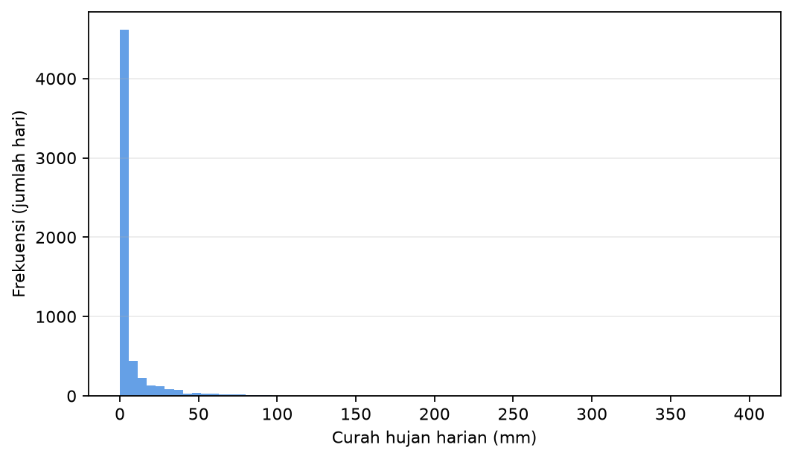

# Bab 6 - Data Meteorologi: Sumber, Kualitas dan Persiapan

> **Prasyarat:** Bab 1 (lingkungan Colab), Bab 2 (split berbasis waktu, MAE/MSE), Bab 5 (walk-forward, anti-*leakage*). Bab ini bersifat praktis: banyak kode, sedikit teori.

> **Catatan:** Materi bab ini adalah **materi pengenalan**, bukan hasil riset baru. Seluruh isi merupakan ringkasan ulang literatur *machine learning*, dengan contoh-contoh yang dekat dengan dunia meteorologi Indonesia.

## Tujuan Pembelajaran

Setelah menyelesaikan bab ini, Anda diharapkan mampu:

1. **Mengambil dan menghubungkan** data meteorologi Indonesia (stasiun dan grid terbuka, *reanalysis* ERA5, pasang surut, satelit) beserta lisensi dan batasannya.
2. **Membaca** format berkas CSV, NetCDF, dan GRIB, menyeragamkan satuan dan zona waktu, serta menangani nilai hilang, pencilan, dan imputasi dasar.
3. **Melakukan eksplorasi** (dekomposisi musiman, distribusi, korelasi silang) dan *feature engineering* (deret tunda, indikator musiman, ENSO/MJO).
4. **Menerapkan** normalisasi (dipasang hanya pada data latih) dan split berbasis waktu yang mencegah *leakage*.

## 6.1 Mengapa Data Menentukan Segalanya

Bab 2-5 membangun model, sedangkan bab ini kembali ke fondasi: **data**. Di meteorologi, ungkapan *garbage in, garbage out* terasa nyata: model terbaik pun tidak berguna jika masukannya salah. Bab data sengaja diletakkan setelah Bab 2 dan 5, agar alasan data harus bersih (konsep *leakage*, split waktu, metrik evaluasi) menjadi konkret. Tiga kenyataan yang perlu dipahami sejak awal:

1. **Data meteorologi tidak selalu bersih.** Sensor rusak, nilai hilang, stasiun pindah lokasi, dan pencilan (ingat distribusi hujan yang berekor panjang di Bab 2 dan 5) adalah hal biasa.
2. **Data adalah deret waktu.** Urutan waktu bermakna, karena itu kita tidak boleh mengacak, memotong sembarangan, atau membiarkan informasi masa depan "bocor" ke masa lalu (Bab 2 §2.7, Bab 5 §5.5).
3. **Sumber data punya aturan.** Lisensi, batasan penggunaan, dan cara kutip berbeda antar lembaga. Memahami aturan ini adalah bagian dari etika riset (Kriteria Sitasi, bagian 3).

Bab ini memberi peta sumber data dan keterampilan mengubahnya menjadi *dataset* siap dilatih untuk Bab 7-9.

### Alur pengolahan data

Bab ini disusun sebagai satu alur tujuh tahap, mulai dari memilih sumber data sampai mencatat metadata yang membuat hasil dapat direproduksi. Tabel 6.1 merangkum ketujuh tahap itu (bagian, yang dilakukan, luaran, dan kode yang dipakai) agar mudah diacu kembali.

**Tabel 6.1**: Pipeline data dari berkas mentah ke *dataset* siap dilatih (digunakan kembali di Bab 8-9).

| Tahap                    | Bagian | Yang dilakukan                                                                           | Luaran                  | Rujukan              |
| ------------------------ | ------ | ---------------------------------------------------------------------------------------- | ----------------------- | -------------------- |
| 1. Sumber data           | §6.2   | Pilih sumber (GHCN-Daily, BMKG, ERA5/ERA5-Land, pasut, GSMaP, CHIRPS) beserta lisensinya | Daftar sumber + lisensi | §6.2                 |
| 2. Baca & gabung         | §6.3   | Baca CSV/NetCDF/GRIB, resample, satukan menjadi satu tabel                               | Tabel berindeks waktu   | Kode 6.1-6.3         |
| 3. QC & imputasi         | §6.4   | Tangani nilai hilang, pencilan, konsistensi, dan indeks waktu                            | Tabel bersih            | Kode 6.4             |
| 4. Eksplorasi            | §6.5   | Lihat distribusi, dekomposisi musiman, korelasi silang                                   | Pemahaman pola          | Gambar 6.1, Kode 6.5 |
| 5. *Feature engineering* | §6.6   | Bangun lag, musiman sinusoidal, dan indeks ENSO/MJO                                      | Matriks fitur X         | Kode 6.6             |
| 6. *Preprocessing*       | §6.7   | Normalisasi/standardisasi (skala latih), transformasi log1p, split kronologis            | X/y siap dilatih        | Kode 6.7-6.8         |
| 7. Metadata              | §6.9   | Catat sumber, versi, transformasi, dan hash berkas                                       | Jejak data              | —                    |

Jika suatu bagian terasa abstrak, langsung ke "Studi mini" di §6.7 yang merangkai semuanya.

## 6.2 Sumber Data Meteorologi Indonesia

Bagian ini merangkum sumber data untuk studi meteorologi Indonesia, semuanya dapat diakses terbuka (gratis, atau gratis dengan pendaftaran). Sumber dipilih karena praktis dan terpelihara, bukan karena lengkap. Perannya berbeda: observasi dapat menjadi *target*, sedangkan *reanalysis* dan estimasi satelit umumnya menjadi fitur. Lisensi dan batas akses dicatat karena tiap penyedia punya aturan berbeda.

### Jenis sumber

Setiap sumber di bawah ini diberi label jenisnya, agar terlihat mana yang berupa pengukuran langsung dan mana yang berupa taksiran model. Lima label yang dipakai:

- **Observasi *in-situ***: pengukuran langsung di lokasi (stasiun darat atau stasiun pasut). Akurat di titiknya, tetapi tidak merata secara spasial dan bisa memiliki gap.
- ***Reanalysis*** (mis. ERA5): model cuaca (mis. IFS milik ECMWF) yang dijalankan ulang sepanjang sejarah sambil menyerap observasi lewat asimilasi data, sehingga konsisten ruang-waktu dan lengkap. Tetap taksiran model, bukan pengamatan langsung.
- **Estimasi satelit**: perkiraan dari penginderaan jauh, dikalibrasi sebagian dengan stasiun. Cakupan luas, tetapi bisa bias, terutama di pesisir dan pegunungan.
- **Prediksi**: keluaran model untuk waktu yang belum terjadi (mis. pasut). Dapat diuji terhadap observasi saat waktunya tiba.
- **Proyeksi iklim (skenario)**: simulasi bersyarat menurut skenario (mis. emisi), berskala dekade sampai abad. Bukan ramalan pasti dan tidak diverifikasi seperti prediksi.

### Sumber data yang dipakai di buku ini

- **BMKG (Data Online)** — observasi *in-situ*: data pengamatan stasiun BMKG (suhu, hujan, angin, kelembapan, dan unsur cuaca lain) dengan cakupan nasional, beresolusi bulanan (level 2). Akses: [dataonline.bmkg.go.id](https://dataonline.bmkg.go.id/), gratis dengan mendaftar akun. Untuk data yang lebih rapat (harian atau jam-an) atau jenis data lain, ajukan permohonan ke kantor BMKG melalui PTSP (`ptsp.bmkg.go.id`).
- **GHCN-Daily (NOAA)** — observasi *in-situ*: observasi suhu dan hujan harian per stasiun, termasuk stasiun Indonesia, dan terbuka tanpa pendaftaran. Akses: `ncei.noaa.gov/pub/data/ghcn/daily` [1]. Lisensi: domain publik AS; kutip Menne et al. [1]. Kualitasnya bervariasi (memiliki gap panjang, galat sensor, atau stasiun pindah lokasi), jadi periksa metadatanya sebelum dipakai.
- **ERA5 / ERA5-Land (Copernicus)** — *reanalysis*: estimasi suhu, hujan, dan angin per jam; resolusi 0.25° (≈31 km) untuk ERA5 dan 0.1° (≈9 km) untuk ERA5-Land. Untuk studi skala lokal (pertanian, hidrologi, wilayah kecil), ERA5-Land umumnya lebih cocok. Akses: Copernicus Climate Data Store [2]. Lisensi: terbuka (setara CC-BY); kutip Hersbach et al. [3]. Catatan: versi final tersedia dengan tunda sekitar 2-3 bulan (versi sementara ERA5T lebih cepat tetapi belum tervalidasi penuh), dan angka 31 km hanya berlaku di sekitar ekuator.
- **CMIP6** — proyeksi iklim (skenario): simulasi iklim masa depan menurut skenario emisi, resolusi lebih kasar, bulanan-harian. Akses: ESGF / Copernicus (`esgf-node.llnl.gov`). Dipakai untuk konteks jangka panjang; dibahas di Bab 10.
- **PSMSL / IOC** — observasi *in-situ*: muka laut dan pasang surut hasil pengukuran stasiun, dari data bulanan (PSMSL) sampai menit (IOC), per stasiun. Akses: `psmsl.org` [4], `ioc-sealevelmonitoring.org` [5]. Lisensi: gratis; data IOC non-komersial (CC BY-NC 4.0). Sertakan rujukan data dan kode stasiun.
- **BMKG (pasut)** — prediksi: prediksi pasang surut per stasiun (rentang 3 hari sampai 1 bulan) beserta unduhan deret waktunya. Akses: [maritim.bmkg.go.id/cuaca/pasut](https://maritim.bmkg.go.id/cuaca/pasut) [6]. Lisensi: gratis; atribusi BMKG.
- **GSMaP (JAXA)** — estimasi satelit: hujan satelit terkalibrasi, 0.1°, 3 jam hingga harian. Tersedia rilis *near-real-time* (GSMaP_NRT, tunda sekitar 4 jam) dan *reanalysis* (GSMaP_RI, jauh lebih lama). Akses: `sharaku.eorc.jaxa.jp` [7]. Kutip paper pembuat [7].
- **CHIRPS (CHC UCSB)** — estimasi satelit: hujan satelit terkalibrasi, 0.05° (≈5 km), harian. Akses: `chc.ucsb.edu` [8]. Lisensi: domain publik; kutip paper pembuat [8].

Untuk semua sumber: cantumkan nama produk, versi, dan tanggal unduh (lihat §6.9); sebagian penyedia (CDS, JAXA) mewajibkan kredit khusus untuk publikasi.

**Catatan penting:** GHCN-Daily [1], termasuk sejumlah stasiun Indonesia, adalah sumber "kebenaran lokal" yang terbuka, tetapi tidak merata secara spasial dan kadang berlubang. ERA5 [2][3] memberi cakupan grid lengkap dan konsisten, tetapi berupa *model* (taksiran), bukan observasi murni. Cara menggabungkan keduanya dibahas di §6.3-6.6; peran satelit dijelaskan di bawah.

### Kapan memakai data satelit hujan?

Untuk wilayah yang minim stasiun (laut, pulau terpencil, Indonesia timur), pengamatan hujan berbasis satelit merupakan alternatif praktis. **GSMaP** (JAXA) [7] dan **CHIRPS** [8] menggabungkan sinyal satelit inframerah/pasif-mikro dengan kalibrasi stasiun, menghasilkan grid hujan yang cukup baik untuk kajian regional.

Catatan penggunaan di buku ini:

- **Kapan digunakan:** manfaatkan data satelit sebagai fitur pelengkap untuk memperkaya informasi spasial model, sekaligus cadangan saat data stasiun berlubang (*missing data*).
- **Kapan hati-hati:** estimasi satelit rentan bias di pesisir dan pegunungan tinggi, jadi verifikasi atau koreksi bias terhadap stasiun lokal bila datanya tersedia.
- **Jangan dipakai sebagai target:** jangan jadikan data satelit sebagai variabel target bila observasi stasiun darat tersedia. Stasiun riil sebagai target menjaga konsistensi evaluasi dan validitas performa model.

Bab ini memperlakukan satelit sebagai "sumber bonus", bukan sumber utama.

### Menggabungkan observasi dan *reanalysis* (praktik yang disarankan)

Strategi yang digunakan di Bab 8-9 adalah menerapkan dua peran secara terpisah:

- **Observasi stasiun** → *target* (`y`): yang ingin diprediksi (hujan, pasang surut).
- **Reanalysis ERA5** → *fitur regional* (`X`): suhu, angin, kelembapan, dan variabel grid di sekitar stasiun untuk memperkaya konteks atmosfer yang tidak tercatat di stasiun.

Alasan pemisahan ini: melatih model untuk mereproduksi observasi langsung (bukan taksiran model) menjaga makna evaluasi. Kita mengukur seberapa baik model menebak kenyataan, bukan menebak tebakan lain. Fitur regional dari *reanalysis* sah sebagai masukan karena tersedia secara konsisten dan tidak "mencurangi" target.

## 6.3 Format Berkas: CSV, NetCDF, dan GRIB

Berikut tiga format yang sering ditemui dalam pengolahan data meteorologi dan *machine learning* (perbandingan ringkasnya di Tabel 6.2):

- **CSV** merupakan tabel teks sederhana yang mudah dibaca menggunakan `pandas` dan cocok untuk data stasiun harian.
- **NetCDF** merupakan format biner ilmiah yang dilengkapi metadata seperti dimensi, koordinat, dan atribut. Format ini menjadi standar untuk data *reanalysis* seperti ERA5 dan dibaca menggunakan `xarray` (lihat Kode 6.1).
- **GRIB** merupakan format standar internasional yang ditetapkan oleh WMO khusus untuk menyimpan dan mendistribusikan data numerik hasil prediksi model cuaca operasional. Format ini dapat dibaca menggunakan `xarray` dengan bantuan pustaka `cfgrib` atau alat *command-line* `wgrib2`.

**Tabel 6.2**: Perbandingan format berkas data meteorologi.

| Fitur / Karakteristik    | CSV                                 | NetCDF                          | GRIB                            |
| ------------------------ | ----------------------------------- | ------------------------------- | ------------------------------- |
| **Tool / Pustaka Utama** | `pandas`                            | `xarray`, `netCDF4`             | `xarray` (`cfgrib`), `wgrib2`   |
| **Metadata**             | Minim                               | Kaya                            | Kaya                            |
| **Ukuran Berkas**        | Besar (teks)                        | Kompak (biner)                  | Sangat Kompak                   |
| **Performa Pembacaan**   | Lambat pada berkas besar            | Cepat (*random access*)         | Cepat (*indexing*)              |
| **Peruntukan Umum**      | Data stasiun harian / *time series* | ERA5, *reanalysis*, model iklim | Prediksi operasional (IFS, GFS) |

Setelah ketiga format itu dibandingkan, Kode 6.1 menunjukkan cara membuka satu berkas NetCDF dengan `xarray` sekaligus memeriksa dimensi dan satuannya.

**Kode 6.1 - Membaca NetCDF dengan xarray (contoh ERA5 suhu harian).**

```python
import xarray as xr

ds = xr.open_dataset("era5_suhu_harian.nc")
d = ds["t2m"]                     # variabel suhu 2 m
print(d.shape, d.attrs.get("units"))
```

`xarray` mempertahankan label koordinat seperti waktu, lintang, dan bujur, sehingga pengirisan (*slicing*) data per wilayah atau periode lebih praktis dibanding *array* mentah NumPy. Untuk CSV stasiun, langkah awalnya membaca berkas dengan `pandas.read_csv`, lalu mengonversi kolom tanggal ke tipe `datetime`.

Untuk format GRIB, terdapat dua jalur umum yang biasa digunakan, yaitu `xarray` dengan `cfgrib` untuk eksplorasi cepat seperti pada Kode 6.2, atau *command-line* `wgrib2` untuk ekstraksi presisi dalam skala besar.

Perlu diperhatikan bahwa `cfgrib` serta pustaka pendukungnya (`eccodes`) tidak terpasang otomatis saat menginstal `xarray`. Pemasangan lewat perintah `pip install cfgrib` biasanya sudah cukup untuk lingkungan Google Colab, tetapi potensi kegagalan instalasi dapat menjadi kendala awal bagi pembaca. Jika perintah `pip` biasa mengalami kendala di Colab, solusi alternatifnya adalah menginstal pustaka sistem terlebih dahulu dengan perintah `!apt-get install -y libeccodes0` sebelum menjalankan `!pip install cfgrib`.

**Kode 6.2 - Membaca GRIB dengan xarray + engine cfgrib.**

```python
import xarray as xr

ds = xr.open_dataset("prakiraan.grib", engine="cfgrib")
```

**Konvensi nama variabel:** ERA5 menggunakan nama seperti `t2m` (suhu 2 m), `tp` (total *precipitation*), `u10`/`v10` (angin 10 m). Selalu cek atribut `units`, karena mengubah satuan tanpa sadar adalah sumber galat klasik.

Satuan juga perlu diseragamkan. Beberapa yang sering berbeda: suhu Kelvin atau Celsius, curah hujan mm atau kg/m² (1 kg/m² setara 1 mm), dan angin m/s atau knot. Perhatikan pula apakah variabel disimpan sebagai **laju** (mis. mm per jam) atau **akumulasi per langkah waktu**. Tetapkan satuan kanonik proyek (mis. °C, mm per hari, m/s), konversi sekali di awal, lalu catat di metadata (§6.9).

### Menyatukan banyak berkas menjadi satu tabel

Pola yang akan berulang di Bab 8-9: baca banyak berkas → *resample* ke frekuensi yang sama → gabung menjadi satu `DataFrame` berindeks waktu.

**Kode 6.3 - Menyatukan ERA5 per jam menjadi tabel harian.**

```python
import xarray as xr
import pandas as pd

# ERA5 per jam -> menjadi harian: hujan (akumulatif) pakai sum()
ds = xr.open_dataset("era5_per_jam.nc")
d_harian = ds["tp"].resample(time="D").sum()
s = d_harian.sel(latitude=-0.01, longitude=109.34, method="nearest").to_pandas()
```

Resample (Kode 6.3) harus disesuaikan dengan sifat variabel: variabel **akumulatif** seperti hujan (`tp`) memakai `sum()`, sedangkan variabel **instan** seperti suhu/angin (`t2m`, `u10`, `v10`) memakai `mean()`. Salah memilih agregasi adalah sumber galat data tersembunyi yang sering luput dari pemeriksaan plot deret.

Menggabungkan stasiun (target) dan *reanalysis* (fitur) lewat indeks tanggal adalah operasi `merge`/`join` yang harus diperiksa hasilnya agar tidak ada baris yang hilang diam-diam. Periksa ulang jumlah baris dan rentang tanggal sebelum membangun model.

### Zona waktu dan batas hari

Data global seperti ERA5, GSMaP, dan CHIRPS umumnya menggunakan **UTC**, sedangkan data stasiun nasional dapat dicatat menggunakan waktu lokal. Indonesia memiliki tiga zona waktu tanpa *daylight saving time*: WIB (UTC+7), WITA (UTC+8), dan WIT (UTC+9). Perbedaan zona waktu perlu diperhatikan terutama pada variabel akumulatif seperti curah hujan. **Batas hari 00:00–24:00 UTC tidak sama dengan batas hari menurut waktu lokal**, sehingga agregasi curah hujan harian berdasarkan UTC dapat menghasilkan periode "hari hujan" yang berbeda dari agregasi berdasarkan waktu lokal.

Praktik yang aman adalah menyimpan indeks waktu dalam **UTC** dan bertipe *timezone-aware* (misalnya dengan `pd.to_datetime(..., utc=True)`), kemudian mengonversinya ke zona waktu lokal (misalnya `tz_convert("Asia/Jakarta")`) ketika menampilkan data atau ketika definisi hari memang mengikuti waktu lokal. Pilih satu konvensi waktu untuk setiap analisis, gunakan secara konsisten di seluruh *pipeline*, dan dokumentasikan pilihan tersebut dalam metadata (§6.9).

## 6.4 Kualitas Data, Nilai Hilang, Pencilan, dan Imputasi

Setelah data terbaca, langkah berikutnya adalah *quality control* (QC).

### Nilai hilang (*missing values*)

Sensor mati, komunikasi terputus, atau galat pencatatan menghasilkan celah. Langkah pertama bukan mengisi, melainkan **memahami polanya**. Tiga pola yang umum:

- Gap kecil dan acak biasanya cukup diatasi dengan imputasi sederhana.
- Gap panjang yang berhari-hari perlu hati-hati, karena imputasi bisa menyesatkan. Pertimbangkan memotong periode tersebut atau memakai model terpisah.
- Gap sistematis, misalnya stasiun yang hanya mencatat pada jam kerja, memerlukan penanganan khusus.

Setelah pola dipahami, nilai hilang baru diisi. Proses ini disebut **imputasi**, dan pilihannya bergantung pada sifat variabel serta panjang gap. Mulai dari cara paling sederhana.

**Interpolasi linear.** Cara ini memakai dua nilai yang mengapit gap, lalu menarik garis lurus di antara keduanya. Interpolasi cocok untuk variabel yang mulus seperti suhu, tetapi **kurang pas** untuk hujan yang banyak nol dan sering melonjak.

**Pengisian dengan rata-rata atau median.** Cara ini mengisi nilai hilang dengan satu nilai statistik, yaitu rata-rata bila data cukup simetris, atau median bila data miring. Cara ini cepat dan mudah, tetapi mengabaikan pola waktu, sehingga sebaiknya dipakai hanya untuk gap pendek pada variabel yang relatif stabil. Bila hasilnya dipakai untuk melatih model prediksi, nilai statistik itu harus dihitung dari **data latih saja**, bukan dari seluruh data.

***Forward fill*.** Cara ini mengisi gap dengan nilai terakhir yang tersedia (`ffill`). *Forward fill* sederhana, cukup untuk gap satu hari, dan bersifat kausal karena hanya memakai nilai masa lalu.

**Cara yang belajar dari data lain.** Ketika gap panjang atau banyak variabel saling berkorelasi, imputasi dapat memanfaatkan hubungan antar-variabel, misalnya regresi dengan stasiun tetangga, imputer berbasis tetangga terdekat (KNN), atau *iterative imputation* (MICE). Bab 8-9 menggunakan imputasi sederhana untuk menjaga alur tetap jelas, sedangkan metode berbasis model seperti KNN dan MICE dapat menjadi langkah lanjutan.

**Kode 6.4 - Cek dan isi nilai hilang dasar dengan pandas.**

```python
import pandas as pd

df = pd.read_csv("curah_hujan_stasiun.csv", parse_dates=["tanggal"])
df = df.set_index("tanggal")
print("Nilai hilang", df.isna().sum())

# Interpolasi linear untuk gap pendek pada variabel mulus
df["suhu"] = df["suhu"].interpolate(method="linear", limit=3)

# Isi dengan rata-rata, statistik yang dihitung dari data latih
df["kelembapan"] = df["kelembapan"].fillna(df["kelembapan"].mean())

# Isi dengan nilai hari sebelumnya untuk gap 1 hari
df["r_hujan"] = df["r_hujan"].ffill()
```

**Imputasi pun bisa menyebabkan *leakage*.** Interpolasi linear (Kode 6.4) menarik nilai dari tetangga waktu, termasuk **masa depan**. Itu tidak masalah untuk analisis deskriptif, tetapi keliru untuk model prediksi: seolah model melihat nilai yang belum tersedia. Untuk prediksi, gunakan imputasi **kausal**, yaitu mengisi hanya dari nilai sebelumnya (`ffill`) atau dari statistik data latih saja. Aturannya sama dengan normalisasi di §6.7: jangan masukkan informasi masa depan ke masa lalu.

### Pencilan (*outlier*)

Pencilan bisa berupa galat sensor atau nilai ekstrem sahih, misalnya hujan di atas 200 mm/hari. Bedakan keduanya dengan melihat konteksnya.

- Suhu 70 °C di Indonesia hampir pasti salah, dan nilainya bisa diganti `NaN`.
- Hujan 300 mm/hari mungkin nyata, tetapi **jangan** otomatis dihapus.

Cara cepat mendeteksi pencilan adalah dengan plot deret, statistik ringkas, dan *rule of thumb*, misalnya nilai di luar `median ± 5 × MAD`. Untuk studi kasus Bab 8-9, pendekatan yang digunakan adalah "jangan menghapus ekstrem sahih, pahami apakah model menyerapnya secara wajar". Ekstrem itulah yang umumnya penting untuk diprediksi.

### Contoh QC numerik sederhana

Misalkan satu stasiun mencatat `r_hujan = -3.2, 0, 0, 255.0, 2.0, 0` (enam hari).

- Nilai `-3.2` mustahil secara fisik karena negatif, sehingga diganti dengan `NaN`.
- Nilai `255.0` mungkin ekstrem sahih di Indonesia dan belum tentu salah, sehingga **dipertahankan dulu** untuk diverifikasi dengan stasiun tetangga atau catatan klimatologi.
- Interval `0,0` wajar terjadi di musim kering.

Aturan praktisnya, galat fisik seperti nilai negatif atau suhu di atas 60 °C dihapus, sedangkan ekstrem yang masuk akal secara fisis dipertahankan sampai ada bukti salah. Menghapus ekstrem sahih agar model "tampak bagus" adalah bentuk kecurangan evaluasi. Di dunia nyata ekstrem itu tetap terjadi dan harus diprediksi.

Cek nilai fisik saja tidak cukup. QC yang baik juga memeriksa **konsistensi** pada tiga tingkat berikut.

- **Internal.** Nilai yang saling bertentangan dalam satu stasiun, misalnya suhu minimum di atas suhu maksimum pada hari yang sama, atau arah angin utara yang muncul bersamaan dengan arah selatan yang menandakan sensor rusak.
- **Temporal.** Lompatan tak wajar antar waktu yang berurutan, misalnya lonjakan suhu 10 °C dalam satu jam, patut dicurigai.
- **Spasial.** Bandingkan dengan stasiun tetangga. Jika ada satu nilai hujan 300 mm/hari sementara lima stasiun sekitarnya kering, maka data patut dicurigai. Ingat pula bahwa perbedaan lokal tetap bisa sahih karena badai sel tunggal, sehingga perlu verifikasi sebelum membuang data [9].

Tujuan QC bukan membersihkan data sembarangan, tetapi **menandai nilai yang tidak bisa dipercaya** tanpa menghilangkan sinyal ekstrem yang sah.

### Konsistensi indeks waktu

Sebelum analisis, pastikan indeks waktu bersih. Periksa empat hal, yaitu **duplikat waktu** (baris ganda akibat penggabungan), **urutan tanggal tidak beraturan** (ada tanggal yang mundur atau melompat), **zona waktu bercampur** (sebagian UTC dan sebagian lokal), serta **frekuensi tidak seragam** (ada hari atau jam yang hilang dari deret, tetapi tidak diberi penanda apa pun). Indeks waktu yang bermasalah membuat operasi `shift`, `resample`, dan `rolling` menghasilkan nilai yang salah tanpa peringatan, sehingga lebih baik dibersihkan lebih awal, misalnya dengan `df = df[~df.index.duplicated(keep="first")].sort_index()`.

## 6.5 Eksplorasi: Memahami Pola Sebelum Membangun Model

Eksplorasi yang baik mencegah model yang salah arah. Empat hal yang hampir selalu dilakukan untuk data deret waktu meteorologi:

### 1. Dekomposisi musiman

Data cuaca punya siklus harian, bulanan, dan musiman (monsun). Memisahkan *tren + musiman + residu* (misal `seasonal_decompose` di statsmodels) membantu melihat apakah pola musiman kuat, dan mengingatkan bahwa model perlu fitur musiman (§6.6).

### 2. Distribusi data

Hujan (Gambar 6.1) berbentuk *berat di nol* dengan ekor panjang ke kanan, sedangkan suhu lebih mirip lonceng. Distribusi menentukan pilihan *loss* (Bab 2), transformasi target, dan metrik yang jujur (Bab 5). Gambar 6.1 memakai observasi hujan harian stasiun Cilacap dari GHCN-Daily [1] pada periode 1960-2024.



**Gambar 6.1**: Distribusi curah hujan harian stasiun Cilacap (observasi GHCN-Daily, NOAA [1], 1960-2024).

### 3. Korelasi silang

Sebelum menambah fitur, lihat seberapa kuat hubungan setiap calon fitur dengan target. **Korelasi** (Pearson) mengukur seberapa searah dua deret pada waktu yang sama. Nilai mendekati 1 berarti searah, mendekati -1 berarti berlawanan, dan mendekati 0 berarti lemah.

Pada deret waktu, hubungan penting sering muncul dengan jeda, bukan pada waktu yang sama. Karena itu digunakan **korelasi silang**, yaitu korelasi antara fitur pada waktu lampau dan target saat ini, untuk menemukan waktu tunda (*lag*) yang layak dijadikan fitur (§6.6). Dua catatan singkat. Korelasi hanya menangkap hubungan lurus, sehingga korelasi rendah belum tentu berarti fitur tidak berguna. Selain itu, dua fitur yang sangat berkorelasi membawa informasi yang mirip; *neural network* lebih tahan daripada regresi klasik, tetapi tetap perlu dipahami.

### 4. Stasioneritas dan musim

Deret cuaca umumnya **tidak stasioner** (rata-rata dan varians berubah musiman). Model sekuensial (Bab 7) bisa menangkap pola ini dari data, tetapi akan lebih membantu jika kita memberikan indikator musiman eksplisit.

### Kode contoh dekomposisi dan korelasi silang

**Kode 6.5 - Dekomposisi musiman dan korelasi silang singkat.**

```python
import pandas as pd
from statsmodels.tsa.seasonal import seasonal_decompose

# 1) dekomposisi hujan bulanan (resample "ME" = akhir bulan)
bulanan = df[["r_hujan", "suhu"]].resample("ME").agg({"r_hujan": "sum", "suhu": "mean"})
hasil = seasonal_decompose(bulanan["r_hujan"], model="additive")
hasil.plot()

# 2) korelasi silang suhu(t-k) dan hujan(t): cari lag terbaik
korelasi = pd.Series(
    {k: bulanan["suhu"].shift(k).corr(bulanan["r_hujan"]) for k in range(0, 150)},
    name="korelasi",
).sort_index()
lag_terbaik = korelasi.abs().idxmax()
print("Lag suhu dengan korelasi tertinggi:", lag_terbaik)
```

Dekomposisi (Kode 6.5) menampilkan komponen musiman, sedangkan bagian kedua menghitung korelasi silang suhu tunda `t-k` terhadap hujan `t` untuk memilih jeda tunda yang layak masuk model. Di daerah tropis hubungan hujan dan suhu bersifat negatif, karena suhu turun saat hujan. Yang penting bukan tanda korelasinya, melainkan letak jeda (`lag`)-nya. Pada data hujan, `seasonal_decompose` *additive* bisa kasar bila distribusi masih sangat miring, sehingga lebih baik memakai transformasi (`log1p`, §6.7) atau model multiplikatif.

## 6.6 Feature Engineering untuk Data Meteorologi

*Feature engineering* adalah keterampilan yang efektif mengangkat performa model. Untuk deret waktu meteorologi, beberapa fitur yang terbukti berguna:

### Deret tunda (*lag*)

Target `y(t)` dijelaskan oleh nilai sebelumnya `y(t-1)`, `y(t-2)`, … (Bab 2 §2.5 sudah memakai 2 deret tunda). Deret tunda menangkap *persistensi* dan *autokorelasi*.

### Indikator musiman

Nomor hari dalam tahun (`1-366`), bulan, atau fungsi sinus/kosinus dari hari Julian (misal `sin(2π·doy/365.25)`, `cos(...)`) memberi model tahu "kapan dalam tahun ini". Fungsi sinus/kosinus digunakan agar siklus musiman kontinu, bukan melompat.

### Indeks iklim: ENSO dan MJO

Fitur **regional** meningkatkan prediksi hujan Indonesia secara signifikan:

- **ENSO** (El Niño-Southern Oscillation): indeks MEI [10] atau Nino3.4 mengukur anomali suhu muka laut Pasifik, sehingga Indonesia cenderung lebih kering saat El Niño.
- **MJO** (Madden-Julian Oscillation): fase dan amplitudo MJO (mis. RMM1, RMM2 dari Wheeler & Hendon [11]) berhubungan dengan osilasi hujan 30-60 hari di wilayah tropis.

Kedua indeks tersedia gratis (NOAA, BoM). Memasukkan indeks itu sebagai fitur adalah contoh nyata "pengetahuan domain meningkatkan model", sesuatu yang dimiliki praktisi meteorologi tetapi umumnya tidak dimiliki mahasiswa ilmu komputer.

**Kode 6.6 - Membangun fitur lag, musiman, dan indeks iklim.**

```python
import numpy as np

# 1) deret tunda
for lag in [1, 2, 3, 7, 14]:
    df[f"hujan_t{lag}"] = df["r_hujan"].shift(lag)

# 2) musiman sinusoidal
doy = df.index.dayofyear
df["mus_sin"] = np.sin(2 * np.pi * doy / 365.25)
df["mus_cos"] = np.cos(2 * np.pi * doy / 365.25)

# 3) indeks iklim (contoh: MJO RMM1 & RMM2 digabung dari berkas eksternal)
df = df.join(rmm.set_index("tanggal"), how="left")
```

Kode 6.6 merangkai ketiga jenis fitur itu: deret tunda (`hujan_t1` sampai `hujan_t14`), dua komponen musiman sinusoidal (`mus_sin`, `mus_cos`), serta penggabungan indeks iklim (mis. RMM1/RMM2) dari berkas eksternal lewat `join`. Setelah fitur dibangun, baris awal yang masih mengandung nilai kosong akibat `shift` perlu dibuang sebelum pelatihan (§6.7).

## 6.7 Normalisasi, Standardisasi, dan Split Berbasis Waktu

### Normalisasi

**Normalisasi** adalah proses mengubah skala nilai suatu variabel ke rentang tertentu. Salah satu metode yang umum adalah *min-max normalization*, yang biasanya mengubah nilai ke rentang 0–1:

$$
x' = \frac{x - x_{\min}}{x_{\max} - x_{\min}} \tag{6.1}
$$

Dengan demikian, sesuai Persamaan 6.1, nilai minimum data menjadi 0 dan nilai maksimum menjadi 1. Tujuannya adalah menyetarakan *magnitude* antar fitur, sehingga fitur dengan rentang besar tidak mendominasi fitur dengan rentang kecil saat model dilatih.

### Standardisasi

**Standardisasi** (*z-score standardization*) adalah proses mengubah data berdasarkan rata-rata dan simpangan bakunya. Berbeda dari normalisasi *min-max*, standardisasi tidak membatasi nilai pada rentang tertentu:

$$
z = \frac{x - \mu}{\sigma} \tag{6.2}
$$

dengan $\mu$ sebagai rata-rata dan $\sigma$ sebagai simpangan baku. Setelah standardisasi (Persamaan 6.2), data memiliki rata-rata 0 dan simpangan baku 1 pada data yang digunakan untuk menghitung $\mu$ dan $\sigma$.

Baik normalisasi maupun standardisasi dapat membantu model berbasis *gradient descent*, seperti pengoptimal `Adam`, bekerja lebih stabil ketika variabel memiliki skala yang berbeda.

**Sangat penting:** parameter transformasi harus dihitung **hanya dari data latih**. Pada normalisasi *min-max* (Persamaan 6.1), parameter tersebut adalah $x_{\min}$ dan $x_{\max}$, sedangkan pada standardisasi (Persamaan 6.2) parameter tersebut adalah $\mu$ dan $\sigma$. Parameter yang diperoleh dari data latih kemudian digunakan kembali untuk mentransformasi data validasi, *test*, dan data produksi.

Jika parameter dihitung menggunakan seluruh data, informasi dari data validasi atau *test* dapat ikut memengaruhi proses pelatihan. Hal ini menyebabkan **kebocoran informasi (*data leakage*)**, salah satu galat yang sering terlewat dalam penyiapan data (Bab 5 §5.5).

> **Catatan istilah:** Dalam literatur pembelajaran mesin, istilah *normalisasi* kadang digunakan secara umum untuk menyebut berbagai teknik penskalaan data. Namun, dalam buku ini, **normalisasi** merujuk pada penskalaan ke rentang tertentu, seperti *min-max*, sedangkan **standardisasi** merujuk pada transformasi *z-score*.

**Kode 6.7 - Standardisasi dengan skala dari data latih + split berbasis waktu.**

```python
from sklearn.preprocessing import StandardScaler

feat = [c for c in df.columns if c not in ("r_hujan",)]  # jangan sertakan target
scale = StandardScaler().fit(df[feat].iloc[:n_train])

X_train = scale.transform(df[feat].iloc[:n_train])
X_val   = scale.transform(df[feat].iloc[n_train:n_train+n_val])
X_test  = scale.transform(df[feat].iloc[n_train+n_val:])
```

Kode 6.7 menunjukkan urutan yang benar: `StandardScaler` di-`fit` hanya pada potongan latih (`iloc[:n_train]`), lalu `.transform` diterapkan ke latih, validasi, dan *test* dengan skala yang sama. Kolom target (`r_hujan`) sengaja dikeluarkan dari daftar fitur agar tidak ikut distandardisasi.

### Transformasi target untuk data miring (hujan)

Distribusi hujan yang berekor panjang (Gambar 6.1) membuat model sulit memprediksi besar dengan baik: galat pada hari 200 mm "menenggelamkan" galat pada ratusan hari kecil. Salah satu cara yang umum dipakai praktisi adalah transformasi monoton seperti `log1p(y) = log(y + 1)` pada *target* sebelum pelatihan, lalu mengeksponensialkannya kembali saat melaporkan hasil.

$$
y_{\text{train}} = \log(y + 1) \tag{6.3}
$$

Transformasi (Persamaan 6.3) meredam ekor kanan, membuat distribusi target lebih simetris dan pelatihan lebih stabil. Kehati-hatian yang perlu:

- Transformasi berlaku pada **target** (dan bisa pada fitur positif), sehingga harus dibalik kembali (`np.expm1`) sebelum menghitung metrik agar MAE/RMSE dalam mm yang sesungguhnya.
- Metrik dihitung pada **skala asli**, bukan pada skala log, supaya dapat dibandingkan dengan *baseline* dan dipahami pengguna.
- Tidak semua masalah butuh transformasi: untuk pasang surut (data mulus) tidak perlu. Cek distribusi dulu (Gambar 6.1 + §6.5).

Bab 9 akan menerapkan transformasi ini pada prediksi hujan harian.

### Split berbasis waktu

Ulangi aturan Bab 2 dan 5: **jangan acak**. Potong deret secara kronologis:

```text
train (2000-2015) | validasi (2016-2018) | test (2019-2021)
```

Untuk evaluasi temporal yang jujur, gunakan *walk-forward* (Bab 5). Pada Bab 8-9, aturan ini menjadi penentu kredibilitas hasil. Kerangka umum representasi data, *preprocessing*, dan evaluasi model yang digunakan sepanjang buku dapat dirujuk pada literatur dasar *deep learning* [12] dan panduan verifikasi prediksi [13].

**Catatan split dan transformasi:** urutkan pekerjaan dengan benar. Transformasi target dihitung dengan statistik **dari bagian latih saja** (seperti μ/σ standardisasi), lalu diterapkan ke validasi/*test* dengan statistik tersebut, setelah itu lakukan *walk-forward*.

### Studi mini: dari berkas mentah ke X/y siap dilatih

Merangkai seluruh bab dalam satu alur yang akan dijadikan *template* (ringkasannya ada di **Tabel 6.1**, §6.1):

1. Baca stasiun (CSV) + *reanalysis* (NetCDF) → gabung per tanggal (Kode 6.1-6.3).
2. QC dan imputasi pilihannya (Kode 6.4).
3. Eksplorasi distribusi dan musiman (Kode 6.5, Gambar 6.1).
4. *Feature engineering*: lag, musiman, ENSO/MJO (Kode 6.6).
5. Buang baris yang masih mengandung `NaN` akibat lag awal (sebelum fitur pertama tersedia).
6. Standardisasi dengan skala latih + split berbasis waktu (Kode 6.7).
7. Simpan hasil (`np.save` atau parquet) untuk dipakai di Bab 7-9.

**Kode 6.8 - Menyimpan hasil akhir untuk bab berikutnya.**

```python
import numpy as np

np.savez("dataset_pasang_hujan.npz",
         X_train=X_train, y_train=y_train,
         X_val=X_val, y_val=y_val,
         X_test=X_test, y_test=y_test,
         tanggal=df_ml.index.values)
```

Menyimpan (Kode 6.8) memudahkan memuat ulang di notebook yang berbeda tanpa mengulang keseluruhan pipeline, penting ketika bab berikutnya fokus pada model, bukan data.

## 6.8 FAQ Singkat

**Apakah saya wajib menggunakan xarray?** Untuk NetCDF/GRIB, ya, sangat disarankan. Untuk CSV stasiun, `pandas` cukup.

**Berapa banyak data "cukup" untuk *deep learning* deret waktu?** Tidak ada angka baku. Untuk stasiun harian, makin panjang periodenya makin baik, dan 1-2 dekade sudah wajar untuk kasus buku ini. Yang lebih penting daripada jumlah data adalah data yang **bersih** dan *split* yang jujur.

**Haruskah indeks iklim (ENSO/MJO) selalu ditambahkan?** Tidak selalu. Uji dulu dengan menambahkan indeks tersebut, lalu bandingkan metrik validasi. Jika perbaikannya bermakna, pertahankan. Untuk prediksi hujan Indonesia, dampak ENSO/MJO sering terasa nyata (Bab 9).

**Apa beda *imputation* dan *interpolation*?** *Imputation* berarti mengisi nilai hilang dengan metode apa pun (statistik atau model), sedangkan *interpolation* adalah salah satu caranya, yaitu memperkirakan nilai yang hilang dari nilai tepat sebelum dan sesudahnya. Istilah sering digunakan bergantian. Yang menentukan pilihan adalah pola gap.

## 6.9 Praktik Metadata dan Reproduksibilitas

Setiap *dataset* harus dapat **direproduksi dan dijelaskan**, agar pihak lain dapat mengulang langkah yang sama. Kriteria Sitasi bagian 3 juga menuntut identifikasi dataset, versi, dan cara aksesnya. Catat hal berikut di `README-data.md` atau di sel notebook.

1. **Sumber dan versi.** Sebutkan berkas stasiun mana yang dipakai (GHCN-Daily atau CHIRPS), produk ERA5 mana (ERA5 atau ERA5-Land), dan tanggal unduhnya.
2. **Lisensi dan cara mengutip.** Tuliskan lisensi dari penyedia data beserta DOI atau rujukan papernya (misalnya [3][8]).
3. **Transformasi yang diterapkan.** Catat perubahan dari satuan asli ke satuan akhir, cara resample harian, imputasi yang dipakai, dan transformasi target yang dilakukan.
4. **Baris dan rentang tanggal tiap split**, serta seed acak bila dipakai.
5. **Hash berkas sumber**, misalnya md5, agar perubahan berkas dapat terdeteksi sejak awal.

Catatan ini menjadi jejak data yang dapat ditelusuri kembali. Dengan begitu, pembaca dapat memperdebatkan, meniru, dan menilai hasil Anda secara jujur. Praktik ini akan dipakai sepenuhnya pada Bab 8-9.

## 6.10 Latihan

**Soal konsep**

1. Mengapa menggabungkan observasi stasiun dan *reanalysis* lebih baik daripada hanya salah satunya? Apa kelemahan tiap sumber?
2. Jelaskan mengapa imputasi interpolasi linear cocok untuk suhu tetapi tidak untuk hujan.
3. Apa bentuk *leakage* ketika normalisasi dihitung dari seluruh data sebelum split?
4. Mengapa fitur ENSO/MJO bisa relevan untuk prediksi hujan di Indonesia?
5. Mengapa latensi (keterlambatan ketersediaan) sebuah dataset menentukan apakah ia cocok untuk aplikasi operasional *near-real-time*? Sebutkan satu contoh dataset yang cocok dan satu yang tidak cocok untuk kasus tersebut (§6.2, catatan pada butir ERA5 dan GSMaP)?
6. Apa perbedaan kegunaan antara ERA5 dan ERA5-Land untuk studi skala lokal di Indonesia (§6.2, catatan pada butir ERA5)?

**Latihan praktik (notebook `ch-06-05_persiapan_data.ipynb`)**

1. Ambil data hujan harian stasiun (atau data contoh yang disediakan), lalu lakukan QC dan eksplorasi (distribusi, dekomposisi musiman).
2. Bangun fitur: lag 1,2,3,7,14, musiman sinus, lalu gabungkan indeks MJO/ENSO (berkas contoh).
3. Normalisasi dengan skala latih, lakukan split berbasis waktu, dan dokumentasikan jumlah baris dan rentang tanggal tiap split. Untuk masing-masing berkas sumber, catat tanggal observasi terakhirnya dalam tabel kecil, lalu hitung selisih harinya terhadap tanggal terakhir *test*, kemudian tuliskan dalam satu kalimat apakah selisih itu membatasi model jika dijalankan secara operasional.
4. (Proyek mini) Buat pipeline data reusable (berkas + fungsi) untuk digunakan di Bab 8-9: input tanggal dan stasiun → output X/y bersih siap dilatih.

## Ringkasan

- Data menentukan hasil: pahami sumber, lisensi, dan cara kutip sebelum membangun model.
- GHCN-Daily dan BMKG (observasi stasiun), ERA5 (*reanalysis*), CMIP6 (proyeksi), PSMSL (pasang surut), dan GSMaP/CHIRPS (hujan satelit/grid) adalah sumber utama buku ini (§6.2). Gunakan observasi/grid sebagai *target* dan *reanalysis* sebagai fitur regional.
- Format CSV untuk stasiun, NetCDF/GRIB (xarray) untuk grid. Selalu cek satuan dan nama variabel (Tabel 6.2).
- Sebelum mengunduh, pahami latensi tiap produk (ERA5 dan ERA5T, GSMaP rilis berbeda), beda ERA5 dan ERA5-Land, cakupan "km" yang bergantung lintang, serta cara akses data stasiun nasional yang sering tidak memiliki API publik (§6.2).
- QC: bedakan nilai hilang (polanya) dan pencilan (salah dan ekstrem sahih) sebelum mengisi. Hapus galat fisik, pertahankan ekstrem yang masuk akal, dan cek konsistensi internal/temporal/spasial (contoh di §6.4).
- Satuan dan waktu: seragamkan satuan (mis. °C, mm/hari) dan simpan waktu dalam UTC; perhatikan batas hari untuk variabel akumulatif, dan hindari imputasi yang memakai nilai masa depan (§6.3-6.4).
- Eksplorasi: distribusi (Gambar 6.1), dekomposisi musiman, korelasi silang - dasar *feature engineering*.
- Fitur: deret tunda (lag), musiman sinusoidal, dan indeks ENSO/MJO memperkuat model hujan.
- Normalisasi *min-max* dan standardisasi (μ/σ dihitung dari data latih saja, Persamaan 6.1-6.2), transformasi target `log1p` untuk data miring (Persamaan 6.3), serta split berbasis waktu dan *walk-forward*.
- Catat metadata dan hash berkas agar *dataset* dapat direproduksi (digunakan ulang Bab 8-9).

## References

1. M. J. Menne et al., "An overview of the Global Historical Climatology Network-Daily database," *Journal of Atmospheric and Oceanic Technology*, vol. 29, no. 7, pp. 897-910, 2012, doi: 10.1175/JTECH-D-11-00103.1. Data: [https://www.ncei.noaa.gov/pub/data/ghcn/daily/](https://www.ncei.noaa.gov/pub/data/ghcn/daily/) (Accessed: Sep. 2026).
2. Copernicus Climate Change Service (C3S), "ERA5: fifth generation ECMWF atmospheric reanalysis of the global climate," Copernicus Climate Data Store, [Online]. Available: [https://cds.climate.copernicus.eu](https://cds.climate.copernicus.eu) (Accessed: Sep. 2026).
3. H. Hersbach et al., "The ERA5 global reanalysis," *Quarterly Journal of the Royal Meteorological Society*, vol. 146, no. 730, pp. 1999-2049, 2020, doi: 10.1002/qj.3803.
4. Permanent Service for Mean Sea Level (PSMSL), "Global sea level data," [Online]. Available: [https://psmsl.org](https://psmsl.org) (Accessed: Sep. 2026); sitasi dataset: Holgate et al. (2013), doi: 10.2112/JCOASTRES-D-12-00175.1.
5. Flanders Marine Institute (VLIZ) and UNESCO/IOC, "Sea Level Station Monitoring Facility," [Online]. Available: [https://www.ioc-sealevelmonitoring.org](https://www.ioc-sealevelmonitoring.org) (Accessed: Sep. 2026), doi: 10.14284/482.
6. Badan Meteorologi, Klimatologi, dan Geofisika (BMKG), "Prakiraan pasang surut," [Online]. Available: [https://maritim.bmkg.go.id/cuaca/pasut](https://maritim.bmkg.go.id/cuaca/pasut) (Accessed: Sep. 2026).
7. K. Okamoto et al., "The global satellite mapping of precipitation (GSMaP) project," in *Proc. IEEE Int. Geoscience and Remote Sensing Symp. (IGARSS)*, vol. 5, Seoul, South Korea, 2005, pp. 3414-3416, doi: 10.1109/IGARSS.2005.1526538.
8. C. Funk et al., "The climate hazards infrared precipitation with stations - a new environmental record for monitoring extremes," *Scientific Data*, vol. 2, p. 150066, 2015, doi: 10.1038/sdata.2015.66.
9. World Meteorological Organization (WMO), *Guide to Instruments and Methods of Observation* (WMO-No. 8), 2021 ed., World Meteorological Organization, Geneva, Switzerland, 2021. [Online]. Available: [https://community.wmo.int/activity-sites/meteorological-and-hydrological-service-wmo-8](https://community.wmo.int/activity-sites/meteorological-and-hydrological-service-wmo-8) (Accessed: Sep. 2026).
10. K. Wolter and M. S. Timlin, "Monitoring ENSO in COADS with a seasonally adjusted principal component index," in *Proc. 17th Climate Diagnostics Workshop*, 1993, pp. 52-57.
11. M. C. Wheeler and H. H. Hendon, "An all-season real-time multivariate MJO index: development of an index for monitoring and prediction," *Monthly Weather Review*, vol. 132, no. 8, pp. 1917-1932, 2004, doi: 10.1175/1520-0493(2004)132<1917:AARMMI>2.0.CO;2.
12. I. Goodfellow, Y. Bengio, and A. Courville, *Deep Learning*. Cambridge, MA, USA: MIT Press, 2016.
13. I. T. Jolliffe and D. B. Stephenson, *Forecast Verification: A Practitioner's Guide in Atmospheric Science*, 2nd ed. Chichester, UK: Wiley, 2011, doi: 10.1002/9781119960003.
