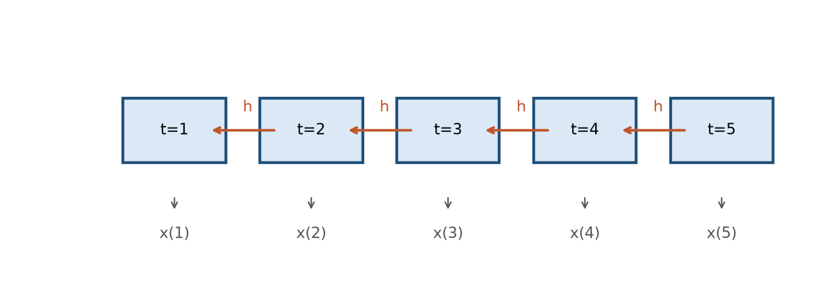

# Bab 7 - Deret Waktu dan Model Sekuensial: RNN, LSTM, GRU

> **Prasyarat:** Bab 2 (regresi, baseline, split waktu), Bab 5 (metrik, walk-forward), Bab 6 (data meteorologi, fitur). Bab ini menyiapkan model sekuensial untuk studi kasus Bab 8-9.

> **Catatan:** Materi bab ini adalah **materi pengenalan**, bukan hasil riset baru. Seluruh isi merupakan ringkasan ulang literatur *machine learning*, dengan contoh-contoh yang dekat dengan dunia meteorologi Indonesia.

## Tujuan Pembelajaran

Setelah menyelesaikan bab ini, Anda diharapkan mampu:

1. **Menyusun** deret waktu menjadi contoh-*window* untuk prediksi satu dan beberapa langkah ke depan.
2. **Membandingkan** LSTM/GRU dengan *baseline* (persistence, mean, AR) secara jujur.
3. **Menjelaskan** intuisi RNN → LSTM → GRU (pintu ingatan/lupa) beserta keterbatasannya.
4. **Memilih** arsitektur masukan univariate/multivariate dan strategi prediksi multi-langkah (recursive/direct/seq2seq).

## 7.1 Mengapa Deret Waktu Istimewa

Model di Bab 2-5 menerima contoh berupa pasangan fitur-target berukuran tetap dan tidak membawa ingatan antar langkah waktu. Bab 2 dan Bab 5 sudah menangani sifat khas deret waktu (split menurut waktu, *walk-forward*), tetapi arsitektur MLP-nya belum memodelkan urutan secara eksplisit. Data **deret waktu** berbeda dalam dua hal mendasar:

1. **Urutan bermakna.** Nilai `y(t)` bergantung pada riwayat sebelumnya: `y(t-1)`, `y(t-2)`, dan seterusnya. Sebagai contoh, membaca nilai tinggi muka air sungai hari ini tanpa memperhatikan kondisinya kemarin akan menghilangkan informasi konteks yang penting.
2. **Korelasi temporal.** Beberapa variabel cuaca, seperti suhu dan tekanan udara, bergerak relatif mulus serta memiliki autokorelasi yang tinggi. Sebaliknya, curah hujan bersifat intermiten, didominasi nilai nol (*zero-inflated*), dan sering mengandung derau (*noise*), sedangkan kecepatan angin dapat berubah mendadak (*gusty*). Tingginya korelasi temporal pada variabel tertentu menjadi kabar baik karena menunjukkan adanya pola yang dapat dipelajari model. Namun, karakteristik ini juga dapat jadi jebakan, sehingga pembagian data secara acak dan kebocoran data harus dihindari dengan ketat.

Sifat khusus lain di meteorologi: deretnya **tidak stasioner** (musim, pola monsun), menyimpan siklus (pasang surut, siklus harian), dan kadang mengandung *regime* (misal transisi musim hujan dan kering). Model yang baik untuk bab ini harus bisa menangkap ketiga hal tersebut dari data, bukan dari asumsi. Kerangka umum representasi dan pelatihan model deret waktu dapat dirujuk pada literatur dasar [1].

### Mengukur Autokorelasi Secara Cepat

Gunakan fungsi autocorrelation function (ACF) via `pandas.Series.autocorr(lag)` untuk mengenali potensi struktur data sekuensial secara cepat:

```python
import pandas as pd
for lag in [1, 7, 14, 30]:
    print(lag, sr.autocorr(lag))
```

Nilai tinggi di `lag=1` menandakan *persistence* kuat (bisa menjadi pesaing berat LSTM), sedangkan nilai tinggi di `lag>1` menunjukkan struktur periodik (siklus) yang bisa dipelajari model. Hasil ACF inilah yang membantu memilih `w` (*window*) dan memprediksi seberapa kuat *baseline* persistence nanti.

## 7.2 Menyusun Deret Waktu Menjadi Data *Machine Learning*

Model sekuensial membaca data dalam bentuk **jendela masukan** (*window*): beberapa langkah waktu masa lalu sebagai masukan, satu (atau beberapa) langkah ke depan sebagai target.

Bayangkan deret harian `y(1), y(2), …, y(N)`. Untuk *window* `w=3` dan *horizon* `h=1` (ingat bahasan Bab 5), susunannya seperti Tabel 7.1:

| Contoh | Masukan `[t-3, t-2, t-1]` | Target `[t]` |
|---|---|---|
| 1 | `y(1), y(2), y(3)` | `y(4)` |
| 2 | `y(2), y(3), y(4)` | `y(5)` |
| 3 | `y(3), y(4), y(5)` | `y(6)` |

**Tabel 7.1**: Contoh *windowing* (w=3, h=1).

### Contoh numerik *windowing*

Misalkan deret waktu `[10, 12, 14, 13, 11, 9, 10]` dengan panjang $N = 7$, panjang jendela masukan $w = 3$, dan horizon prediksi $h = 1$. Pasangan masukan dan target yang terbentuk adalah sebagai berikut:   

- `[10, 12, 14] → 13` (menggunakan 3 data pertama untuk memprediksi data ke-4)
- `[12, 14, 13] → 11`
- `[14, 13, 11] → 9`
- `[13, 11, 9] → 10`

Jumlah contoh sampel yang dihasilkan mengikuti rumus $$N - w - h + 1$$. Setiap sampel membutuhkan total $w + h$ titik data berurutan ($w$ sebagai fitur masukan dan $h$ sebagai target). Jendela pertama dimulai pada data ke-1, sedangkan jendela terakhir berakhir tepat pada data ke-$N$. Untuk $N = 7$, $w = 3$, dan $h = 1$, jumlah sampel yang terbentuk adalah: 

$$7 - 3 - 1 + 1 = 4 \text{ sampel}$$

Intuisinya sederhana: setiap prediksi membutuhkan $w$ nilai sebelumnya, sehingga 3 data pertama (`10, 12, 14`) hanya berfungsi sebagai riwayat awal dan tidak dapat dijadikan target. Prediksi pertama baru dapat dilakukan pada data ke-4 (`13`). Selanjutnya, jendela bergeser satu langkah ke depan hingga menghasilkan target data ke-5 sampai ke-7 (`11, 9, 10`), sehingga diperoleh total 4 sampel pelatihan. 

### Pengaruh tumpang-tindih jendela terhadap keacakan data

Proses pembentukan jendela (*windowing*) yang bergeser satu langkah membuat sampel-sampel yang berdekatan saling tumpang-tindih dan memiliki korelasi yang tinggi. Karakteristik ini umum dijumpai pada data meteorologi, tetapi memiliki implikasi krusial sehingga sampel tidak boleh dibagi secara acak. Pembagian data wajib menggunakan pendekatan berbasis waktu (Bab 2 dan 6) untuk mencegah data latih menyimpan informasi yang tumpang-tindih dengan data uji (*test data*).

Metode *windowing* ini sejalan dengan konsep yang diperkenalkan pada Bab 2 (§2.5). Perbedaannya terletak pada bentuk masukan yang kini berupa urutan sepanjang $$w$$, bukan fitur yang terpisah.

### Bentuk tensor masukan

Bentuk tensor masukan untuk model sekuensial adalah 3D:

$$  
\text{Bentuk masukan} = (\text{ukuran batch},\, \text{langkah waktu } w,\, \text{jumlah fitur } f) \tag{7.1} 
$$

Persamaan 7.1: dimensi pertama adalah jumlah sampel per *batch* (otomatis di Keras), dimensi kedua adalah panjang *window* `w`, dimensi ketiga jumlah fitur `f`. Untuk *univariate* `f=1`, sedangkan untuk *multivariate* `f>1` (misal hujan + suhu + kelembapan).

Bedanya dengan MLP di Bab 2: masukan MLP berbentuk 2D, yaitu `(batch, fitur)`, karena tiap contoh hanya satu vektor fitur. Model sekuensial menambahkan satu dimensi waktu, sehingga tiap contoh menjadi matriks berukuran `w × f`. Sebagai gambaran, untuk `batch = 32`, `w = 7`, dan `f = 3`, tensor yang masuk berbentuk `(32, 7, 3)`.32 jendela, tiap jendela berisi 7 langkah waktu, dan tiap langkah punya 3 fitur. Saat mendefinisikan model, dimensi *batch* biasanya tidak ditulis karena Keras mengisinya otomatis; cukup `input_shape=(w, f)` seperti pada Kode 7.3 dan 7.4.

**Kode 7.1 - Membuat *window* dari deret dengan TensorFlow.**

```python
import numpy as np
import tensorflow as tf

def buat_window(deret, w=7, h=1):
    X, y = [], []
    for i in range(len(deret) - w - h + 1):
        X.append(deret[i:i+w, np.newaxis])   # (w,) -> (w, 1) fitur
        y.append(deret[i+w:i+w+h])
    return np.array(X), np.array(y)

# contoh: deret suhu harian sintetik
ts = np.sin(np.arange(100) / 5) + np.random.randn(100) * 0.1
X, y = buat_window(ts, w=7, h=1)
print(X.shape, y.shape)   # (93, 7, 1) dan (93, 1)
```

Kode 7.1 menggunakan fungsi `buat_window` untuk mengubah deret waktu menjadi pasangan masukan dan target. Penentuan panjang jendela $$w$$ (jumlah data riwayat) dilakukan berdasarkan pemahaman domain meteorologi serta uji eksperimen. Sebagai contoh, pada prediksi pasang surut air laut, rentang beberapa siklus (seperti $$w = 72 \text{ jam} \times 3 = 216 \text{ jam}$$) membantu model mempelajari pola periodisitas. Sementara itu, untuk curah hujan, penggunaan riwayat 7 hingga 30 hari umumnya dapat mewakili pola musiman skala pendek. 

### Berapa panjang *window* yang baik?

Tidak ada jawaban universal, tetapi tiga pertimbangan membantu:

4. Siklus alami data. Jika data punya siklus 24 jam (misal siklus harian suhu), sertakan minimal satu siklus (`w ≥ 24`). Untuk pasang surut, jenis siklus perlu ditentukan terlebih dahulu karena semi-diurnal punya periode ≈ 12,42 jam (dua kali sehari), diurnal ≈ 24 jam, dan tidal day ≈ 24,84 jam. `w` setidaknya mencakup satu periode siklus agar model bisa "melihat" pola naik-turun.

5. Harga komputasi dan data berkaitan dengan ukuran memori dan jumlah sampel latih. Semakin besar nilai `w`, ukuran tensor *input* menjadi lebih besar sehingga membutuhkan memori GPU yang lebih tinggi dan waktu latih yang lebih lama. Selain itu, *window* yang besar akan mengurangi total jumlah sampel contoh yang terbentuk dalam data deret waktu (`N - w - h + 1`). Untuk data stasiun dengan rentang ribuan hari, nilai w dalam skala ratusan jam masih sangat wajar digunakan.

6. Eksperimen validasi dilakukan untuk mencari nilai optimal melalui pengujian beberapa kandidat panjang *window* (seperti `w ∈ {3, 7, 14, 30}`) menggunakan metode *walk-forward*. Dari hasil pengujian tersebut, pilih nilai dengan galat terkecil (seperti MAE) pada data validasi, bukan pada data *test* agar model tidak mengalami *overfitting*.

Contoh dua opsi window untuk data jam-an pasang surut, ringkasnya di Tabel 7.2:

| Nama | `w` (jam) | Makna | Catatan |
|---|---|---|---|
| Pendek | 6 | seperempat hari | kecepatan, tetapi tak lihat siklus penuh |
| Standar | 24 | satu siklus harian | untuk semi-diurnal ≈ dua siklus, titik awal yang baik |

**Tabel 7.2**: Pilihan panjang window untuk deret jam-an.

### Satu langkah atau beberapa langkah ke depan (*horizon*)

- Satu langkah (`h=1`) menargetkan prediksi untuk satu langkah waktu ke depan. Data meteorologi umumnya data per jam, `h=1` berarti memprediksi satu jam ke depan. Ini merupakan pendekatan yang mudah dan banyak model unggul di sini.

- Beberapa langkah (`h>1`) menargetkan prediksi beberapa langkah ke depan atau *lead time* tertentu. Sebagai contoh, analisis prediksi cuaca sering kali membutuhkan proyeksi 1 sampai 7 hari ke depan. Pendekatan ini lebih sulit dilakukan karena galat prediksi cenderung menumpuk, dan §7.6 membahas strategi penanganannya.

Jangan mencampur kedua pendekatan tersebut karena model yang unggul untuk `h=1` belum tentu baik untuk `h=3`. Evaluasi model harus disesuaikan dengan horizon yang benar-benar dibutuhkan secara operasional.

## 7.3 *Baseline* Dulu: Persistence, Mean, dan AR

Sebelum membangun LSTM (§7.5), ingat aturan Bab 1: **ukur *baseline* dulu**. *Baseline* adalah model sederhana yang menjadi tolok ukur. Jika model *deep learning* tidak mampu mengalahkannya, kompleksitas tambahan tidak memberi manfaat. Untuk deret waktu meteorologi, tiga *baseline* berikut yang lazim dipakai, ringkasannya di Tabel 7.3:

- ***Persistence***: prediksi `y(t+h) = y(t)` (nilai terakhir). Sangat kuat untuk data yang mulus dan berkorelasi tinggi, seperti pasang surut.
- ***Mean/klimatologi***: prediksi rata-rata musiman (mis. rata-rata hujan harian untuk bulan yang sama). Mengalahkan *persistence* hanya jika deret tidak berkorelasi kuat.
- ***AR(p)*** (*autoregressive*): regresi terhadap `p` nilai sebelumnya (lag). *Baseline* ini menangkap autokorelasi tanpa arsitektur rumit dan sering cukup baik untuk pola sederhana. **ARIMA** adalah perluasan AR(p) yang menambahkan *differencing* dan komponen *moving average*, sedangkan AR(p) hanyalah bagian *autoregressive* dari keluarga ARIMA. Pembahasan lengkap *forecasting* klasik ada di literatur analisis deret waktu [2].

**Tabel 7.3**: *Baseline* deret waktu untuk dibandingkan.

| *Baseline* | Ide | Kuat ketika | Lemah ketika |
|---|---|---|---|
| **Persistence** | `ŷ(t+h)=y(t)` | Deret mulus, berkorelasi kuat | Data berisik / musim kuat |
| **Mean/klimatologi** | rata-rata sesuai bulan/musim | Musim dominan, korelasi pendek | Variabilitas antar tahun besar |
| **AR(p)** | regresi `p` lag | Autokorelasi `p` langkah | Pola non-linear / panjang |

Tidak semua *baseline* harus dihitung untuk setiap masalah. Pilih yang paling relevan dengan sifat data: *persistence* untuk deret mulus, klimatologi untuk pola musiman yang kuat, dan AR(p) untuk autokorelasi jangka pendek. Yang terpenting, *baseline* terkuat selalu dilaporkan sebagai pembanding.

**Kode 7.2 - Menghitung ketiga *baseline*: persistence, mean, dan AR(p).**

```python
from sklearn.linear_model import LinearRegression

# persistence: nilai terakhir tiap window (t-1)
pred_persist = X_test[:, -1, 0]   # shape: (n_test,) - ambil langkah terakhir tiap window

# klimatologi sederhana: rata-rata global train
pred_klimat = np.full(len(y_test), float(np.mean(y_train)))

# AR(p): regresi linear pada p lag terakhir tiap window
p = 3
ar = LinearRegression().fit(X_train[:, -p:, 0], y_train.ravel())
pred_ar = ar.predict(X_test[:, -p:, 0])
```

Kode 7.2 menghitung ketiga *baseline*: persistence, klimatologi, dan AR(p). Tujuannya bukan agar *baseline* menang, melainkan agar ada **angka pembanding yang jujur**. Jika LSTM tidak mengalahkan *persistence* pada pasang surut, ada dua kemungkinan: modelnya perlu diperbaiki, atau masalah itu memang tidak membutuhkan LSTM. Sikap inilah yang membuat evaluasi Bab 8-9 dapat dipercaya.

## 7.4 RNN: Memahami Jaringan Berulang

**RNN** (*recurrent neural network*) dirancang untuk data berurutan. Bayangkan jaringan yang membaca deret satu langkah demi satu langkah, sambil membawa "catatan ringkas" dari langkah sebelumnya. Pada tiap langkah waktu, RNN menggabungkan masukan saat ini `x(t)` dengan **keadaan tersembunyi** (*hidden state*) dari langkah sebelumnya `h(t-1)`:

$$ h_t = \tanh(W_x x_t + W_h h_{t-1} + b) \tag{7.2} $$

Pada Persamaan 7.2, `h_t` adalah **ringkasan ingatan** sampai langkah `t`. Matriks bobot `W` dibagikan di semua langkah waktu, sehingga jumlah parameter tetap sedikit dan komputasi lebih efisien. Konsep jaringan berulang sudah ada sejak awal jaringan saraf [1]; Elman (1990) memperkenalkan salah satu arsitektur dasarnya yang banyak dipakai, yaitu *Elman network* [3].

**Keterbatasan utama RNN: *vanishing gradient* (bahasan Bab 4).** Saat galat dirambatkan mundur melalui ratusan langkah, gradien dikalikan berulang. Jika faktor pengalinya lebih kecil dari 1, hasil perkalian menyusut mendekati nol; jika lebih besar dari 1, hasilnya justru meledak. Akibatnya, RNN praktis hanya "mengingat" beberapa langkah terakhir dan sulit menyimpan pola yang jauh di masa lalu. Untuk pasang surut dengan siklus 12-24 jam atau lebih, keterbatasan ini jelas merugikan.



**Gambar 7.1**: Ilustrasi RNN *unrolled*.

Gambar 7.1 memperlihatkan satu sel yang sama "dibuka" (*unrolled*) sepanjang waktu, membawa keadaan tersembunyi `h_t`. Semakin panjang deret, semakin rawan *vanishing gradient*.

### Contoh intuisi keadaan tersembunyi

Ambil deret suhu `[30, 31, 30, 29, 28, 27, 26]`. RNN membaca tiap hari dan memutakhirkan `h_t`:

- `h_1` menangkap "mulai panas" (30).
- `h_2` menangkap "masih panas" (31).
- setelah beberapa hari dingin, `h_7` bisa "lupa" bahwa awalnya panas - itulah kelemahan RNN.

LSTM (Bagian 7.5) memperbaiki ini dengan mempertahankan memori jangka panjang dan memutuskan sendiri kapan melupakan.

## 7.5 LSTM: Memori dengan Pintu (*Gates*)

**LSTM** (*long short-term memory*) memperbaiki keterbatasan RNN dengan menambahkan **pintu** (*gates*) yang mengatur isi memori secara selektif. Gagasan ini diperkenalkan oleh Hochreiter dan Schmidhuber (1997) [4]. Intuisinya: bayangkan sebuah "kotak memori" yang bisa diisi, dipertahankan, atau dikosongkan, dan diatur oleh tiga pintu:

1. **Pintu lupa** (`f_t`): seberapa banyak memori lama yang *dibuang*.
2. **Pintu masukan** (`i_t`): seberapa banyak informasi baru yang *ditulis* ke memori.
3. **Pintu keluaran** (`o_t`): seberapa banyak memori yang *dipancarkan* ke output.

Ketiga pintu inilah yang membuat LSTM mampu mengingat pola jauh (misalnya siklus pasang surut beberapa hari lalu) sambil membuang informasi yang tidak relevan. Dengan cara ini, masalah *vanishing gradient* berkurang. Perlu dicatat, masalah itu tidak hilang sepenuhnya, melainkan hanya diringankan, sehingga *gradient clipping* masih menjadi praktik umum saat melatih LSTM.

$$ f_t = \sigma(W_f x_t + U_f h_{t-1} + b_f) \tag{7.3} $$
$$ i_t = \sigma(W_i x_t + U_i h_{t-1} + b_i) \tag{7.4} $$
$$ o_t = \sigma(W_o x_t + U_o h_{t-1} + b_o) \tag{7.5} $$

Persamaan 7.3 sampai Persamaan 7.5 menunjukkan bahwa tiap pintu memakai sigmoid. Nilai sigmoid berada di antara 0 dan 1, sehingga pintu dapat "terbuka", "tertutup", atau "setengah terbuka" secara mulus. Nilai ini lalu digabungkan dengan `tanh` untuk menuliskan memori kandidat. Anda tidak perlu menghafal rumusnya. Yang penting dipahami: **LSTM = RNN + memori berpintu**, dan itulah yang membuatnya bekerja pada deret panjang seperti data cuaca.

### Analogi pintu dengan proses keputusan peramal

Bayangkan seorang peramal yang memakai catatan lama:

- **Pintu lupa**: "seberapa banyak catatan minggu lalu yang sudah tidak relevan karena musim berubah?" → dibuang.
- **Pintu masukan**: "catatan suhu hari ini layak dicatat (misal ada pola hujan baru)?" → ditulis ke memori.
- **Pintu keluaran**: "dari memori yang saya pegang, berapa yang saya gunakan untuk membuat prediksi hari ini?" → dipancarkan.

LSTM mempelajari kapan membuka/menutup tiap pintu **dari data** selama pelatihan, bukan diprogram manual. Inilah mengapa ia bisa menyesuaikan diri dengan pola musim yang berbeda-beda di tiap wilayah.

## 7.6 GRU: Pilihan Ringkas

**GRU** (*gated recurrent unit*) menyederhanakan LSTM: hanya **dua pintu** (*update* dan *reset*) dan tidak memakai "sel memori" terpisah. Arsitektur ini diperkenalkan oleh Cho et al. (2014) [5]. Hasilnya, parameter lebih sedikit sehingga pelatihan lebih cepat dan lebih hemat memori, dengan performa yang sering sebanding. Ringkasannya ada di Tabel 7.4.

Secara singkat, **pintu *update*** menentukan seberapa banyak keadaan lama dipertahankan, sedangkan **pintu *reset*** menentukan seberapa banyak keadaan lama diabaikan saat menghitung informasi baru.

**Tabel 7.4**: Perbandingan LSTM dan GRU.

| Aspek | LSTM | GRU |
|---|---|---|
| Pintu | 3 (lupa, masukan, keluaran) | 2 (update, reset) |
| Sel memori terpisah | Ya | Tidak |
| Parameter | Lebih banyak | Lebih sedikit |
| Performa umum | Unggul di deret sangat panjang (tergantung data) | Sebanding, sering lebih cepat |
| Kapan pilih | Data panjang dan butuh memori lama | Pertimbangan kecepatan dan kesederhanaan |

Tidak ada model yang "selalu menang". Di Bab 8-9 kedua-duanya diuji dan dibandingkan dengan *baseline*. Untuk buku ini, **GRU adalah titik awal yang baik**: parameter sedikit, cepat dicoba, dan hasilnya sering cukup.

### Ketika LSTM lebih dipilih

Ada beberapa situasi di mana LSTM sering unggul:

- Deret yang **sangat panjang** (puluhan ribu langkah) dengan ketergantungan yang benar jauh ke belakang - sel memori terpisah membuat informasi lebih "awet".
- Tugas yang butuh membedakan dua memori yang kontradiktif dalam satu waktu (misal mengingat pola pasang surut dua siklus lalu, sambil melupakan satu siklus tertentu).
- Saat parameter ekstra tidak menjadi masalah (GPU cukup).

GRU dipilih ketika kecepatan eksperimen dan kesederhanaan lebih penting, atau data tidak cukup besar untuk memanfaatkan parameter LSTM. Dalam bab ini keduanya digunakan secara bergantian, dan pembaca diajak menguji keduanya di *walk-forward*.

## 7.7 Arsitektur Praktis di Keras

### Univariate LSTM

**Kode 7.3 - Model LSTM univariate untuk prediksi h=1.**

```python
import tensorflow as tf

model = tf.keras.Sequential([
    tf.keras.layers.LSTM(32, return_sequences=False, input_shape=(w, 1)),
    tf.keras.layers.Dense(1),
])
model.compile(optimizer="adam", loss="mse", metrics=["mae"])
```

Kode 7.3 adalah model LSTM univariate. Argumen `input_shape=(w, 1)` menandakan *window* sepanjang `w` dengan satu fitur, sedangkan `return_sequences=False` membuat lapisan hanya mengembalikan output pada langkah terakhir (cocok untuk prediksi satu langkah).

### Multivariate LSTM

Saat `f > 1` (misal hujan, suhu, kelembapan), ubah jumlah fitur di `input_shape` seperti Kode 7.4, sedangkan target tetap satu (hujan):

**Kode 7.4 - Model LSTM multivariate (3 fitur, prediksi hujan besok).**

```python
model = tf.keras.Sequential([
    tf.keras.layers.LSTM(32, return_sequences=False, input_shape=(w, X.shape[2])),
    tf.keras.layers.Dense(1),
])
model.compile(optimizer="adam", loss="mse", metrics=["mae"])
```

### Multi-langkah: model per *horizon* (direct) dan rekursif (recursive)

Untuk `h>1`, ada tiga strategi umum. Namanya mudah diingat dari kata kuncinya: *recursive* mengulang satu model, *direct* memakai satu model untuk tiap target, dan *seq2seq* memakai *encoder* lalu *decoder*.

- **Recursive**: gunakan prediksi `ŷ(t+1)` sebagai bagian masukan untuk `ŷ(t+2)`, dan seterusnya. Hanya perlu satu model, tetapi galat menumpuk cepat.
- **Direct**: latih **satu model per *horizon*** (`model_h1`, `model_h2`, …). Tiap model memprediksi *horizon*-nya sendiri. Cara ini mencegah penumpukan galat, tetapi biaya pelatihan lebih besar.
- **Seq2seq** (*sequence-to-sequence*): *encoder* meringkas *window*, lalu *decoder* menghasilkan seluruh jajaran prediksi. Paling ekspresif, tetapi arsitekturnya paling rumit sehingga hanya dibahas singkat di sini (Sutskever et al., 2014 [6]).

Untuk Bab 8-9, *direct* (model per *lead time*) adalah titik awal yang jujur dan mudah dievaluasi.

### Contoh memilih strategi multi-langkah

Jika target operasional adalah prediksi hujan 1-7 hari ke depan, bandingkan ketiga strategi di *walk-forward* seperti ringkasan Tabel 7.5:

| Strategi | Kelebihan | Kekurangan | Kapan digunakan |
|---|---|---|---|
| **Recursive** | 1 model saja | galat menumpuk cepat | lead time pendek (1-3 hari) |
| **Direct** | tiap horizon independen | perlu banyak model | lead time bervariasi dan panjang |
| **Seq2seq** | satu model, semua horizon | lebih rumit, data banyak | pola antar horizon kompleks |

**Tabel 7.5**: Perbandingan strategi prediksi multi-langkah.

Untuk pasang surut (periodik, sebagian besar deterministik, walaupun tinggi muka laut juga dipengaruhi cuaca, angin, tekanan, dan gelombang), *direct* h=1-7 sering memberi hasil yang baik dari sisi biaya, sedangkan untuk hujan (berisik), *direct* juga pilihan yang jujur.

## 7.8 Evaluasi dan Membaca Prediksi

Evaluasi mengikuti aturan Bab 5: *walk-forward*, metrik sesuai tujuan, bandingkan dengan *baseline*. Yang khas bab ini: **memplot prediksi dan aktual** sepanjang waktu uji. Contoh plotnya ada di Kode 7.5.

- **Plot deret penuh** → lihat apakah model mengikuti musim/trend, bukan hanya "mengikuti" nilai kemarin (jika prediksi tertinggal 1 langkah dari aktual, model mirip persistence).
- **Plot per horizon** → melihat degradasi seiring lead time (recursive sering menurun cepat, direct lebih stabil).
- **Scatter aktual dan prediksi** → selain kurva, titik di dekat garis `y=x` berarti akurat, sedangkan pencilan ke arah ekstrem menunjukkan kelemahan pada kejadian besar.

**Kode 7.5 - Plot prediksi dan aktual sederhana.**

```python
import matplotlib.pyplot as plt
plt.figure(figsize=(9, 3))
plt.plot(y_test, label="aktual", lw=1.5)
plt.plot(pred, label="prediksi LSTM", lw=1.2, alpha=0.8)
plt.legend(); plt.tight_layout(); plt.show()
```

### Mengukur keunggulan dan mendeteksi model yang "meniru" *baseline*

Dua angka sederhana membantu menilai apakah LSTM benar-benar menambah nilai:

- **Selisih MAE(LSTM) − MAE(persistence)**: jika bernilai negatif dan cukup besar, LSTM menang. Jika hampir nol atau positif, LSTM tidak memberi nilai tambah.
- **Perbandingan dengan MAE *mean/klimatologi*** pada periode yang sama. Model yang konsisten kalah pada metrik utama, dan tidak unggul pada *horizon* atau target operasional, sebaiknya dipertimbangkan untuk dibuang.

Namun, MAE global saja tidak cukup. Model bisa saja lebih baik pada kejadian ekstrem, pada *threshold* tertentu, atau pada *lead time* tertentu. Karena itu, laporkan MAE/RMSE, bias, *skill score*, dan metrik per *horizon*.

Praktik ini mengubah klaim subjektif seperti "LSTM lebih baik!" menjadi klaim yang terukur.

### Evaluasi multi-horizon dengan skill score

Untuk melaporkan perbaikan relatif terhadap *baseline*, gunakan *skill score*:

$$ \text{SS} = 1 - \frac{\text{MAE}_{\text{model}}}{\text{MAE}_{\text{baseline}}} \tag{7.6} $$

Persamaan 7.6 menjelaskan arti nilainya: `SS > 0` berarti model lebih baik daripada *baseline*, `SS = 0` setara, dan `SS < 0` lebih buruk. *Skill score* mudah ditafsirkan karena tidak bergantung pada satuan, sehingga nilai 0,30 berarti model menurunkan galat 30% dibanding *baseline*. Pembaca berhak tahu *baseline* mana yang dipakai, jadi laporkan *persistence* maupun *mean/klimatologi*, termasuk jika LSTM tidak unggul sama sekali.

### Membaca pola galat untuk memperbaiki data

Dua plot tambahan yang jarang dilaporkan tetapi sering menentukan perbaikan:

1. **Galat per bulan/musim** - jika model buruk hanya di musim hujan puncak, fitur regional (Bab 6) atau transformasi target (log1p) bisa membantu.
2. **Galat per jendela peristiwa** - misal galat membesar saat transisi musim, lalu coba tambah fitur musiman atau indeks iklim.

Analisis galat inilah yang membedakan model yang baru selesai dilatih dari model yang siap produksi, dan akan sangat dimanfaatkan di Bab 8-9.

## 7.9 Catatan Pelatihan Model Sekuensial

Seluruh contoh di bab ini berjalan di atas TensorFlow [7]. Beberapa hal praktis yang sering membedakan konvergensi LSTM/GRU:

1. **Normalisasi** (Bab 6) wajib - LSTM sangat sensitif skala.
2. **Mulai window kecil**, lalu naikkan hanya jika perlu (window besar = data lebih sedikit dan biaya lebih besar).
3. **Aturan *shuffle* bergantung pada jenis RNN.** Untuk *stateless* LSTM/GRU (versi yang dipakai di buku ini), `shuffle=True` di Keras umumnya aman dan sering membantu, karena setiap *window* sudah membawa masukan dan targetnya sendiri. Sebaliknya, `shuffle=False` hanya diperlukan untuk *stateful* RNN yang bergantung pada urutan *batch*. Yang terpenting, jangan sampai setiap *batch* mencampur masa depan di batas train/validasi/test.
4. **Stateful LSTM** (mempertahankan keadaan antar *batch*) jarang diperlukan di buku ini, dan gunakan versi biasa.
5. **Regularisasi** (Bab 5): tambah `Dropout`/`recurrent_dropout` bila overfit, dan kurangi bila underfit.
6. **Pertimbangkan GRU dulu** untuk eksperimen pertama - lebih cepat, parameter lebih sedikit (Tabel 7.4).

### Menumpuk lapisan LSTM/GRU (stacked)

Jika satu lapisan kurang, tumpuk dua lapisan. Lapisan pertama memakai `return_sequences=True` agar mengembalikan urutan ke lapisan berikutnya:

**Kode 7.6 - LSTM bertumpuk (stacked) dua lapisan.**

```python
model = tf.keras.Sequential([
    tf.keras.layers.LSTM(32, return_sequences=True, input_shape=(w, 1)),
    tf.keras.layers.LSTM(16, return_sequences=False),
    tf.keras.layers.Dense(1),
])
```

Kode 7.6 menumpuk dua lapisan LSTM. Aturan jempol: **mulai dengan satu lapisan**, naikkan menjadi dua hanya jika kurva validasi menunjukkan *underfit*. Menumpuk terlalu cepat membuat model gemuk tanpa manfaat, dan *overfit* mengintai (Bab 5).

### Memprediksi beberapa horizon dengan *direct*: pola kerja Bab 8-9

Karena Bab 8-9 memakai *direct* (model per horizon), berikut pola yang akan diulang:

**Kode 7.7 - Melatih satu model per *horizon* (strategi *direct*).**

```python
def latih_per_horizon(X, y):
    model = tf.keras.Sequential([
        tf.keras.layers.LSTM(16, input_shape=(X.shape[1], X.shape[2])),
        tf.keras.layers.Dense(1),
    ])
    model.compile(optimizer="adam", loss="mse", metrics=["mae"])
    model.fit(X, y, epochs=40, batch_size=32, verbose=0)
    return model

models = {}
for h in range(1, 8):
    yh = buat_target_horizon(y, h)      # target untuk lead time h
    X_tr, X_va, yh_tr, yh_va = split_waktu(X, yh)
    models[h] = latih_per_horizon(X_tr, yh_tr)
```

> **Catatan:** Kode ini *template pseudocode* untuk menggambarkan pola kerja. Fungsi `buat_target_horizon` dan `split_waktu` analog dengan `buat_window` (§7.2) dan split waktu (Bab 2/6), dan iterasi `h` yang menentukan horizon. Versi produksinya di Bab 8-9 menyertakan validasi/*early stopping* dan normalisasi per split.

Kode 7.7 melatih satu model per *horizon*. Setiap `models[h]` adalah prediktor untuk *lead time* `h`. Evaluasi per `h` dengan MAE/RMSE lalu plot (§7.8). Ini template yang langsung digunakan di Bab 8-9.

### Kapan arsitektur "tidak perlu dinaikkan"?

Jika *baseline* persistence sudah memberi MAE sangat rendah (misal pasang surut), LSTM mungkin hanya menambah sedikit. Itu bukan kegagalan LSTM, melainkan keputusan bisnis: biaya komputasi dan pemeliharaan dibandingkan dengan perbaikan kecil. Bab 10 membahas keputusan ini di konteks produksi.

## 7.10 Studi Mini: Bingkai Pasang Surut (Teaser Bab 8)

Untuk melihat bab ini "bekerja", bayangkan dataset tinggi pasang surut jam-an (Bab 8 akan memakai data nyata). Langkah yang mengikuti seluruh bab ini:

1. **Windowing**: data jam-an, `w=168` jam (1 minggu) atau skala siklus. Untuk prediksi 1-7 hari, `h` diukur dalam jam: `h=24, 72, 168`. Pastikan satuan `w` dan `h` konsisten (Bab 8 memakai konvensi ini).
2. **Baseline**: persistence (kuat untuk pasang surut) dan LSTM/GRU.
3. **Model**: mulai GRU 1 lapisan `units=32`, `input_shape=(w,1)`.
4. **Evaluasi**: *walk-forward* per bulan, MAE/RMSE per `h`, dan plot prediksi dan aktual.
5. **Kesimpulan jujur**: seberapa jauh LSTM mengalahkan persistence - dan apakah menutupinya layak untuk kebutuhan ops.

Menjalankan kerangka ini di Bab 8 membuat studi kasus tidak terasa baru, hanya mengganti data sintetik dengan data nyata Cilacap.

## 7.11 Menghubungkan ke Bab 8-9

Dua keterampilan yang dibawa ke studi kasus berikutnya:

1. **Pipeline yang reusable** - fungsi `buat_window`, model template, evaluasi MAE/RMSE per horizon. Simpulkan dalam satu modul agar mudah digunakan ulang (Bab 6 mengajarkan menyimpan data, sedangkan bab ini menambahkan *template* model).
2. **Kerangka berpikir baseline-dulu** - setiap klaim "LSTM unggul" harus selalu menyertakan angka *persistence* dan skill score (Persamaan 7.6). Disiplin inilah yang membuat laporan Bab 8-9 bisa dipercaya.

## 7.12 FAQ

**Apakah LSTM selalu lebih baik daripada MLP untuk deret waktu?** Tidak. Untuk data mulus/berkorelasi pendek, MLP + lag (Bab 2) bisa setara, sedangkan untuk deret panjang dengan pola jauh, LSTM/GRU unggul. Ukur keduanya di *walk-forward*.

**Kenapa hasil LSTM kadang "tertinggal"/mirip persistence?** Karena model belajar bahwa meniru nilai kemarin adalah tebakan yang aman (*bias*). Kurangi dengan fitur yang lebih informatif (Bab 6), *window* lebih baik, atau model/granularitas yang sesuai.

**Berapa lama latihan LSTM?** Untuk stasiun harian dan GRU, beberapa menit di Colab sudah lumrah, sedangkan LSTM sedikit lebih lama. Jika terlalu lambat, kecilkan `units`, `w`, atau gunakan subset data saat eksperimen.

**Bisakah LSTM digunakan untuk data bulanan/jam-an?** Bisa, selama disusun sebagai *sequence* dengan frekuensi konsisten. Bedanya hanya skala waktu di `w` dan `h`.

**Apakah saya perlu menstandarisasi window?** Ya, lazimnya normalisasi (Bab 6) diterapkan sebelum windowing agar skala fitur seragam. Pastikan μ/σ dihitung pada data latih, lalu diterapkan pada validasi/*test*.

**Apakah dropout LSTM berbeda dengan MLP?** Keras mendukung `recurrent_dropout` khusus keadaan berulang. Gunakan yang kecil (0-0,2) untuk *recurrent*, sedangkan dropout biasa untuk layer antar output. Jangan berlebihan di LSTM karena bisa menghambat belajar.

**Bisakah saya menambah fitur yang bukan deret waktu (misal indeks bulan)?** Ya, fitur eksternal ditambahkan sebagai dimensi fitur per langkah waktu (multivariate), atau diselipkan lewat lapisan setelah LSTM (concatenate). Detail di Bab 8-9.

**Kenapa model memprediksi "rata-rata" saat data berisik?** Karena loss kuadrat (MSE) mendorong prediksi menuju *rata-rata kondisi* (conditional mean), sedangkan loss mutlak (MAE) mendorong menuju *median kondisi*. Untuk data berisik, keduanya bisa tampak "menghindari ekstrem" jika metriknya tidak sesuai tujuan. Untuk menggerakkan ke ekstrem, gunakan transformasi target (Bab 6) atau metrik sesuai tujuan.

**Apakah perlu `window` yang mengandung target masa depan?** Tidak! Itu *leakage*: window hanya berisi data sampai `t`, target mulai `t+1`. Pastikan pergeseran benar.

**Kapan berhenti mencoba arsitektur dan fokus ke data?** Sering kali jawabannya di data: tambah fitur (Bab 6), perbaiki QC, atau ubah *horizon* sesuai kebutuhan. Jika kurva validasi macet di banyak konfigurasi, kembali ke *baseline* dan data, bukan menambah tumpukan lapisan.

## 7.13 Latihan

**Soal konsep**

1. Mengapa *window* yang terlalu besar tidak selalu lebih baik?
2. Jelaskan mengapa *baseline* persistence sangat penting pada data pasang surut.
3. Apa perbedaan utama LSTM dan GRU, dan kapan memilih masing-masing?
4. Mengapa *recursive* multi-step menumpuk galat lebih cepat daripada *direct*?

**Latihan praktik (notebook `ch-07-06_lstm_gru.ipynb`)**

5. Bangun dataset *window* dari data Bab 6, lalu bandingkan LSTM, GRU, dan persistence pada data uji (MAE).
6. Uji `w` ∈ `{3, 7, 14, 30}`, lalu buat tabel MAE tiap window.
7. Bandingkan univariate dan multivariate (tambah suhu/kelembapan sebagai fitur) - apakah fitur tambahan membantu?
8. Terapkan strategi *direct* untuk `h=1..7`, lalu plot MAE per horizon dan bandingkan dengan *recursive*.
9. (Proyek mini) Simpan hasil yang dipilih sebagai "template model Bab 8-9": function `build_lstm(w, f, units)` + function evaluasi MAE/RMSE per horizon.

## Ringkasan

- Deret waktu = urutan bermakna + autokorelasi, dan hindari *leakage* (split waktu).
- *Windowing* (w,h) mengubah deret menjadi contoh ML. Input shape 3D `(batch, waktu, fitur)`.
- Panjang window mengikuti siklus alami dan biaya, lalu diuji pada validasi (Tabel 7.1-7.2).
- *Baseline* dulu: persistence, mean/klimatologi, AR(p) - DL harus mengalahkannya (Tabel 7.3).
- RNN menangkap urutan tetapi lemah pada deret panjang akibat *vanishing gradient* (Gambar 7.1).
- LSTM menambahkan tiga pintu memori (lupa/masukan/keluaran) → tahan deret panjang (Persamaan 7.3-7.5).
- GRU dua pintu, lebih ringkas, titik awal yang baik. Pilih sesuai kebutuhan (Tabel 7.4).
- *Horizon*: satu langkah (`h=1`) mudah, multi-langkah gunakan *direct* (per horizon) atau *recursive* (Tabel 7.5).
- Evaluasi: *walk-forward* + metrik tepat + plot prediksi dan aktual + bandingkan selisih MAE terhadap *baseline*.
- Pelatihan: normalisasi, window kecil dulu, shuffle sesuai kasus (stateful: tanpa), stacked hanya jika underfit.

## References

1. I. Goodfellow, Y. Bengio, and A. Courville, *Deep Learning*. Cambridge, MA, USA: MIT Press, 2016, ISBN 978-0-262-03561-3. [Online]. Available: https://www.deeplearningbook.org (diakses: September 2026)
2. R. J. Hyndman and G. Athanasopoulos, *Forecasting: Principles and Practice*, 3rd ed. Melbourne, Australia: OTexts, 2021. [Online]. Available: https://otexts.com/fpp3/ (diakses: September 2026)
3. J. L. Elman, "Finding structure in time," *Cognitive Science*, vol. 14, no. 2, pp. 179-211, 1990, doi: 10.1207/s15516709cog1402_1.
4. S. Hochreiter and J. Schmidhuber, "Long short-term memory," *Neural Computation*, vol. 9, no. 8, pp. 1735-1780, 1997, doi: 10.1162/neco.1997.9.8.1735.
5. K. Cho et al., "Learning phrase representations using RNN encoder-decoder for statistical machine translation," in *Proc. Conf. Empirical Methods in Natural Language Processing (EMNLP)*, 2014, pp. 1724-1734. (Preprint: arXiv:1406.1078, diakses: September 2026)
6. I. Sutskever, O. Vinyals, and Q. V. Le, "Sequence to sequence learning with neural networks," in *Advances in Neural Information Processing Systems (NeurIPS)*, 2014, pp. 3104-3112. [Online]. Available: https://arxiv.org/abs/1409.3215 (diakses: September 2026)
7. M. Abadi et al., "TensorFlow: Large-scale machine learning on heterogeneous systems," 2016. [Online]. Available: https://arxiv.org/abs/1603.04467 (diakses: September 2026)
